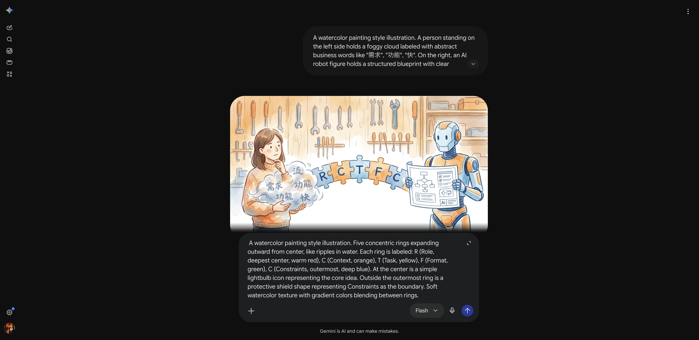
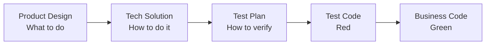
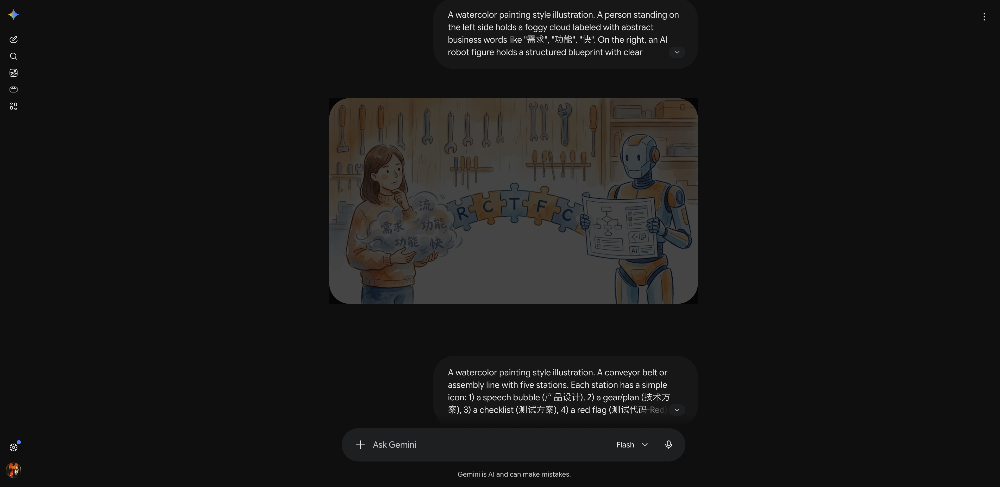

> This is a supplementary part of the AI Path Advanced Guide L2, teaching non-coders how to use AI to write code.

L2 has one final step: *making AI write code that actually works.*

**How do you make AI write code you can use?**

Not a demo that runs once. A script you can drop into your project and run.

For someone who doesn't code, the biggest pain points aren't "how to write code." They're three questions:

1. I don't know how to describe clearly what I want
2. After the code is written, how do I know it's right
3. When the code breaks, how do I tell AI to fix it

These three things don't require programming knowledge. They just require a communication method.

---

## Problem 1: Vague Description → The RCTFC Framework

GCO (Day 10) solves the task-description problem. But GCO is a one-off prompt for agents, not a complete framework for describing code tasks.

Code tasks need a finer-grained framework: **RCTFC**.

**R (Role):** What role should the AI play? "You are a Python script engineer" and "You are an experienced backend developer" will produce different quality code. The former yields basic scripts; the latter produces modular, well-documented code.

**C (Context):** The AI needs to know your existing environment: what language, what dependencies, which project, what existing files to reference. Without this, the AI guesses from scratch—and when it guesses wrong, you go back and forth fixing it.

**T (Task):** Same as GCO's Goal—a single sentence describing what you want done. Don't say "optimize it." Say "write a script that reads a CSV and outputs a statistical summary."

**F (Format):** The output format of the code. Function signatures, module structure, comment style. Without this, the AI's code might work—but it won't match your standards.

**C (Constraints):** Same as GCO's Constraints, but code tasks have more specific constraint types:
- Environment constraints: standard library only, or third-party allowed?
- Performance constraints: how much data? Any time requirements?
- Safety constraints: no file writes, no network access, no system commands
- Style constraints: naming conventions, comment requirements

The five elements build on each other. Role sets the tone, Context sets the boundaries, Task sets the goal, Format sets the structure, Constraints set the floor. Missing Context is the most common root cause of code problems—the AI doesn't know your environment, so the code it writes won't run.

### Format Is About Shape, Not Syntax

Here's a common misconception: many people think Format requires coding knowledge. It doesn't.

**Format asks for "the physical shape and interface contract of the result," not "the specific syntax and implementation details of the code."**

Non-coders can take full control of Format by distinguishing between two things:

- **Code-level format (don't worry about it):** Tabs or spaces for indentation, camelCase or snake_case for variables, how to express underlying data structures. Leave all of this to the AI.
- **Interface contract (you can control this):** What form does the data come in, what format does it go out in, what parameter names does the function accept. This is fundamentally **business logic**, not a technical barrier.

You define "how many rooms the house needs and which way the door faces." The AI buries the pipes and runs the wiring.

**How to specify Format requirements without code, using natural language and examples:**

- Structure description: *"Write a function that takes a file path as input and returns a dictionary with two fields: total and average."*
- Function signatures: *"Split the code into two independent functions: one handles reading the file (parse_file(path)), the other handles computing the data (calculate_data(data))."* (Even if you can't write the function internals, you can name the building blocks.)
- Text/file format: *"The output JSON file must be sorted by key alphabetically, and every key name must be lowercase."*

**Comparison of good vs. bad examples:**

> ❌ Vague: "Help me write a script to process this file."

The AI will guess: What file? CSV or JSON? What language? What output? Get it wrong and start over.

> ✅ Clear:
>
> Role: You are a Python engineer.
> Context: Project path `~/projects/sales`, Python 3.12, standard library only. Existing file `data/sales_2024.csv` with columns: date, product, amount, price.
> Task: Write a script to read this CSV and output the total amount and average price per product, saved to `output/summary.json`.
> Format: Functional structure—`parse_csv(path)` returns a list, `summarize(records)` returns a dictionary, `save_json(data, path)` writes the file.
> Constraints: No third-party libraries; handle empty rows and outliers; sort output JSON by product.

Same task. The gap between the two descriptions isn't the AI's capability—it's whether you explained things clearly.


---

## Problem 2: Not Knowing If It's Right → Describe Test Cases

The code is written. How do you know it's right?

You don't need to run every scenario. Just describe three things:

**Happy path:** One typical use case. "Run it with `data/sales_2024.csv`—the output should be one row per product with correct totals and averages."

**Edge cases:** Extreme but not exceptional situations. "If a product has only one record, its total amount equals that row's amount, and its average price equals that row's price."

**Invalid inputs:** Anomalous situations. "If the CSV has empty rows, the script should skip them instead of throwing an error."

These three things form a minimal test set. You're not asking AI to write test code—you're asking yourself before delivery: "Can this code handle these three cases?" Then verify item by item against GCO's Output.

Another method: **invariant checking.** This is the same concept as Day 11. For code tasks, invariants guard the baseline—"regardless of input, the output format must match Format requirements," "no uncaught exceptions under any circumstances," "file size stays under the threshold."

The minimal test set validates specific results. Invariant checks guard the baseline. Together they cover two layers: "can it work?" and "will it break?"

---

## Problem 3: Code Breaks → Iterative Fixing

When code breaks, many people say "fix it for me." That's too vague—the AI guesses where the problem is, gets it wrong, and you go another round.

The core of iterative fixing is **describing the difference precisely**, not describing the problem itself.

❌ "The code broke."
✅ "Running `python main.py data/sales_2024.csv` throws `KeyError: 'amount'`. The input file has an `amount` column—maybe the column name case doesn't match."

❌ "The output is wrong."
✅ "The `total_amount` field in `summary.json` is a string, not a number. Expected a float."

❌ "Optimize it for me."
✅ "The current script takes 3 seconds to process 100k rows. Target is under 1 second. The bottleneck is likely line-by-line parsing—consider reading the file in chunks instead of one row at a time."

Each fix addresses one thing. Don't throw "fix bug + add feature + change format" at once. Progressive development: change one thing, run once, verify once, then change the next thing.

Another technique: **minimal reproducible case.** If the problem is complex, ask the AI to first write a minimal reproducible case containing only the broken part. Once the case reproduces correctly, expand it back to the full code. Each iteration stays scoped, reducing the chance of introducing new bugs. If a fix breaks an earlier passing case, you revert to the last working state and try again.

---

## Practical Case: TDD Pipeline

After learning RCTFC, the next question is: **when faced with complex requirements, how do you move forward step by step?**

TDD Pipeline is the answer. It's a multi-stage workflow based on RCTFC that guides AI to transform business requirements into deliverable code. Each stage has independent input, output, and review mechanisms. Information flows between stages through fixed-format files.

### Five-Stage Flow




- **Product Design:** Turn vague requirements into testable acceptance criteria (User Story + Acceptance Criterion)
- **Tech Solution:** Research APIs, design architecture, clarify interfaces between components
- **Test Plan:** Write test cases covering all scenarios based on the tech solution
- **Test Code:** Write failing tests first (Red) to lock in expected behavior
- **Business Code:** Write code that passes all tests (Green)

Each stage ends with an independent review—not AI self-assessment, but a fresh perspective checking specifically for issues. Only after two consecutive rounds without C/H/M-level issues (Critical, High, Medium) do you move to the next stage.

### Why You Need a Pipeline

L2's RCTFC is a one-shot task description. But for complex projects, one-shot description has problems:

1. **Context explosion:** A complete project description might be thousands of words. The AI reads the later parts and forgets the earlier constraints.
2. **Error propagation:** Ambiguities from the requirements stage only surface at the code stage—fixing them costs ten times as much.
3. **No staged verification:** Going through all stages at once leaves no checkpoint. When something goes wrong, you don't know which layer leaked.

TDD Pipeline's approach: **break one big task into multiple small ones, each with clear input/output and review criteria.**

Behind this is RCTFC extended—each stage is itself an RCTFC task, except the input isn't "your thoughts" but "the previous stage's output."

### Using RCTFC to Describe the First Stage

Say you want the AI to help design a "batch translation script." The first step is product design. Using RCTFC:

```
Role: You are a product analyst skilled at breaking vague requirements into testable acceptance criteria.

Context:
- The user wants a batch translation tool
- Input: .md files in a folder
- Target language: English
- Output: same-named .en.md files

Task:
Generate user stories and acceptance criteria based on the above.

Format:
- 3-5 core user stories, each using "As a...I want...so that..." format
- Each story has 2-3 acceptance criteria; each AC must be binary-decidable (answerable with "yes" or "no")
- Mark each AC's criticality (key/peripheral)

Constraints:
- No technical implementation design; describe behavior only
- Each AC must be verifiable without writing code
- Key ACs don't exceed 60% of total count
```

After the AI outputs acceptance criteria, run a review:

- Is each AC testable? (Can it be judged with "yes" or "no"?)
- Are any key ACs missing? (e.g., "empty file handling")
- Are there vague subjective adjectives? (Words like "fast," "high quality" should be deleted)

> ❌ Vague AC: "Translation should be fast and error-free."
>
> Two problems: first, "fast" and "error-free" are not binary-decidable; second, there's no way to know the judging criteria.

> ✅ Binary-decidable AC (Key): "For any input `.md` file, a same-named `.en.md` file must be generated in the same directory."
>
> The pass condition is clear: check the output directory—if the same-named `.en.md` exists, Pass; otherwise, Fail.

After passing review, move to Stage 2: tech solution. Now the product design output becomes the new tech solution's Context, and Format becomes "API research conclusions + component architecture diagram + data flow description."

### The Role of Format in the Pipeline

Notice the Format requirements for these two stages—they're completely different:

- Stage 1 (Product Design) Format: user story list + acceptance criteria table
- Stage 2 (Tech Solution) Format: API research table + component diagram + data flow

**Format is like slots and interfaces on an assembly line:** the previous station must produce parts of the right shape before the next station can attach and continue.

Format determines what each stage's output "looks like," letting the next stage read it directly without guessing. This is TDD Pipeline's core value—**each stage's Format is the next stage's Context**, and information flows between stages through fixed-format files, not relying on the AI's "understanding."

### Complete Five-Stage Flow

| Stage | Input | Output (Format) | Review Focus |
|-------|-------|-----------------|--------------|
| 1. Product Design | Raw user requirements | User stories + acceptance criteria | AC testability, criticality labeling |
| 2. Tech Solution | Acceptance criteria | API research conclusions + architecture design | Whether each design decision has a basis and satisfies the stated RCTFC constraints |
| 3. Test Plan | Tech solution | Test case checklist | Whether all key ACs are covered |
| 4. Test Code | Test cases | Failing test files | Whether tests anchor to requirements |
| 5. Business Code | Test code | Passing business code | Whether all tests pass |

### Why This Doesn't Require Coding Knowledge

Throughout the TDD Pipeline, as a non-programmer, you only need to focus on two things:

1. **Describe business requirements** (Stage 1): Tell the AI what you want in natural language
2. **Review acceptance criteria** (after Stage 1 ends): Check whether the AI-generated ACs cover your real needs

The later stages—tech solution, test cases, code implementation—are all autonomously derived by AI based on your input. **Note: "writing test code" here doesn't mean you type `assert`—it means the AI writes its own examination paper to test itself.** You don't need to write a single line of code, but you control the direction the whole time.

This is the real power of RCTFC + TDD Pipeline: replacing the question "Do I know how to code?" with "Can I describe my requirements clearly?"

---

## Also: Project Management Habits

Having AI write code isn't just about describing problems and verifying results. You also need some project habits:

- **Plan before executing:** Use Plan Mode (read-only) to have the AI list implementation options first, so you can confirm the direction before executing. Otherwise, the AI writes a pile of code only for you to realize the direction was wrong.
- **Project memory:** Place a `PROJECT_STATE.md` in the root directory recording current progress, known issues, and next steps. The AI reads this file at the start of every new conversation, so there's no need to re-explain background.
- **Git version control:** Have the AI commit after every change with clear messages about what was changed. If something breaks, you can roll back to any state.
- **Sandbox strategy:** Test on a copy and never touch the original, especially for tasks involving file operations or network requests.

These habits aren't mandatory, but they significantly reduce the risk of "breaking things and not knowing how to get back to the previous version."

---

## Today's Takeaways

- [ ] Can use the RCTFC framework to describe code tasks: Role → Context → Task → Format → Constraints
- [ ] Understand Format is "the shape of the result," not "the syntax of the implementation"—no coding knowledge needed
- [ ] Can use three-part test description to verify AI-generated code
- [ ] Can use precise difference description for iterative fixes without guessing
- [ ] Know how TDD Pipeline's five-stage workflow transforms requirements into code
- [ ] Understand the value of project management habits (Plan mode, project memory, Git, sandbox)

---

That's the end of L2. If anything is unclear, go back to the corresponding article and practice again.

---

> This is AI Path L2 Part 5. Next up: Day 16 L2 graduation assessment.
