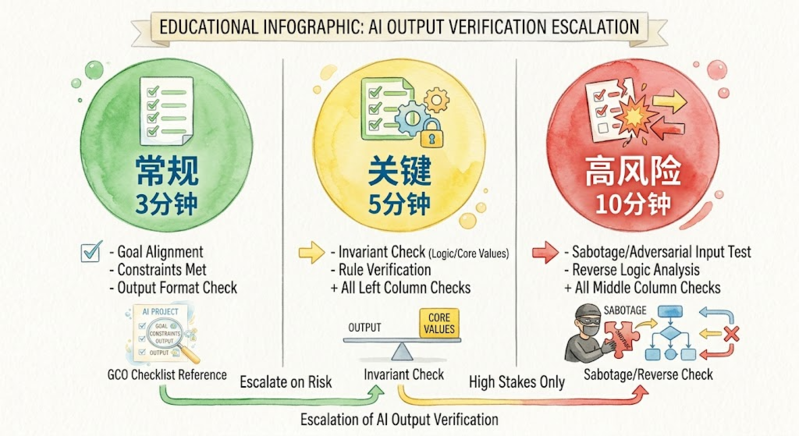

> This is Day 11 of the AI Path L1→L2 Upgrade Guide; if you haven't done so yet, complete [Day 8]() and [Day 10]() before diving into this practice session.

Day 10 ended with a note: description and verification are two sides of the same coin. If you can't describe what you want, you can't check whether you got it.

I default to trusting AI output, especially when it sounds confident. The generated text is well-structured, clear, and sounds right. Day 10 mentioned an example: I asked AI to "organize these files by category." It sorted them alphabetically by name. The result looked organized, but it wasn't the kind of organization I meant. At the time, I thought, "I need to describe it better next time," rather than asking, "Did it actually deliver what I requested?"

That pattern keeps repeating. AI produces something that looks reasonable at a glance; I skim it and move on. By the time a detail goes wrong enough to notice, I've already built on top of the mistake.

Today, I flip GCO around. It functions as a spec on the way in and a checklist on the way back. Same three fields, different direction.

None of these methods require writing code.

---

## GCO as a Checklist

The GCO you wrote to describe the task doubles as your set of acceptance criteria; you simply flip its direction.

Day 10 exercise 2 asked AI to analyze 2025 sales data: trends by product line, growth rates, and recommendations. Day 10 showed the difference between vague and clear descriptions. Today, I pick up where Day 10 left off: how to check the result.

Say AI finished the analysis and handed you a report. Verification starts by pulling out the original GCO and going line by line:

| GCO Field | As Description | As Verification |
|-----------|---------------|-----------------|
| Goal | Analyze sales trends by product line with growth rates. | Report covers trends and growth by product line → pass |
| Constraints | Use 2025 data only | No 2024 data mixed in → pass |
| Constraints | Quarterly aggregation | Consistent quarterly granularity → pass |
| Constraints | Independent analysis per product line | Lines `A` and `B` aren't conflated → pass |
| Constraints | Flag growth below 10% | Product `C` (growth < 10%) explicitly flagged → pass |
| Output | Table, line chart, three key findings (one sentence each) | Table and chart present; five findings returned, but two exceed the one-sentence limit → fail, ask AI to condense |

One pass through the checklist and you know exactly what's off. No more "something feels wrong about this." You point at "The spec says three findings, you gave me five, please consolidate them."

I keep the original GCO in a quick note. When the results come back, ticking through the checklist takes less than three minutes.

---

## Invariant Checks

Some things shouldn't change simply because AI processed the data. Identify the core properties that must remain unchanged regardless of the analysis.

Let's go back to the sales example:

- **Row count**: 1,024 rows in, 1,024 rows out. AI won't delete data intentionally, but it might unilaterally decide a row looks "anomalous" and silently filter it out.
- **Key identifier columns**: Order IDs, user IDs. These are anchors. If they change, you can't trace back to the source.
- **Raw values**: AI can compute aggregates, but it shouldn't round individual values so aggressively that the underlying data becomes distorted.
- **Source categories**: Raw data has `A`, `B`, and `C` categories. The result shouldn't invent category `D`.

The most straightforward approach is to have the AI verify its own output.

> Check your analysis: did the total row count change, were any order IDs modified, or were any raw categories altered? Answer each point, and if any invariant has been broken, halt processing immediately and list the affected rows.

Not sure what's invariant? Have AI figure it out:

> You're about to process this dataset. First, list the properties that must never change no matter what analysis you perform. Then, explain how you will verify each one.

AI lists the properties so you can review them, confirm the right ones, and add missing ones, all in about two minutes.

---

## Reverse Checking

The GCO checklist ensures completeness, while invariant checks verify correctness. Reverse checking goes further: it assumes the result is wrong, then finds where it broke.

**Method 1: Likelihood list.**

> Pretend this analysis result is already wrong. List 10 potential failure points stemming strictly from data transformations, formula errors, or logic flaws, ordered from most to least likely.

AI will likely list issues such as an incorrect data source, a faulty aggregation formula, an improper time range, or unhandled null values. If any of these are directions you haven't checked, you now have a to-do list.

**Method 2: Sabotage testing.** Have AI play auditor against its own work.

> Now act as a reviewer. Find every issue in this report, the more detailed, the better. Tag each with a risk level and a fix recommendation.

AI will surface a few false positives, but a quick skim lets you filter out the noise and catch logic flaws you might have missed during your initial prompt setup.

---

## Human in the Loop

Match your verification depth to the task's stakes: use quick checklist passes for routine drafts, invariant checks for production data, and full reverse-checks before touching financial figures.

- 🟢 **GCO checklist**: Every task. 3 minutes. Since your GCO is already written from the prompt stage, simply use it as your verification baseline.
- 🟡 **Invariant checks**: Critical tasks. 5 minutes. This step is essential for any task involving raw data, system configurations, or batch processing.
- 🔴 **Reverse checks**: High-risk tasks. 10 minutes. Anything involving money, permissions, or external delivery.

You are not the one doing the manual checking. AI handles the bulk of verification: scanning a thousand rows in under a minute, listing possible failure modes, and questioning its own output from different angles. Your job is judgment. Is this deviation acceptable? Does that risk need action?

This completes the loop: GCO guides your request on the way in, and it serves as your benchmark on the way out. You stay in control of the final judgment, without doing any of the manual grunt work.

---

## Today's Practice

Pick a task you'd give AI today, preferably with data output or text generation. Run it through:

1. **GCO checklist**: Turn your original GCO into an acceptance checklist and check off each item.
2. **Invariant check**: Ask AI to list immutable properties and verify each one.
3. **Reverse check (optional)**: Have AI attack its own result.

### Today's Takeaways

- [ ] I can use GCO as a specification tool on the way in and a checklist on the way out.
- [ ] I can use GCO as a checklist to verify AI output line by line.
- [ ] I can identify invariants and have AI self-verify critical properties.
- [ ] I can apply two reverse-checking methods: likelihood lists and sabotage testing.
- [ ] I can choose verification depth based on task importance (3 / 5 / 10 minute tiers).

---

Description and verification covered. [Day 12]() is next: your AI toolbox, how to combine APIs with autonomous AI agents, and when to reach for which.
