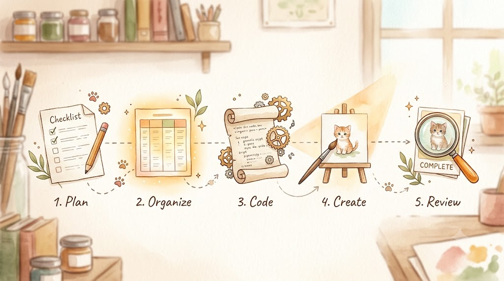

> This is Day 12 of the AI Path L1→L2 Upgrade Guide. Do [Day 8](), [Day 10]() and [Day 11]() first.

Day 11 ended with a crucial question: How do we automate these steps? My approach relies on a simple realization: pairing stateless API calls with an AI agent shares the same core principles as breaking down workflows, designing systems, and building software. I've been doing that kind of work for years. The AI picture book project I'm building right now is a clean example. I'll walk through how I designed its pipeline and tasks.

Let's align on the terms first. An autonomous execution AI and an AI agent are essentially the same thing: a system built with context and state awareness. It remembers the earlier conversation and adjusts course as it works. Under the hood it runs on stateless LLM API calls: one request at a time, no memory between calls. The agent keeps its own state on top of that. I'll use both terms interchangeably from here on; they point to the same concept.

Now for the project itself: my kid was learning Dolch sight words, and I was looking for storybooks that reinforced them. Everything on the market was flashcards and worksheets. There were no storybooks at all.

So I decided to make our own. I can't draw, so AI had to paint. The full Dolch list: 220 words, 5 levels. That's a lot of books.

I started with level PP (Pre-Primer, the first reading level): 40 words, 10 books, 71 pages. Cast: Sam the kitten, Pip the chickadee, Ben the dog. Each book is 6-8 pages, with one simple English sentence and one watercolor illustration per page. Generating those 71 images manually one by one? I'd still be clicking button by button today.

Before any story, there's the word plan. Sight words must appear gradually, in a controlled order. Deciding which story gets which words: 40 words alone could take me a month, and that's before writing stories around them. A job like this was a natural fit for AI.

I made my wish. Reality pushed back: handing everything to AI was slow and expensive, and one story could take half a day.

I stopped and took the job apart. What exactly is it made of? Six pieces: planning word lists, deciding stories and characters, polishing the text, writing image prompts, generating images, checking the results. Each piece needs a different kind of tool. How I matched them is today's topic.

The finished books matter less than the logic behind them: why this job can run in batch, and which step goes to whom.

---

## Who Gets Which Work

The rule has one line:

**Can this step be pinned down?** If yes: prompts, process, output format can all be fixed. I write a script and call the API. Each call is stateless: prompt in, result out, no memory between calls. Running it once or a hundred times gives the same result. If no, it goes to an AI agent with context and state awareness. Exploring, trial and error, and on-the-fly judgment are its job. It converts the task into something that can be pinned down: scripts, prompts, tables.

Here's the split in the picture book project:

- **Story text and image prompts**: one-time exploration and judgment. Each story needs a plot, embedded vocabulary, controlled sentence patterns, and per-page image prompts following the character style guide. That work goes to the AI agent.
- **71 illustrations**: the same action repeated 71 times. Prompts are already written, so no judgment is needed. This goes to the API script, queued one by one.
- **Verification**: Are the words sufficient? Are the page counts correct? Are the images any good? Human and AI check together.

The dividing line is worth repeating: **writing prompts is judgment work, running prompts is labor. Judgment happens once; labor goes to scripts.** That's the core of this combination.

---

## The Pipeline: Five Steps

Let's look at the whole before the details:

```text
Constraints first → AI generates structured table → script parses Markdown → API generates/downloads images → rules + human verification
```

Each step's output is the next step's input. Break anywhere in the middle and everything after stops.



### Step 1: Design Constraints First

The constraints are fixed before the first story is written. For PP level, constraints center on two things: **word distribution** and **text shape**.

Word distribution: 40 words across 10 books. Each book introduces 4-5 new words (with the final book, PP10, introducing 3), while systematically reusing vocabulary from earlier titles. The distribution table is fixed before any story is written:

| Story | New words | Reused From |
|:----:|------|---------|
| "PP01: I Can See" | I, can, see, the, a | None |
| "PP02: Look! Look!" | look, funny, you, we | PP01 |
| "PP03: It Is Big" | is, it, big, little | PP02 |
| "PP04: Jump In" | jump, in, my, and | PP03 |
| "PP05: Go Up!" | go, up, down, run | PP04 |
| "PP06: Come and Play" | come, here, play, find | PP05 |
| "PP07: Help Me!" | help, not, for, make | PP06 |
| "PP08: One, Two, Said" | one, two, said, me | PP07 |
| "PP09: Away We Go" | away, red, blue, yellow | PP08 |
| "PP10: Where Is Three?" | where, three, to | PP09 + earlier books |
Text constraints: 1-2 sentences per page, 3-5 words per sentence, 30-60 words per book, simple patterns only (like `I can see...`, S + can + V). Character style guide: Sam is an orange tabby kitten with a white chest and green eyes; Pip is a blue chickadee; Ben is a brown dog. Every page's image prompt must follow it.

Hard targets: each new word appears at least 3 times in its story, each reused word at least once, fixed page count per book.

These are Day 10's Constraints. Establishing them up front provides a clear benchmark for every subsequent step.

### Step 2: AI Generates Structured Content

I asked the AI agent to write stories against the constraints. Each story lands in a four-column table:

| Page | Scene description | Story text | Image prompt |
|:--:|---------|---------|-----------|
| 1 | Sam wakes up in his bedroom, sunlight streaming in | I can see. | Children's book illustration, soft watercolor style. Small orange tabby kitten Sam... |
| 2 | Sam steps outside, looks at the bright sky | I can see the sun. | ... |
| 3 | Sam walks toward a big tree | I can see a tree. | ... |

One page per row. The four columns: page number, scene description (Chinese, for humans), story text (English, the book's text), image prompt (English, fed to the image API).

This is the single decision everything else in the pipeline depends on: **AI's output is not loose narrative text; it's a structured protocol.**

### Step 3: The Script Parses the Table

Once this structured table is ready, the remaining work becomes pure mechanical execution. A Python script ingests the Markdown file, segments it into 10 sections by story headers (`# PP01`, `# PP02`, etc.), splits lines using pipe delimiters, and extracts the target image prompt for each page:

```python
import re

def parse_pages(md_path):
    # Use a context manager for standard file handling
    with open(md_path, 'r', encoding='utf-8') as f:
        text = f.read()
    pages = []
    # Split by story title
    for part in re.split(r'\n(?=# PP\d+)', text):
        name = re.search(r'^# (PP\d+)', part, re.M)
        if not name:
            continue
        # Locate the table block (header is assumed to be "| Page |"; use a more tolerant regex in production)
        table = part[part.find('| Page |'):]
        for line in table.split('\n'):
            cells = [c.strip() for c in line.strip('|').split('|')]
            if len(cells) < 4 or not cells[0].isdigit():
                continue
            pages.append({
                'story': name.group(1),
                'page': int(cells[0]),
                'prompt': '|'.join(cells[3:]).strip()  # Column 4 onward: contains full prompt with global style & character constraints
            })
    return pages
```

Only two things matter: **splitting stories with regex and splitting columns by pipe delimiters**. The table format is fixed, so the script can safely assume "column 1 is the page number, column 4 is the prompt."

Note: column 4 carries the global constraints assembled into a prompt: art style, character appearance, scene rules. If the prompts are imprecise, the images suffer no matter how well the script runs. Step 2's quality directly decides Step 4's output.

### Step 4: The API Generates the Images

With the prompt list ready, I call the image API. The sequence for each image is straightforward: write the prompt to a temp file, call the API once, extract the image URL from the JSON response, and download the file.

The generation script runs synchronously: it sends a request, awaits the generated URL, downloads the payload, and then moves to the next item. Requests enter a queue and execute sequentially: 71 images finish in about half an hour, and nobody needs to watch. Doing them by hand, one at a time, would mean waiting most of a day.

### Step 5: Verify and Fix

Generating isn't finishing. Checklist:

- [ ] Vocabulary frequency: Does every target new word appear at least 3 times? (A script quantifies this instantly.)
- [ ] Structural targets: Do total page counts and text lengths match the baseline design doc?
- [ ] Asset completeness: Are all 71 images successfully downloaded without generation artifacts, with any failures regenerated?
- [ ] Auditability: Is every API interaction fully logged for complete failure traceability?

I isolate any flawed images (e.g., incorrect proportions or blurry ones) and batch-regenerate only those specific pages. This is the payoff of pinning the process down: a rerun is merely a targeted API call with minimal marginal cost. If an AI agent reran the whole pipeline every time, tokens would be wasted on duplicated work.

---

## The Intermediate Output Is the Protocol

The whole pipeline runs because of that four-column table.

The table is the contract between human and AI. It's also the input protocol for every script. The script only knows "page number, prompt". AI output must land in this format before the script can touch it.
Two payoffs:

**Easier updates: change one input, and the pipeline updates smoothly.** Want to add a new word to PP01? You'd edit the story text in that row, regenerate images, and recount words. The other 9 stories are untouched.

**Clear verification: the table is the validation checklist.** Rows for page counts, cells for word counts.

Day 10 said GCO output must be explicit. At the project level, the explicit output is this table. The clearer the format, the easier the downstream scripts.

---

## Turning the Script into a Tool

Once the pipeline works, the script is still stuck in the "edit code every run" stage, with input paths, model names, and output directories all hardcoded. A new story set means editing code.

Two changes turn it into a reusable tool:

**Command-line arguments:** Use argparse to make the changeable options parameters:

```python
import argparse

parser = argparse.ArgumentParser(description="Generate picture book illustrations in batch")
parser.add_argument("--input", required=True, help="Story Markdown path")
parser.add_argument("--output", default="static/images", help="Image output directory")
parser.add_argument("--story", help="Only generate one story, e.g. pp01")
parser.add_argument("--pages", help="Only generate specific pages, e.g. 3,5")
args = parser.parse_args()
print(f"Processing {args.input}...")
```

Then batch runs:

```bash
python batch_generate.py --input pp-storybook-complete.md

# pp01 pages 3 and 5 came out bad, regenerate just those
python batch_generate.py --input pp-storybook-complete.md --story pp01 --pages 3,5
```

Script vs. Tool: A script handles a specific, single-use task; a tool is parameterized, reusable, resilient to changing inputs, and easy to share across workflows.

The refactor is two steps: the parts that change (input path, output dir, which book, which pages) go into variables; then argparse wraps them. An AI agent can do it in a few minutes. Once the tool exists, every similar task reuses it. The time and tokens saved pay for the refactor quickly.

**Config file:** Options that rarely change (API key, default model, image size) go into a config file read at startup. Changing the config replaces changing the code.

---

## FAQ

**"I can't write scripts."**

Have an AI agent write them. Describe the process with Day 10's GCO and verify the result with Day 11's methods; the script is yours. That's how the scripts in this project were born: I described the process, AI wrote the code, I checked it.

**"Is API more expensive than a subscription?"**

The division of labor matters more than the price.

The AI agent's output is a script: it thinks through the process for the task and writes the prompts. Once the script exists, image generation becomes a fixed task. No more judgment, just API calls.

One note: a subscription model often uses the same underlying models under a different pricing structure. If the Terms of Service (TOS) permit it, you can use a subscription to drive your own scripts and AI agents for personal use. **So the dividing line comes down to whether the task can be pinned down: fixed tasks go through stateless API calls, the rest goes to an AI agent.**

Each new book in the project follows the same pattern: AI writes a new script, and the script generates the images via the API. The repeatable part always runs programmatically; writing the script for a task happens once.

**"Isn't this too complex?"**

At its core, the setup relies on just two actions: AI generates structured content, and automated scripts handle the labor in batch. The only complex part is designing the upfront constraints, and that only happens once.

---

## Today's Takeaways

- [ ] Split tasks based on whether they can be strictly pinned down.
- [ ] Master the five pipeline steps: constraints → generate → parse → execute → verify.
- [ ] Use intermediate structured output as a communication protocol.
- [ ] Refactor scripts with CLI arguments to build reusable tools instead of editing code each time.

---

[Day 13]() is next: it runs this pipeline once by hand. The next step is to batch-generate a set of content via API, then have an AI agent review and filter it. Two tools working in relay. One run makes it visible.

---

> This is Day 12 of the AI Path L1→L2 Upgrade Guide. The previous article was [Day 11](), output quality checks; the next is [Day 13](), combining both tools.
