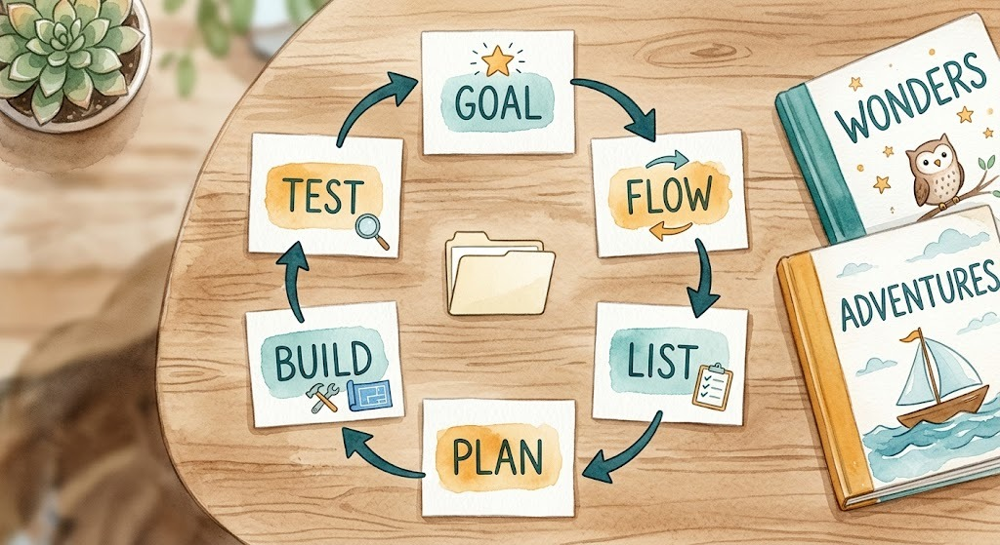

> This is Day 13 of the AI Path L1→L2 Upgrade Guide. Do [Day 8](../ai-path-l1-l2-week2-day8/), [Day 9](../ai-path-l1-l2-week2-day9/), [Day 10](../ai-path-l1-l2-week3-day10/), [Day 11](../ai-path-l1-l2-week3-day11/), and [Day 12](../ai-path-l1-l2-week3-day12/) first.

Day 12 ended with a promise: in the next practice, we'd run the pipeline by hand. Two tools working in relay. Today, I deliver on that promise.

I'm not here to show you how to use an off-the-shelf skill; I'll show you how to build one from scratch. The project is [picture-book-pipeline](https://github.com/alexwwang/picture-book-pipeline), which I use to batch-generate children's picture books. It turns a workflow into a complete skill kit: a SKILL.md overview, role prompts, and execution scripts, all in one directory.

The project took shape through six core conversations with an AI agent, along with minor follow-up tweaks. The agent executed the heavy lifting. Six rounds, six jobs: set the goal, explain the workflow, confirm nodes and acceptance, ask for a plan, implement, test. Each round has its design, its thinking, and its prompt.



---

## Round 1: Set the Goal

Defining the target end state before implementation is critical. This is Day 10's GCO. Goal: batch-generate children's picture books. Constraints: ages 3-5, fixed vocabulary list, 6 pages per story, `watercolor` style. Output: a reusable skill kit structure. The first prompt:

**Input · Prompt**

```text
Goal: build a reusable skill kit for batch-generating children's picture books. Constraints: ages 3-5, fixed vocabulary list, 6 pages per story, `watercolor` style. Output: a reusable skill kit with the protocol, role prompts, and execution scripts.
```

Without a goal, everything downstream drifts. That's the point of GCO: ensuring the agent sees the finish line before we discuss how to get there.

---

## Round 2: Explain the Workflow

Goal set. Now tell the agent what the workflow is. The picture book generation workflow is divided into five stages: outline, story, prompts, images, and review. This round writes no plan. It confirms the agent's understanding first.

**Input · Prompt**

```text
The workflow is: outline → story → image prompts → generate images page by page → review. First, restate your understanding of each stage, then we continue.
```

Requiring the agent to restate the workflow guarantees alignment before execution, preventing cascading errors down the road. Day 8's task description applies here: if the job isn't described clearly, the AI can't do it.

---

## Round 3: Confirm Nodes and Acceptance

Workflow confirmed. Now walk through each node's responsibility: what it does, what the intermediate result looks like, what the final result must satisfy. Before touching code, bring in Day 12's dividing line.

Day 12's golden rule: prompt design requires judgment; script execution is pure grunt work. Judgment is for the LLM; grunt work goes to the script. The test is whether the step can be pinned down. If it can, the logic can be written as program steps and the result is deterministic. Image generation is that kind of work: prompt ready, flow fixed, then call the API, save the file, done. Every step is a fixed action. If a step can't be strictly pinned down, forcing it into hardcoded program logic yields rigid, subpar results. It needs flexible adjustment that code can't express. Writing stories is that kind of work. Word lists, sentence patterns, plots can all have standards, but all-rule writing makes every story the same. Adjust flexibly on top of standards. That's judgment work, for the agent or a human.

**Input · Prompt**

```text
Analyze each node: can it be implemented as a script, and what is its acceptance criterion. Define the handoff format between nodes together. Scriptable nodes go to scripts; the rest get prompts for the agent. Give the full list first; I'll confirm.
```

The agent ran each node through the test and came back with the full list:

**Output · Agent checklist**

> Outline: agent-led. Acceptance: an outline with the vocabulary list and page count\
> Story: agent-led. Acceptance: a table covering the full vocabulary\
> Prompts: agent-led. Acceptance: fourth column filled, consistent style\
> Images: script-led. Acceptance: one image per page, saved successfully\
> Review: agent-led. Acceptance: image and text judged consistent\
> Intermediate artifact: four-column table with page number, scene description, story text, image prompt

I confirmed the list. No disagreement on the split. For review, the agent checks first, a human has the final say.

The intermediate output is the core. The agent and the scripts hand off through a four-column table: page number, scene description, story text, image prompt. Page numbers are `p.01`, `p.02`. Parsing is position-based: the script doesn't look at column names, only column indices. Reading by column name would allow flexible column order, but a renamed column header breaks the script. I chose position, simple and direct. There's a trap with column names: the agent writes the table, and if it tweaks a header, the script dies. Why rely on position instead of column headers? Because agents love tweaking header names on a whim. Locking column positions feels rigid, but it imposes the strictest constraint on the agent. Reorder the columns and the script reads the wrong cells and fails immediately. The table is Day 12's protocol. The clearer the protocol, the higher the chance the agent writes working scripts.

Protocol before implementation. The table comes first; role prompts and scripts all follow it.

---

## Round 4: Ask for a Plan

Nodes and acceptance confirmed. Now the agent refines the implementation plan. In this round, the agent formulates a multi-layer deployment plan detailing component hierarchy and role prompt organization.

**Input · Prompt**

```text
Based on the confirmed list, propose an implementation plan: the skill directory structure, the prompt framework for each role, and script behavior with parameters. List them by node, noting the dependency order.
```

The plan has three layers. SKILL.md serves as the protocol overview, defining four key aspects: execution order, node outputs, data formats, and error handling. roles/ holds the four role prompts. tools/ holds tool definitions (like agnes usage), tied to specific roles. scripts/ holds the execution scripts. The resulting file tree:

**Output · Proposed tree**

```text
skill/
├── SKILL.md               # Overview: order, output, format, failure handling
├── roles/                 # Judgment-based role prompts
│   ├── outline-planner.md # Outline: topic and audience, fixed structure
│   ├── story-writer.md    # Story: three-column table from the outline
│   ├── prompt-artist.md   # Fourth column: image prompts
│   └── image-qa.md        # Review: judge image-text consistency
├── tools/                 # Agnes usage for role 4
│   └── agnes-generate.md  # Call the existing agnes image skill
└── scripts/               # Execution tools that ship with the skill
    ├── pipeline.py        # Parse the table, batch generate, mechanical acceptance
    └── verify_images.py   # Visual review: score images against text
```

This directory structure acts as our implementation checklist. The plan locks down the file hierarchy, building on the node responsibilities settled in Round 3. Round 5 has the agent implement file by file against the list. Every file, md or py, was written by the agent from the design.

Each role prompt is three sections: identity, input, output format. Day 14 covers how to write them.

---

## Round 5: Confirm, Then Implement

Plan confirmed. Let the agent work. When implementing, you can take two approaches: single-pass execution or iterative micro-stepping. I opted for micro-stepping when writing the scripts. Since they involve the most ambiguity, it's better to write and revise as you go.

Role prompts first. Four roles, the agent wrote them one by one against the plan, and I reviewed each one. How a prompt document tells the agent what to do and how to do it: Day 14. Not here.

Scripts: talk requirements before writing. What does `pipeline.py` do? Parse the `stories.md` table, generate one image per page. It doesn't send HTTP requests itself. It calls the existing `agnes-ai` image skill. `agnes-ai` is a skill set for calling command-line tools, with an image generation workflow inside; the agent can use it directly. The requirements prompt:

**Input · Prompt**

```text
`pipeline.py` parses `stories.md` line by line and generates one image per page. Image generation calls the existing `agnes-ai` skill, running the `agnes_media.py image` command with the prompt read from the fourth column. Suggest concurrency, timeout, and retry counts from your experience, with clear reasoning. Print one `ok` line per page with the story name and page number. Log one JSON line per page in `audit.log` with time, story, page, API, status, URL. If anything is uncertain, ask me before writing.
```

The agent came back with parameter suggestions: a concurrency of 4, a 120-second timeout, and 2 automatic retries. The logic was solid, so I went with it. I added a few requirements of my own here: `audit.log` needed to use JSON with six fixed fields (time, story, page, API, status, URL). Console output provides human-readable progress, while structured JSON logs cater to machine parsing and post-run auditing. And rerun parameters: `--story` picks a story, `--pages` picks pages. This acts as a restart checkpoint for the pipeline, allowing partial runs without re-executing from scratch. Proposing this was up to me; it's not something the agent would proactively introduce. Requirements settled, then the agent writes code. This embodies Day 12's core principle: "turn the script into a tool." Once requirements are solid, user prompts collapse into command-line flags. You change parameters, not code.

**Input · Prompt**

```text
Implement `pipeline.py` and `verify_images.py` per the agreed requirements. Use the `agnes-ai` image generation skill. TDD: write the tests first, then implement; done only when the tests pass.
```

When the scripts were done, the agent ran them first and only handed them to me after they passed. The agent runs the commands; nobody types manually. The implementation flow: talk requirements, fix parameters, agent writes, agent self-tests, user accepts.

---

## Round 6: Test

Implementation done. Does the output meet Round 1's goal? Have the agent list a test plan mapped to the goal and the acceptance criteria.

**Input · Prompt**

```text
List a test plan covering Round 1's goal and Round 3's acceptance criteria; for each item, explain how to test it and the expected result.
```

Plan listed. Run it:

**Input · Prompt**

```text
Run the tests per the plan. Paste the commands and output: per-page output, `audit.log`, verify results. I'll interpret the results.
```

The agent ran a mock test first: zero API cost, no network required.

**Input · Command**

```bash
uv run python3 skill/scripts/pipeline.py run stories.md --output-dir output
```

Each processed page outputs a status line where `ok` designates successful execution:

**Output · Run results**

```output
  ok  the-red-ball p.01
  ok  the-red-ball p.02
```

`audit.log` gets one JSON line per page: time, story, page, API, status, URL. The mock run produced this. `api` says mock:

**Output · audit.log entry**

```json
{"ts": "2026-08-05T04:12:56.832184+00:00", "story": "the-red-ball", "page": 2, "api": "mock", "status": "ok", "url": "mock://images/the-red-ball/page_02.png"}
```

Run the same mock command from the repo root to verify. The result should match the article.

Structural validation is also handled by the script. The agent ran verify:

**Input · Command**

```bash
uv run python3 skill/scripts/pipeline.py verify stories.md --output-dir output
```

Output: `verify: PASS` and `errors: 0`. Page numbers continuous, fields non-empty, images exist. These three conditions form our core invariants, a concept we established back in Day 11.

Structural validation checks that files exist, not what the images contain. Checking whether the generated image actually matches the story text requires a higher-level check. The visual QA script sends image, scene description, and story text to a vision model:

**Input · Command**

```bash
uv run python3 skill/scripts/verify_images.py \
  --manifest output/manifest.json --output-dir output \
  --report qa-report.md --model opencode/mimo-v2.5-free
```

Passing the mock tests was only the first step. When the agent switched to the real agnes tool, the first live run hit a snag. The real command:

**Input · Command**

```bash
uv run python3 skill/scripts/pipeline.py run stories.md \
  --output-dir output \
  --api command \
  --cmd "uv run --with httpx python agnes_media.py image --prompt-file {prompt_file}" \
  --json-path data.0.url \
  --cmd-cwd ~/agnes-ai
```

6 images, 5 succeeded. One failed with a network resolution error (`Cannot connect to unknown`). Retries happen inside the same run; `stderr` prints `retrying ... (attempt 1/2)`. Still failing, record `errors: 1`. Verify doesn't trigger a rerun; pick the failed pages and rerun them. 6 for 6 after that. Real-world APIs rarely behave like textbook examples; handling transient failures is just part of the engineering reality. Day 9's reminder: when evaluating providers, stability is a cost.

Single-page repair relies on targeted CLI flags: `--story` selects a story, and `--pages` isolates specific pages. This allows re-running only the failed assets rather than restarting the entire batch. This requirement came from Round 5's talk. Without it, the agent would have missed the feature.

AI review caught real problems. `the-red-ball` page 1: the scene description says "standing", the generated image shows "sitting". The vision model judged `consistent=false`. If the vision model flags a mismatch, that's an automatic fail. The fix is straightforward: edit the scene description, rerun that specific page, regenerate the image, and re-verify. Only then is it truly ready. Looking at the end-to-end pipeline: the agent generates creative content, scripts execute bulk operations, AI conducts automated QA, and the human makes final decisions. This is Day 12's relay system in full effect, four distinct steps seamlessly chained together.

---

## Today's Takeaways

- [ ] Use GCO to set the goal before talking to the agent.
- [ ] Have the agent restate the workflow to confirm shared understanding.
- [ ] Draw a clear boundary between script deterministic logic and LLM judgment.
- [ ] Request an architecture plan first, and proceed to implementation only after explicit user confirmation.
- [ ] Nail down requirements and parameters first; only then let the agent write code.
- [ ] Run tests against a clear checklist aligned with your original goals.

Today, we turned a manual workflow into an automated skill kit across six conversations: Goal, Flow, List, Plan, Build, and Test. Looking back, no completely new concepts were introduced, just solid engineering patterns applied in sequence. Core concepts connected seamlessly: GCO from Day 10, task descriptions from Day 8, task division and protocols from Day 12, acceptance checks from Day 11, and provider evaluations from Day 9.

Day 14 is next: dissect this skill further. The focus is how to write prompts, how an md document tells the agent what to do and how to do it.

The full project code and docs are open source on GitHub: [picture-book-pipeline](https://github.com/alexwwang/picture-book-pipeline). Commands, scripts, role prompts, 16 tests, all in the repo.

---

> This is Day 13 of the AI Path L1→L2 Upgrade Guide. The previous article was Day 12.
