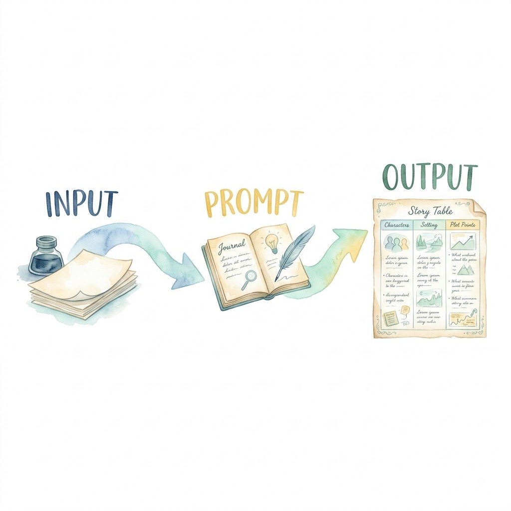

> 这是「AI 之路进阶升级指南」第四周 Day 14 的配套练习。上篇是 [Day 13 练习]()。项目地址：[picture-book-pipeline](https://github.com/alexwwang/picture-book-pipeline)。

## 引言

上篇（Day 13）我们六轮对话建了一个 skill。skill 由多份角色文档组成，每个角色一份。agent 按文档干活，文档怎么写，结果就什么样。

一份角色文档由四块组成：身份、输入、输出要求、质量要求。这篇逐块讲，每块怎么写、为什么这么写。

## 先别急着拿别人的技能用

不自己写，能不能直接拿别人做好的技能？

省事，但有两类风险。

一类是技术风险。技能长在别人的环境里，驱动模型、命令行、API key、脚本路径全按别人的习惯写死。照搬过来，跑不动是小，用错模型、串了凭证是大。验收标准也是别人的，质量要求是原作者对「算对」的定义。你的项目该验收什么，它不知道。中间产物协议更麻烦。技能把格式定死了，比如 Day 13 的 stories.md 表格，三列按位置读。协议是别人定的，你的流程要消费它。格式对不上，就得加转换层，或者改接口。

一类是安全风险。万一遇到恶意提示词注入，给你自动清除根目录，或者上传你的 API Key、登录凭证，要么给你电脑里埋个木马，而你恰好图省事没用沙盒，画面太美难以想象🙈……

所以别急着拿来用。看懂四块骨架，才能判断技能适不适合你、哪里要改。或者让 AI 按四块结构搭一个你自己的。

## 一份角色文档的骨架

以 story-writer.md 为例，它是 skill 里的角色文档。这是绘本流水线的角色 2，任务是根据大纲写每页故事文本。

**第一块：身份**。标题写"角色 2：story-writer（故事内容）"。驱动模型写 `opencode-zen/deepseek-v4-flash-free`（免费档）。两行，告诉 agent 它是谁、用什么模型。

**第二块：输入**。一行："outline.md（角色 1 产物）"。提示词正文里嵌了 `{outline.md 全文}`，把上一角色的产物整块塞进来。

**第三块：输出要求**。提示词正文里，标题写"输出要求（严格）"。逐条看：

```text
- 每个故事一个 Markdown 表格，表格在 '## 故事N 标题' 标题之后
- 表头固定为：| 页 | 画面描述 | 故事文本 |，第二行是分隔行 |:--|:--|:--|
- 页号从 1 连续编号
- 画面描述：该页画面（中文，供后续转提示词），描写画中有什么 + 动作 + 情绪
- 故事文本：一句话，只使用该故事的 vocabulary 词 + 高频词，句式简单
- 一个故事一个表格，表与表之间用 # 标题分隔
- 只输出表格，不要解释
```

**第四块：质量要求**。文件末尾单独一节：

- 故事文本只用 vocabulary 词 + 高频词（超范围词必须划掉重写）
- 每页一句话 ≤ 10 词
- 画面描述与故事文本严格对应（画面描述里出现的东西必须能被故事文本支持，反之亦然）
- 页号 1..N 连续（坏表会卡住角色 4 的 verify）

四块各回答一个问题：你是谁、用什么材料、做成什么样、怎么算对。

## 技巧一：把「如何做」写成可检查清单

输出要求里没有"认真写""写得好"这类词。全是可判定的短句：表头固定为 X、页号从 1 连续、只输出表格。

agent 对形容词免疫，对清单敏感。"认真写"四个字，模型读完还是不知道怎么做。表头固定为 | 页 | 画面描述 | 故事文本 |。模型读完就知道每列是什么。

这跟 Day 13 第 6 轮的测试清单是同一个逻辑。验收条件逐项列出。agent 照着做，人照着查。

再对比 prompt-artist.md。它写"原样保留前 3 列，在第 4 列加提示词"，还有"页号、画面描述、故事文本与输入完全一致"。每条都能验证。不靠形容词，靠清单。

## 技巧二：质量要求 = 验收标准前置

验收标准前置，省掉事后检查。Day 11 讲过三种验证，正好对得上。验证分三层：格式、内容、一致性。story-writer.md 的质量要求覆盖这三层。

Day 12 讲过判断活和体力活的判据：能不能定下来。判断活不能定成脚本，但能定成提示词里的验收清单。story-writer.md 正好是例子，清单定下来了，内容让 agent 现场写。

outline-planner.md 也一样：vocabulary 必须落在词表范围内，style 全篇唯一。角色 1 规划大纲时就要守住词表。

## 技巧三：输入 = 协议产物

上一角色的输出，直接变成下一角色的输入。提示词正文嵌 `{outline.md 全文}`，这就是管道式传递。



提示词是协议的第一个消费者。协议定义得越清楚，提示词越省事。Day 12 说过中间产物即协议。outline.md 的格式在 SKILL.md 的"中间产物协议"里定死了。story-writer.md 不用再解释格式，直接嵌进来就行。

prompt-artist.md 也一样。输入是 stories.md（角色 2 产物，3 列表格），提示词里嵌 `{stories.md 全文}`。角色 2 的表格，角色 3 直接补第 4 列。协议靠提示词强制执行，前 3 列不许动。

## 判断活 vs 体力活在 skill 里的落点

五角色分工，落在 skill 文件里的方式不同。

角色 1/2/3 是判断活，载体是提示词。执行方式按优先级选：当前 agent 直接执行（推荐）、委派 subagent、装 pi 或 opencode 用命令行。提示词里写的是"做什么"和"怎么做"。

角色 4/5 是体力活，载体是脚本，命令固定。角色 4 的文档 `tools/agnes-generate.md` 写的是命令调用：

```bash
uv run python3 skill/scripts/pipeline.py run stories.md \
  --output-dir output \
  --api command \
  --cmd "uv run --with httpx python agnes_media.py image --prompt-file {prompt_file}" \
  --json-path data.0.url \
  --cmd-cwd ~/agnes-ai \
  --concurrency 2 \
  --timeout 300 \
  --retries 2
```

角色 4 不写提示词，写的是调用参数。分界线就是 Day 12 的判据：判断活靠提示词，体力活靠脚本。

角色 5 image-qa 是灰色地带。它用脚本跑（`verify_images.py`），判定标准也写进脚本：`{"consistent": bool, "quality": 1-5, "issues": [...]}`。consistent=false 或 quality<3，该页就不通过。这是"标准能定下来的一半交给脚本"。看图判断本身还是模型做。

SKILL.md 的五角色表清楚地标注了这条线：

| # | 角色 | 调用方式 |
|---|------|----------|
| 1 | outline-planner | agent 直接 / subagent / CLI（按优先级） |
| 2 | story-writer | agent 直接 / subagent / CLI（按优先级） |
| 3 | prompt-artist | agent 直接 / subagent / CLI（按优先级） |
| 4 | image-generator | skill/scripts/pipeline.py run |
| 5 | image-qa | skill/scripts/verify_images.py |

## 写角色文档也是判断活

把四块结构写进需求，交给提示词制作技能，比如 skill-creator，agent 就会按协议结构生成 skill 文档。记得把验收标准放进需求提示里，生成的 skill 文档就不会偏离你的目标。

## 今日收获

- [ ] 能说出角色文档的四块骨架：身份、输入、输出要求、质量要求
- [ ] 会把「如何做」写成可检查清单，不写形容词
- [ ] 会把验收标准前置进质量要求
- [ ] 会用管道式输入：上一角色产物嵌进下一角色的提示词
- [ ] 能分清判断活靠提示词、体力活靠脚本

下一篇做 L2 毕业考核。考完这篇，L2 就结束。L3 往哪走，那篇再讲。
