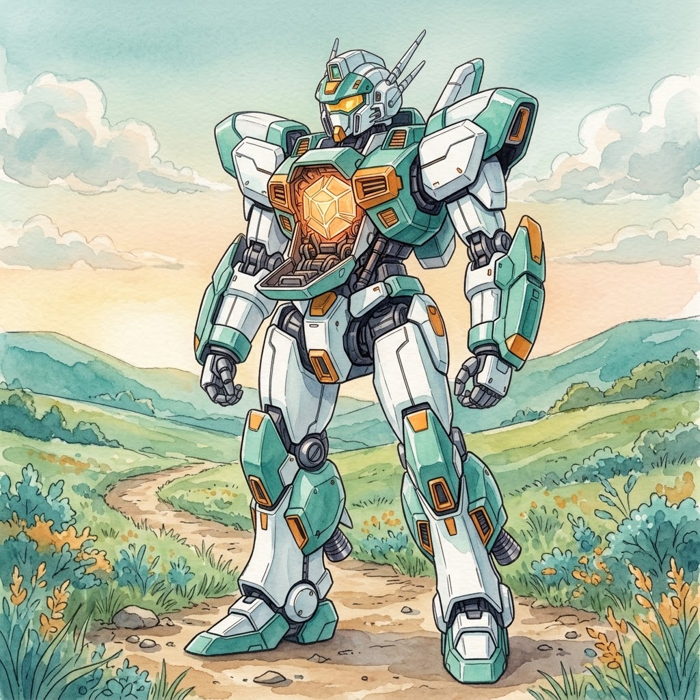
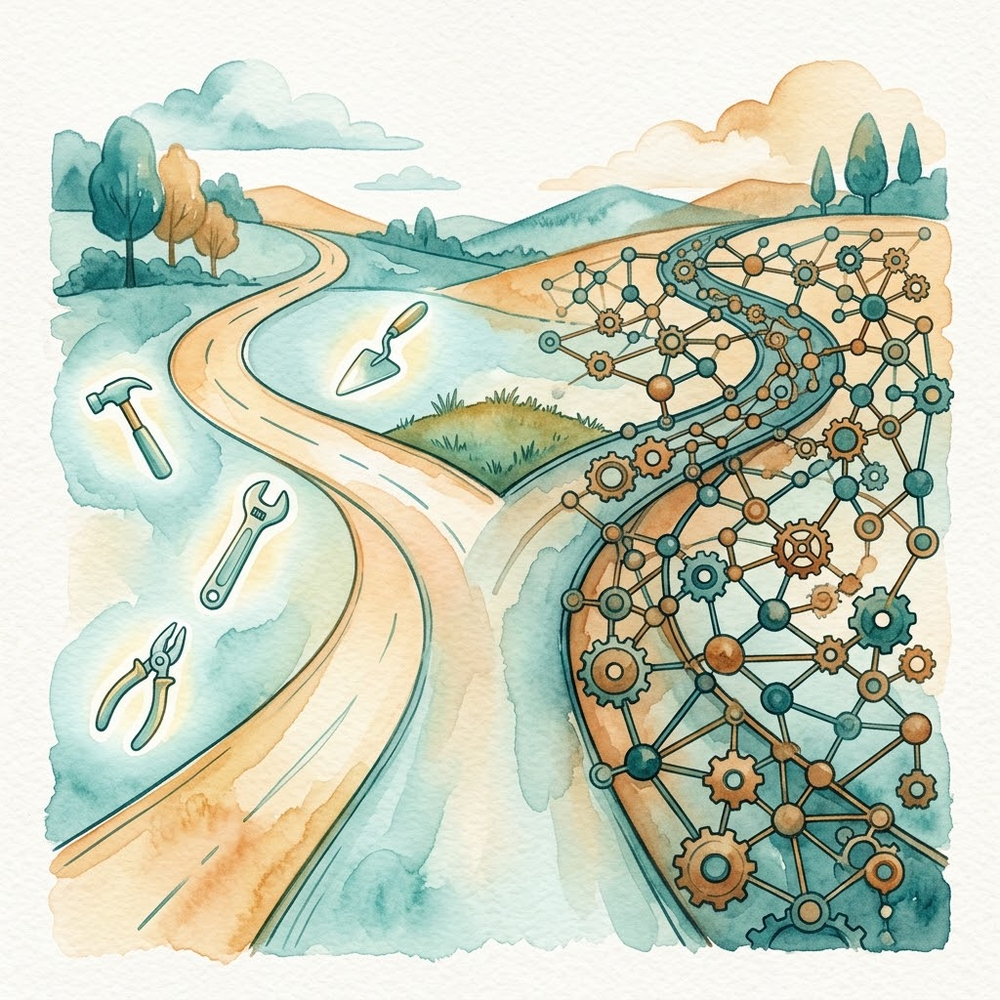

> This is the graduation assessment of the "AI Path: L1→L2 Upgrade Guide" series. Previous post: [Part 5: How Non-Coders Use AI to Write Code](/en/posts/2026/08/ai-path-l1-l2-part5/).

## Graduation Assessment: The L2 Nine-Item Checklist

Seventeen days, from your first API call to a complete pipeline of your own. AI tools and features will keep changing, but don't let that scare you: turning the unchanging methods and ways of thinking into your own capability is the right choice.

Before I call you "graduated," score yourself against this list and tick the ones you can do. Each item comes with a note to help you judge whether you actually pass.

- [ ] **You can register an account with an API provider and get your first reply from a Python request** (Day 0-3). Not just copy-pasting code once. Switch to another provider, another model name, and you can do it again on your own.
- [ ] **You understand token billing, temperature, and context window limits** (Day 0-3). Input and output are billed separately. At temperature=0 the output is deterministic. An overlong context pushes early content out, and you can explain why to someone else.
- [ ] **You have written at least one batch-processing script** (Day 4-7). Read file, call API, write results. It runs on real data, not just test data.
- [ ] **You can describe a task to an autonomous agent** (Day 8). One-sentence goal, constraints listed, expected output made specific. Not a pile of requirements dumped all at once; you know how to break them down and send them one task at a time.
- [ ] **You can use the GCO framework to turn a vague request into clear instructions** (Day 10). Given "help me analyze this," you can break out goal, constraints, and output format, and point out which pieces the original request missed.
- [ ] **You can check AI output with three verification methods** (Day 11). GCO cross-check asks "was it done," invariant checks ask "did anything change," reverse checks ask "where could it be wrong." You know which one fits when.
- [ ] **You can sort a task by "can it be pinned down"** (Day 12). Prompt or script. Writing prompts is judgment work; running them is labor. The criterion works on real tasks, not just on paper.
- [ ] **You can read and modify the four-block skeleton of a skill document** (Day 13-14). Identity, input, output requirements, quality requirements. You know what question each block answers, and how to change one block without breaking the others.
- [ ] **You own a reusable script or skill kit** (the whole series). A picture-book pipeline, a batch translator, anything. It runs, it gets reused, and you can pull it out and modify it when needed.

All checked? Congratulations, L2 is done.

A few unchecked? Go back and patch them. This tutorial is not a read-once-and-throw-away thing; it is your reference manual. Reread the unclear posts with a question in hand. It works better than the first pass.

---

## L2 Closing

L2 was never about how many tools you learn. It is about one thing: **making AI do the work for you.**

API makes it work in batches. Agent makes it plan on its own. Skill makes it reusable. Many tools, one principle that holds: pin down what can be pinned down, and hand the rest to judgment.

Stopping at any level is a capability. Driving does not require building cars. L1 is enough. L2 is enough. L3 is another leap, not a requirement.

---

## Where L3 Heads

If you checked every box above, you can already make AI work for you. But you may have noticed: once the task chain gets long, AI still hallucinates. At that point, tweaking the prompt will not save you. That is the problem L3 sets out to solve.

L3's theme: **from using tools to Harness architecture design.**

Start with an experiment. Anthropic ran the same model with the same prompt ("build a 2D retro game editor") twice. With nothing around it, the model burned $9 in 20 minutes and produced something unplayable. With a full environment around it (planner + generator + evaluator), six hours and $200 produced a game that actually plays. [The model did not change; what changed was the layer around it](https://www.anthropic.com/engineering/effective-harnesses-for-long-running-agents).

That layer is the Harness (the exoskeleton). In [DeepSeek's formula](https://github.com/deepseek-ai/deepseek-harness): **Model + Harness = Agent**. The model is the brain; the Harness is the body. It does not think for the agent; it keeps the agent standing, carrying weight, and getting back up when it falls. How context gets assembled, how tools get called, how errors get recovered, how "done" gets verified: all Harness work.

In L2 I showed how to hand work to AI. In L3 I will show how to constrain the environment AI works in, improving the quality and stability of its output.

### The Core Insight: Harness Beats Prompt

L2 spent a lot of pages on prompting. In L3 you will hit a counterintuitive conclusion: **what decides whether an agent system runs stably is whether the Harness design is sound and rigorous. The influence of Prompt and Skill comes second.**

Prompts are soft. They rely on the AI's "self-discipline." Over long chains, AI drifts, hallucinates, ignores constraints. A Harness is hard. It is enforced by the runtime environment and does not rely on the AI's understanding. A well-designed Harness keeps even a mediocre model stable, while a badly designed one breaks the agent even with the strongest model.

### The Evolution: From Workbenches to Minimalism and Meta-Architecture

L3's first lesson teaches no new concept. It starts by showing you how the industry's understanding of the Harness got to where it is today.

The first generation of Harnesses, the **agent workbenches** represented by Claude Code, Codex, and [OpenCode](https://github.com/anomalyco/opencode), proved that "loop + tools + file system" works. Everything you can do now (writing code with AI, batch jobs, automation) rests on the paradigm the first generation established. But as task chains grew longer, the workbenches showed common pain points: stacked system prompts eating context (bloat), behavior drifting whenever an upgrade rewords the prompts (fragility), permission popups firing until you click "allow" out of habit (performative security). And a subtler problem: over long-running tasks, context piles up and rots, and [corrupted context gradually drifts the goal](https://github.com/walkinglabs/learn-harness-engineering/blob/main/docs/en/lectures/lecture-05-why-long-running-tasks-lose-continuity/index.md). When the AI announces "done" and stops, what it delivers is no longer what you asked for (goal drift).

So the 2026 generation of Harnesses split into two opposite extremes:

- [**Pi**](https://github.com/earendil-works/pi) **(minimalism, subtraction)**: no built-in subagents, no MCP, no plan mode, no built-in todos. The model gets four atomic tools: `read`, `write`, `edit`, `bash`. Everything else is imported on demand through extensions and skills, which is what `.pi/skills`, `.pi/extensions`, and `.pi/prompts` in your project are for. Safety goes to an external container sandbox: the Harness should be thin enough not to disturb the model's own reasoning.
- [**DeepSeek Harness**](https://github.com/deepseek-ai/deepseek-harness/blob/master/docs/architecture.md) **(plugins, addition)**: it proposes the Model + Harness = Agent formula and, built on the Cordis architecture, abstracts models, tools, sessions, and even third-party agents into plugins. The essence of a Harness is defining universal protocols and interfaces that assemble freely across systems.

One subtracts, one adds. L3 plans to walk both routes and break them down for you, one by one.

### The L3 Syllabus

The current plan unfolds in four stages: subtraction, constraints, addition, evolution.

- **Subtraction (demystification):** dissect the agent loop. The core loop is about a hundred lines; the ability to recover from errors comes from the loop structure itself, not from piles of prompts. Then Pi's minimal philosophy: four atomic tools plus an external Docker sandbox. Why bloated prompts and nested plan modes are counterproductive, and why safety needs container isolation instead of a human clicking "allow."
- **Constraints (hardening):** add hard constraints to a minimal Harness, moving from soft constraints (prompt persuasion) to hard constraints (programmatic interception). `AGENTS.md` should be a directory, not an encyclopedia. Lifecycle hooks intercept programmatically before and after tool execution; a linter error gets fed back to the AI so it fixes itself. Day 11's three verification methods are soft verification; L3 adds the hard layer.
- **Addition (extension):** tools and meta-architecture. Where MCP, Pi extensions, and DSH plugins each fit. How to abstract models, storage, sessions, and even another agent into pluggable components, and build a cross-agent collaboration system for your team.
- **Evolution (landing):** state and practice. How three-layer memory is tiered, how tree-structured sessions and checkpoints let a long task resume execution instead of restarting, how token burn gets monitored in real time. It all lands back on a full workflow: **plan, implement, verify, reflect**, each stage backed by a Harness-level mechanism.

The finish line is a graduation project: build a CI/CD automation Harness for your team. Container sandbox isolation, automatic linter interception, and a two-agent setup where one writes code and the other reviews it.

---

Every stage of L3 dissects real products. The planned lineup includes Pi, DeepSeek Harness, Claude Code, and Codex, so your choices rest on analysis, not on following the crowd.

If anything in L2 is still unclear, consolidate first. L3 can wait.

---

*From L0 to L2, you spent over three months. But the real starting point is not graduation day. It is the moment you finish a project with these methods and your self-efficacy goes off the charts.*

---

> This is the graduation assessment of the "AI Path: L1→L2 Upgrade Guide" series. L2 ends here; L3 is on the way.
