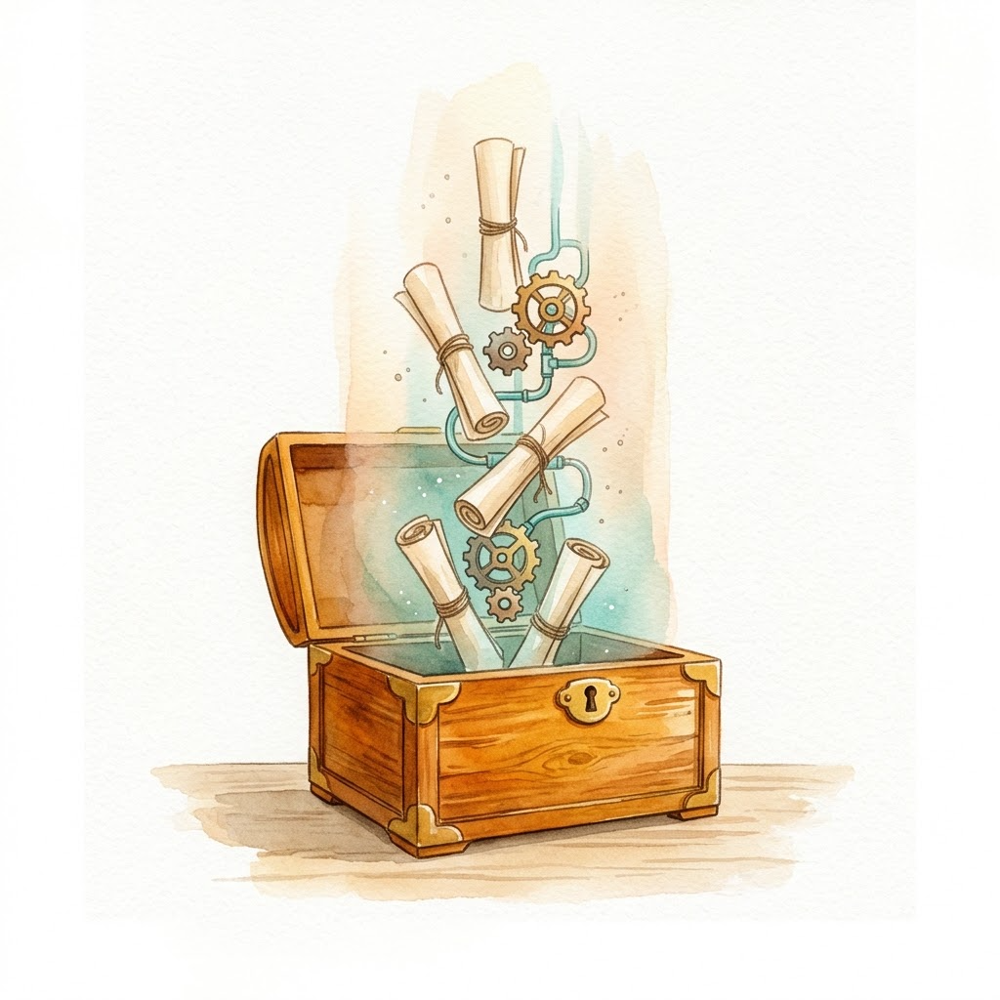

> Previous post: [Day 16: L2 Complete! Next Stop: Harness Engineering Evolution and the L3 Blueprint](/en/posts/2026/08/ai-path-l1-l2-week5-day16/).
> Make sure you have understood or mastered the skills Day 16 covered, and let's start L3 from here.
>
> This is the L3 entry point. Upcoming posts:
>
> | Day | Type | Topic |
> |-----|------|-------|
> | Day 1 | Exercise | Reading the Agent Loop in 120 lines |
> | Day 2 | Core | Contracts and interception: hooks and permissions |
> | Day 3 | Exercise | Building an approval flow with Claude Code hooks |
> | Day 4 | Core | Extensions vs plugins: Pi vs DSH |
> | Day 5 | Exercise | Writing a Pi extension |
> | Day 6 | Exercise | Composing DSH Cordis plugin modes |
> | Day 7 | Core | Agent Teams and task DAGs |
> | Day 8 | Core | Memory and learning: Hermes, Nowledge Mem, EvoMap |
> | Day 9 | Exercise | Designing your own skill system |
> | Day 10 | Wrap-up | L3 graduation check |

---

## Start by Remembering Your Day 4 Script

Think back to Day 4 of L2. In that lesson we wrote a batch script: read files from a folder, call the API on each one, write the results back, and when a step failed, log the error first, then keep going.

At the time it felt like "just calling an API." Look again. That script decided quite a lot: what the model saw each time (how you assembled the prompt), the order of work (file by file), and what to do on failure (log and continue, or stop). **These decisions, outside the model and inside the task, add up to a simple Harness.**

Harness as a verb means to channel and direct: a horse's harness guides the animal's strength toward where the cart should go. In AI, the Harness is the layer that channels the model's capability onto the task. In construction language, it is scaffolding: it lays no bricks itself, but without it workers cannot raise the building correctly, to the design. Here the model is the worker; the Harness is the scaffolding.

The learning goal of L3 is understanding first, then knowing how to choose and build the scaffolding that fits your own tasks.

## A Controlled Experiment: What the Scaffolding Is Worth

In March 2026, Anthropic published the results of a controlled experiment evaluating the same model (Claude Opus 4.5) on the exact same task prompt: "Create a 2D retro game maker with features including a level editor, sprite editor, entity behaviors, and a playable test mode." The results:

The control group without a harness: 20 minutes and $9. The UI looked real, the sprite editor opened, menus worked. But in play mode the game character ignored player input, and digging into the bug showed the model had failed to wire the front-end interface to the game runtime.

The experiment group with a full harness: 6 hours and $200, and this time the result worked: the character moved, jumped, and generated levels.[1]

Time went up 18x and cost 22x, but the output moved from "looks right but unusable" to "actually usable." What mattered was the division of labor the harness defined: three agents, each carrying a different responsibility.

- **Planner**: expanded the one sentence into a 16-feature spec, split into ten steps. We did this work in L2 Day 10: turning "help me analyze this" into clear instructions with the GCO framework. That is planner work.
- **Generator**: built one step at a time against the spec. This is what L2 Days 4-7 covered, having the agent write scripts to do the work.
- **Evaluator**: after each step's code was generated, it ran a round of checks like a real user and filed bugs. This is the output-quality checking L2 Day 11 introduced.

In L2, we had a single agent take on the three roles in sequence. But for more complex tasks, Anthropic runs three independent agents in an alternating loop. **The model is still the same model, but the definition and use of agents changed.**

## What Is a Harness? Three Equivalent Definitions

Now that you have the feel for it, the definitions. Different teams divide up the harness differently, but the goal is the same: the structure and constraints that turn an LLM from a model that talks into an agent that acts.

1. **The DeepSeek formula**: Model + Harness = Agent. The model is the brain; the harness is the body.[2]
2. **Li Bojie's *Deep Understanding of AI Agent***: Agent = LLM + context + tools. Context and tools together form the body of the harness.[3]
3. **The walkinglabs five subsystems**: Instructions (what you tell the model) + State (where the task stands) + Verification (how you check it worked) + Scope (what it may touch) + Lifecycle (how tasks start, pause, and end). This breaks the harness into engineering parts, and nearly every post in this series designs one of those parts.[4]

In one sentence: a harness is the middle layer between a model and a real task. It decides what the model sees, what it can call, how it judges completion, how it recovers from errors, and how context is handed off on long tasks.

After nearly a year of vibecoding, my strongest takeaway is this: model capability stopped being the bottleneck a year ago. The binding constraint on model performance is what happens after the task arrives: which process breaks it down, how the nodes are designed, how agent roles are defined and divided. That is L3's learning goal.

## The Workbench Pattern: Scaffolding Someone Else Built for You

Around 2025, a wave of products turned this middle layer into something ready to use. In L2 I called them autonomous agents; by now, agent workbenches is the better name: a chat window where the model reads files, runs commands, edits code, and asks for permission.

Their value fits in one sentence: the kind of script you used to write by hand, now done automatically by the model (something we experienced in L2).

- **Claude Code**: the first coding agent I used every day. Its core is a loop: the model thinks one step, calls one tool, reads the result, thinks again. That loop plus filesystem access proved the combination works.
- **Codex CLI**: OpenAI's counterpart, later rewritten in Rust, emphasizing sandboxing and approval modes. A sandbox means running the AI in an isolated environment so it cannot touch the rest of your computer.[5]
- **OpenCode**: an open-source alternative, community-driven, multi-model. A modular workbench with plugins and hooks (hooks let you insert your own rules before and after tool execution), not a closed black box.[6]

These products turned something that only chatted into something that ships real work.

## Five Pain Points You Hit in Practice

But the longer I used tools like Claude Code and OpenCode, the more they felt like a sealed magic box. Pi's author, Mario Zechner, wrote a post listing these same issues, and they lined up almost perfectly with my own experience.[7]

**1. Hidden context injection**

The context window is limited, but the workbench stuffs system prompts, tool descriptions, and project conventions into the message context beyond what you write. What gets stuffed in eats window length, yet you cannot see it directly. To figure it out, you would have to monitor network traffic with a tool, capture the outgoing request, compare your input against what was captured, and find the differences. That is not something an ordinary user can do proficiently.

**2. Fragile upgrades**

When defining and implementing workflow skills, we prefer to freeze a proven workflow into a fixed script. Why do this instead of letting the agent improvise every run? Saving money is one reason, but the bigger consideration is that the workbench's internal system prompts and tools can change after a version upgrade. If we supply only a prompt and code is generated on the spot every time, agents in different workbench versions will generate different code, the odds of errors rise sharply, and the completion rate can collapse. These upgrades are usually mandatory: pin the version, and you lose access to better new features and new models.

**3. Bloat**

Feature bloat: you never touch 80% of a workbench's functionality, but you pay for its complexity anyway: more memory, slower startup, and so on. Mario said some tools "turned into a spaceship with 80% of functionality I have no use for."[7] Those features can also inflate the context: the workbench's layered, pre-built prompts occupy much of the context window, leaving less room for your actual task. OpenCode's plugin oh-my-opencode, for example, is known for its heavy system prompt. Even with a model that supports a 1M-token window, measured token burn is higher, and even with a high cache-hit ratio it stays uneconomical. If it can cost less, why pay more? Why not spend it on something else?

**4. Performative security**

Permission popups create a security illusion. Users habitually click "Allow," and the popup turns into process noise, which is why Pi drops permission popups by default and goes straight YOLO. The reason is blunt: a coding agent that can run shell commands is inherently dangerous, and popups do not make it any safer.[7]

**5. Goal drift on long tasks**

Anyone who has vibecoded for a while has hit "finished, but not what I asked for," and on long tasks especially, this kind of drift amplifies more easily: context rots as the conversation grows and early constraints degrade, so the agent quietly drifts from its original objective. When the agent stops and declares "done," the deliverable may no longer match the original request. Anthropic built its long-running harness work around exactly this motivation.[1][8]

These five pains are structural to the first generation's model of designing a harness as a closed black box, so the tools that came after began, step by step, trying to solve them.

## Two Routes: Minimalism and Meta-Architecture

Against the workbench pattern's weaknesses, I have watched two design routes gradually take shape. Both attempts strike me as meaningful and genuinely interesting, so I present them as the two main characters of this series.

### Route one: Pi, minimalism

Pi goes back to the state where you assembled your own script, keeping only a minimal core: no built-in subagents, no MCP (a general protocol for AI to call external tools), no planning mode, no built-in todo list. It gives the model exactly four atomic tools: `read`, `write`, `edit`, `bash` (the command line).[9]

Everything else comes from extensions and skills loaded on demand. The skill here is the same kind of package you built in Day 13: a capability folder with its own documentation. The project-level conventions are `.pi/skills/`, `.pi/extensions/`, and `.pi/prompts/`.[9][10] In one line: keep the core small, make the rest open to user extension.

An interesting detail: OpenClaw's underlying framework switched to Pi after several upgrades. If you have used OpenClaw for more than half a year, have you noticed any difference?

### Route two: DeepSeek Harness, meta-architecture / plugin network

The design is not to ship with built-in features, but to define interface contracts: developers build concrete features against those contracts, and users compose plugins on demand like Lego bricks, assembling their own scaffolding.[2][11]

The official repo ships four sample assemblies for different scenarios: Standard (everyday coding), Code (lets the model orchestrate multiple rounds of tool calls itself), Minimal (only the most basic tools, good for testing), and Creator (inspect the current runtime, test plugins on the fly, combine them into new modes).[2]

## Keep, Drop, Improve

I set what the two routes share against the old pattern, and the new routes' trade-offs come into focus. This comparison is the running thread of the series.

| | Keep | Drop | Improve |
|---|---|---|---|
| Structure | Agent loop, tool calling, session persistence | Hidden context injection, monolithic architecture | Replayable traces, composability |
| Features | Skill / prompt system | Fixed feature sets | On-demand loading, plugins vs extensions |
| Safety | Permission boundaries | Performative popups | Explicit policies, auditable logs |
| Long tasks | Incremental delivery | The illusion of one-shot completion | Task-level checks, context handoffs |

Pi chooses subtraction: shrink the core and push all extras into extensions. DeepSeek Harness chooses addition: turn every capability into a composable, replaceable plugin. The two approaches look opposite, but they share one goal: stop treating a harness as a black box, lay "what is hidden inside" on the table, and let users see it clearly and choose for themselves.

That closes the snapshot of harness engineering up to mid-2026. One caveat: the field is still evolving fast. New work will keep rewriting today's categories, and this tutorial will iterate too, but my goal is to distill whatever stays invariant.

## The L3 Roadmap

This series unfolds in four phases:

1. **Subtraction**: strip the harness architecture to its minimum and understand the essence of the harness's core agent loop (Day 1).
2. **Constraints**: build contracts and interception, understand the harness's logic, and predict its behavior for a given input (Days 2-3).
3. **Addition**: understand the ideas and principles of plugin composition and extend the capability boundary of your agent system (Days 4-7).
4. **Evolution**: give the harness memory, observe its behavior, and understand how the system achieves long-term learning and improvement (Days 8-10).

The thinking behind this design: first see the harness's core, the agent loop (subtraction), which helps you understand why hooks and permission policies must constrain it (constraints). Once constraints are stable and reliable, it makes sense to add plugins safely (addition). And when plugins lift your agent system to complex tasks, you need memory and observation so the system keeps evolving (evolution): ever more efficient, ever more reliable at tasks.

Next post, Day 1, we take a look inside a minimal harness called miniharness. Its core logic is about 120 lines of code. You do not need to write it. The goal is to understand the principle, the way you read a recipe: knowing how the dish is made without having to cook it yourself.

---

## Notes and References

1. Anthropic, *Harness design for long-running application development*, 2026-03-24. Experiment data: Claude Opus 4.5, prompt "Create a 2D retro game maker with features including a level editor, sprite editor, entity behaviors, and a playable test mode." Without harness: 20 min / $9. Full harness (planner + generator + evaluator): 6 hr / $200. Accessed 2026-08-25. https://www.anthropic.com/engineering/harness-design-long-running-apps
2. deepseek-ai/deepseek-harness GitHub repository and official docs. Built on the Cordis kernel; models, tools, sessions, and agents are all abstracted as plugins. Accessed 2026-08-25. https://github.com/deepseek-ai/deepseek-harness
3. Li Bojie, *Deep Understanding of AI Agent*, Chapter 1. Agent = LLM + context + tools. https://github.com/bojieli/ai-agent-book
4. walkinglabs, *Learn Harness Engineering*, Lecture 02. Five-subsystem framework: Instructions + State + Verification + Scope + Lifecycle. Accessed 2026-08-25. https://github.com/walkinglabs/learn-harness-engineering
5. OpenAI, *Unrolling the Codex agent loop*, Michael Bolin. Codex agent loop, Rust rewrite, and approval modes. Accessed 2026-08-25. https://openai.com/index/unrolling-the-codex-agent-loop/
6. anomalyco/opencode GitHub repository. Open-source modular coding workbench with plugins and hooks. https://github.com/anomalyco/opencode
7. Mario Zechner, *Pi: a coding agent that is just right for me*, 2025-11-30. Pi design philosophy, critique of workbench-style harnesses, default no-confirmation stance, "spaceship" metaphor. Accessed 2026-08-25. https://mariozechner.at/posts/2025-11-30-pi-coding-agent/
8. Anthropic, *Effective harnesses for long-running agents*, 2025-11-26. Introduces the initializer agent and coding agent context-handoff pattern. Accessed 2026-08-25. https://www.anthropic.com/engineering/effective-harnesses-for-long-running-agents
9. Pi official docs: *harness.md*. Defines Pi's core constraints: four atomic tools (read/write/edit/bash), triple-store structure, session tree, operation state machine. Accessed 2026-08-25. https://github.com/earendil-works/pi/blob/main/packages/agent/docs/harness.md
10. Pi official docs: *extensions.md*. Auto-discovery directories (`~/.pi/agent/extensions/`, `.pi/extensions/`), tool registration, event subscription, command registration. Accessed 2026-08-25. https://github.com/earendil-works/pi/blob/main/packages/coding-agent/docs/extensions.md
11. DeepSeek Harness official docs: *architecture.md*. Cordis kernel, capability seams, event flow. Accessed 2026-08-25. https://github.com/deepseek-ai/deepseek-harness/blob/master/docs/architecture.md
