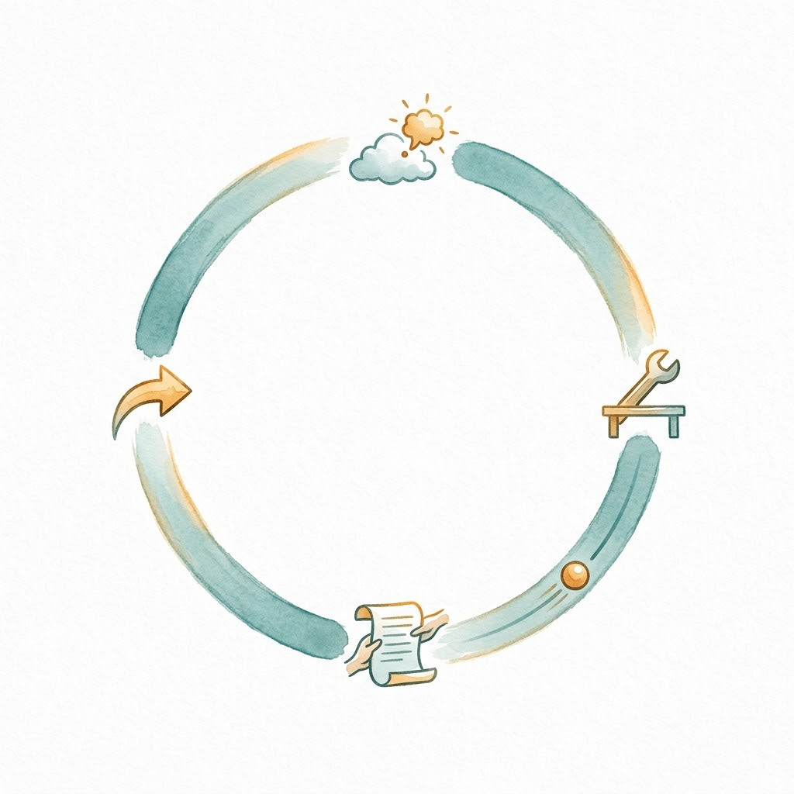

> 上一篇是 [Day 0｜L3 启航：从工作台到极简与元架构的 Harness 演进史](/posts/2026/08/ai-path-l3-day0-harness-evolution/)。
> 确认你已经了解 Day 0 的 Harness 概念和 L2 Day 0-3 的 API 调用后，让我们开始拆 loop。
>
> 本篇是 L3 的练习篇。后续导航：
>
> | Day | 类型 | 主题 |
> |-----|------|------|
> | Day 2 | 骨干 | 约束与拦截：Hooks 与权限 |
> | Day 3 | 练习 | 用 Hook 给 Agent 装审批 |
> | Day 4 | 骨干 | 扩展与插件：Pi vs DSH |
> | Day 5 | 练习 | 写一个 Pi 扩展 |
> | Day 6 | 练习 | 用 DSH Cordis 插件组合模式 |
> | Day 7 | 骨干 | Agent Teams 与任务 DAG |
> | Day 8 | 骨干 | 记忆与学习：Hermes、Nowledge Mem、EvoMap |
> | Day 9 | 练习 | 设计自己的 Skill 系统 |
> | Day 10 | 阶段小结 | L3 毕业考核 |

---

## 为什么是练习篇

上一篇我们看了 Harness 的演进史，从 Anthropic 的对照实验到 Pi 和 DeepSeek Harness 两条路线，得出的结论是：模型之外，那套"引导结构"才是真正决定成败的因素。

看过概念和效果，现在轮到我们自己亲手做一遍：get hands dirty 才能真正理解。本篇就是一次"把手弄脏"的练习，拆开引擎盖，我们来看看 harness 的引擎是怎么转的。

## 顶尖 Agent 的核心只有百行

用 Claude Code 的时候，你可能从没想过它背后做了什么：你的提示词发出去，它读文件、跑命令、改代码，最后交给你一份东西，整个过程是一个黑盒。

本篇带着你打开这个黑盒，不用害怕自己看不懂，这个核心逻辑的代码比 L2 Day 4 我们写的那份批量脚本也长不了多少。

## 拆解 miniharness：120 行核心代码

今天拆解的对象是 `tljcpa/miniharness`，这是一个专为实证研究设计的最小 Harness[1]，规模极小但结构完整。

核心 `agent.py` 包含文档字符串共约 240 行，其中实际逻辑大约 120 行，配套有 7 个"朴素的工具"：`read_file`、`write_file`、`edit_file`、`list_dir`、`run_command`、`grep`、`finish`[1]；没有 MCP，没有计划模式，没有子 Agent。

miniharness 的作者总结了一个组合公式：`Agent = Provider × ToolFormat × ToolRegistry × Context × UI`。Provider 是模型接口、ToolFormat 是工具调用格式、ToolRegistry 是工具注册表、Context 是上下文管理、UI 是用户界面，这五个维度自由组合，就能搭出不同的 Agent。

把 loop 逐段拆开，每行都对应一个已学概念：

```python
def agent_loop(context, provider, tools):
    while True:
        response = provider.chat(context)         # call the model once
        tool_calls = response.tool_calls           # get the tool call list

        if not tool_calls:                         # exit condition: no tool calls
            return finalize(context)               # exit via finish or end_turn

        for call in tool_calls:
            name = call.name
            args = call.arguments
            result = tools[name].execute(**args)   # run the tool, catch exceptions

            context.append({                       # append the result to context
                "role": "tool",
                "tool_call_id": call.id,
                "content": result.output,
                "is_error": result.is_error,
            })
```



`provider.chat(context)` 就是 L2 的 API 调用；`if not tool_calls` 就是退出条件；`context.append(result)` 就是上下文累积。每一行都不是新概念，只是把 L2 学到的东西换了个名字，放进了一个循环。

剩下的几千行都是结构和约束，那是后面几节课的事。

## 三个反直觉的实验发现

miniharness 的仓库里有一次消融实验的记录：固定模型（DeepSeek-Chat）、固定任务（写 FizzBuzz 并验证），只换工具调用格式（`native_json` / `xml` / `prompt`），每种格式跑一次[1]，结果里有几个反直觉的发现。

**发现一：loop 可实现自动纠错。**

直觉上，"从错误中恢复"应该是 harness 专门写代码实现的功能：重试机制、错误分类、恢复策略。miniharness 里这些一行都没有。

在 smoke test（greet.py）里，模型走了 5 步，消耗 7,883 token，成本约 0.01 美元：step 2 遇到 `python: not found`（return_code=127），step 3 模型自发执行 `which python3 || which python` 探测，step 4 改用 `python3` 成功。

同样的恢复模式在 fizzbuzz 消融实验中第二次出现：这次模型直接改用了 `python3`，一步到位。

机制很清晰：`ToolRegistry.execute` 捕获所有异常，以 `is_error=True` + traceback 回灌上下文；若让异常冒泡，loop 直接崩溃，恢复无从谈起；错误处理在这里就是 loop 架构本身的功能，Day 3 我们会展开，讨论与之相关的 Back-Pressure 机制。


**发现二：Harness 的 "success" ≠ 任务成功。**

直觉上，harness 报告 `status: OK` 就是任务完成，可以信。

三次运行 harness 全判 OK，但读轨迹发现两种偏离：

- `xml` 格式：模型 2 步就退出，声称"我知道 FizzBuzz 是对的"，但从未运行脚本，没有验证任务是否完成。
- `prompt` 格式：模型 2 步运行并验证了输出，但没有按指令调用 `finish`，靠 end_turn 退出。
- 只有 `native_json` 格式（4 步）完整完成。

两次运行的偏离方式不同、程度也不同，这意味着 loop 之上需要任务级检查器。我在 Aristotle 项目里踩过的"审核断裂"的坑就是同根因的生产级版本：看懂 `task()` 子会话非交互式的 loop 行为后，我才定位到结构性缺陷（[复盘全文](/posts/2026/04/from-scars-to-armor-harness-engineering-practice/)）。[Aristotle](https://github.com/alexwwang/aristotle) 的四阶段 loop（Coordinator→Reflector→Review→Checker）也是一种 harness，感兴趣的话可以作为扩展阅读。

**发现三：token 消耗的主因是轮次。**

直觉上，厂商原生支持的结构化调用（`native_json`）是"正道"，应该比往 prompt 里塞 XML 或文本约定更省 token。实际数据反过来了：`native_json` 6,618 token / 4 步 vs `xml` 3,188 / 2 步 vs `prompt` 2,966 / 2 步，换算一下，native_json 的消耗是另外两者的两倍出头。原因是多 2 轮带全量上下文的往返，每多一轮，整个上下文就要原样重发一遍，步骤数比格式开销更影响成本；三次总成本 0.0041 美元（12,019 prompt + 753 completion token，按 $0.27/M + $1.1/M 定价）[1]。

需要说明的是：每组实验只跑了一次（n=1），仓库 README 明确写着「差异小于 2× 视为噪声」，这次的「两倍出头」刚在噪声线上，而且 xml 那次是早退未验证的混淆变量：若强制验证，它的 token 消耗可能追平；所以准确的说法是「发现」，不是「证明」：仓库自述「统计意义上成立的发现：0 个」，上面三个发现都是单样本的定性观察。

但这给了我们方向性的启发："没有恢复代码却能自我恢复"，观察到一次就证明这条路径存在；"每多一轮就重发全量上下文"是 API 计费结构决定的，虽然跑一轮我们无法确定 2.2倍的 token 消耗量是否稳定，但这启发我们设计harness不能忽视对话轮次的成本影响。你可以把代码 clone 下来，跑十次自己验证，这正是练习篇留的作业。数字会波动，但三个发现背后的判断方向不会变：排障先怀疑 loop 结构，别信 harness 自报的完成状态，优化成本先考虑减循环步数再抠格式。


## 动手：跑一遍 smoke test

clone miniharness 仓库，配好 API key，跑 smoke test：

```bash
git clone https://github.com/tljcpa/miniharness
cd miniharness
uv venv && source .venv/bin/activate
uv pip install -e ".[dev]"
cp .env.example .env   # edit .env, set DEEPSEEK_API_KEY=sk-...
python scripts/smoke_test.py --provider deepseek
```

配套教学脚本 `mini_loop.py` 和执行说明在文章目录的 `code/` 子文件夹下（[GitHub 上的 code/ 目录](https://github.com/alexwwang/blog-chuanxilu-net/tree/master/content/posts/ai-path-l3-day1-miniharness-agent-loop/code)），随博客仓库一起发布，git clone 即可在本地运行。

观察点清单：

- 每步的上下文是怎么变化的：看 `context` 数组的 append
- 工具结果怎么回灌上下文：注意 `is_error` 字段
- loop 在哪步退出：看 `tool_calls` 何时为空

延续 Day 0 看菜谱的比喻：不需要立刻会写，目标是理解原理。

## 两个进阶方向

如果希望了解的更深入，可以考虑以下两个方向：

读懂真实产品：Pi 的核心包，一个下午读完，真实产品的 loop 也没比这个复杂多少[2]。

亲手造一个：《动手学 Pi》（pi-textbook），15 个可运行 checkpoint，跟着做完就懂了[3]。

延伸阅读：Thorsten Ball 用约 200 行 Go 从零搓一个 Agent 的指南[4]，以及 Hugging Face 的 smolagents 文档[5]，同一个极简哲学的另外两个实现。

## 今日收获

今天的热身课程，我们主要讨论了以下三个重点：

1. 逐行解释 miniharness 的核心 loop。
2. 理解实验的三个发现。
3. 上下文工程的最佳实践：新增对话内容追加到上下文尾部（为什么？Day 3 讲透，和 KV 缓存有关）。

理解了 loop 做什么之后，要看到这 120 行其实什么都能干，但真正的工程不能这么奔放，下一篇 Day 2 我们看看 Pi 怎么给它建立边界。

---

## 参考资料

1. [tljcpa/miniharness：最小 Harness 实证研究仓库（消融数据见 `experiments/results_v0.md`）](https://github.com/tljcpa/miniharness)
2. [Pi 官方 GitHub 仓库](https://github.com/earendil-works/pi)
3. [hahhforest：Pi Textbook（动手学 Pi）](https://github.com/hahhforest/pi-textbook)
4. [Thorsten Ball：How to Build an Agent](https://ampcode.com/how-to-build-an-agent)
5. [Hugging Face：smolagents 文档](https://huggingface.co/docs/smolagents/en/index)
