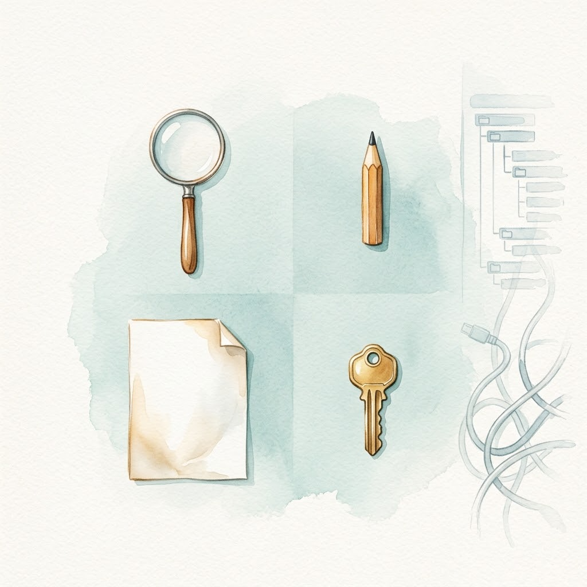
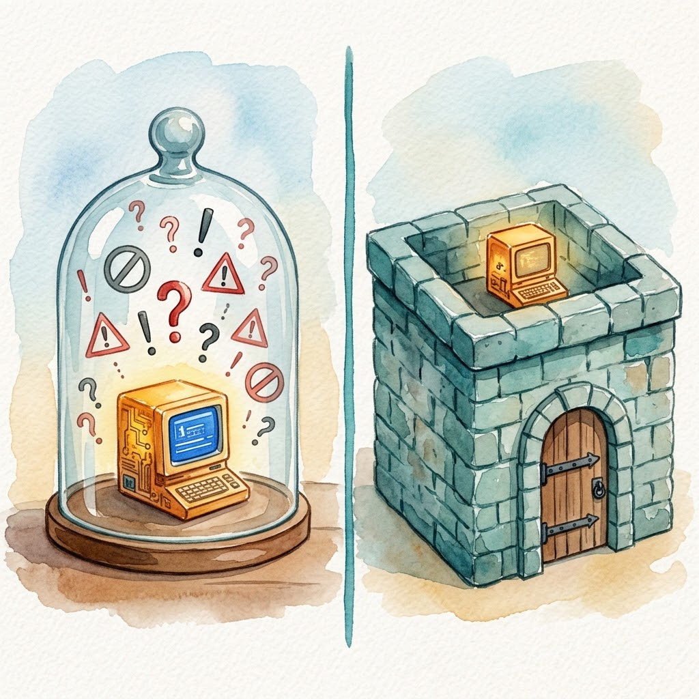

> Previous post: [Day 1 | 120 Lines to Understand the Agent Loop: miniharness Teardown and 3 Counterintuitive Findings](/en/posts/2026/09/ai-path-l3-day1-miniharness-agent-loop/). Now that we understand the loop's core structure, let's ask a more fundamental question: of the remaining thousands of lines, what belongs and what doesn't?
>
> This is an L3 core lesson. Upcoming navigation:
>
> | Day | Type | Topic |
> |-----|------|-------|
| Day 3 | Core | Hard constraints in the Harness: static contracts and lifecycle hooks |
> | Day 4 | Exercise | Rewrite your AGENTS.md + add an interception hook |
> | Day 5 | Core | Tools as interface: three extension paths |
> | Day 6 | Exercise | Give your Agent a new tool |
> | Day 7 | Core | Meta-architecture: Everything is a Plugin |
> | Day 8 | Core | Memory, traces, and observability |
> | Day 9 | Exercise | Capstone: build a team-level CI/CD automated Harness |
> | Day 10 | Wrap-up | L3 graduation assessment + Harness future trends |
>
---

## Why "More Features" Is a Reverse Optimization

In Day 1 we dismantled the loop, showing that the core logic takes only about a hundred lines; the remaining thousands consist of structure, constraints, tools, permissions, and planning modes—all the extra capabilities designed to let Agents "do more things."

Intuition says more features mean a stronger Agent. But experience says the opposite: **each additional feature muddies the model's decision space a little more.**

Start with context. OpenAI proposed the "context scarcity thesis" in their Harness Engineering article: context is the most expensive bottleneck resource during model inference, and the multi-layer pre-built prompt logic embedded in workbenches crowds out useful task space[7]. Every unnecessary line of system prompt compresses the Agent's room to think.

Or take planning mode. It offloads the model's planning ability to a fixed workflow: the Agent writes a plan first, then executes it. Sounds reasonable, but the effect is that the model gets dumber. Planning output gets locked into a template; the model no longer needs to make decisions at each step, only to mechanically fill in the format. Decision space is compressed, creativity is outsourced.

Pi's author, Mario Zechner, is blunt about older-generation workbenches, describing them as spaceships where 80% of the features go completely unused, yet every update alters system prompts and tools, breaking existing workflows in the process[4]. Feature inflation and context inflation lead to the same bill: every bit of unused complexity costs you twice, first by increasing your cognitive load, and second by eating into the context window fed to the model.

## Pi's Answer: Keep 4 Tools and Extend the Rest

Pi takes the opposite approach by retaining only four atomic tools and cutting everything else.

- `read`: read file contents
- `write`: write new files
- `edit`: edit existing files
- `bash`: execute shell commands

Need more capability? You can import what you need on demand using three project-level directory conventions: .pi/skills, .pi/extensions, and .pi/prompts[1].

This follows the Unix philosophy to the letter: each tool does one specific job, yet through simple composition, you can build arbitrarily complex workflows. Instead of a bloated "general-purpose text processing tool," you get `cat`, `grep`, `sed`, and `awk`.

This design brings three direct benefits. **Transparency:** nothing secretly modifies context behind your back. **Debuggability:** when something breaks, you trace layer by layer. Did a tool fail, did an extension fail to load, or was the prompt ineffective? **Portability:** no lock-in to any specific model or platform; as long as it supports the base API, it runs.

Day 1's miniharness was already practicing this principle with its seven basic tools, lack of MCP or sub-agents, and built-in self-recovery loop. Pi is the same approach scaled to a product.

If you want to feel the difference yourself, try running the same task on both a feature-bloated traditional Harness and on minimal Pi, then compare execution speed and context usage.

## Popups Are Not Security: A Critique of Performative Safety

When you write code with Claude Code, sensitive commands trigger frequent permission popups—whether it's `run_command: rm -rf /tmp/build` or `run_command: npm install`. By the third prompt, most developers click "Allow" automatically without reading the content[8].

The problem isn't the popup itself; it's your habit. When popups appear frequently enough, your brain filters them as noise and eventually they become reflexive clicks.

Pi's author acknowledges this reality directly: a coding agent with bash access is inherently dangerous. Permission popups provide "psychological safety" rather than true security, so Pi bypasses popups entirely in favor of direct execution[4].

OpenAI's Codex CLI offers a three-tier approval model, more granular than Claude Code's single-layer popup[6]. Still, the problem is the same: security decisions happen when you're tired, and nobody makes careful decisions when tired.

Permission popups are like having to ring a doorbell every time you enter your own house, annoying enough that you eventually leave the door unlocked. A sandbox, by contrast, builds a secure perimeter around the property: you can move freely inside without ringing a bell, but you cannot step outside the yard.

A boundary must be stated here: **the critique above applies only to coding/personal scenarios.** Coding scenarios share three traits: actions are reversible (git can roll back), sandboxes provide a backstop, and the user is a knowledgeable operator. Under these conditions, permission popups become performative safety. But for irreversible business actions (payments, sending client emails, modifying production databases), approval is real control, even a compliance requirement; there is no "performance" problem. Enterprise business security strategies will be covered in L4.

## The Right Security Model: Build the Wall Outside, Not Popups Inside

Pi chose the external hard-isolation route: the Harness itself handles no permission management; permissions are the responsibility of external containerization. Common implementations include Gondolin (micro-VM approach), Docker (generic container isolation), and OpenShell (containerized secure execution environment)[4]. Pi itself ships no sandbox; the container is an external tool. That separation of responsibilities is deliberate.

The core distinction comes down to where boundaries live: Are constraints enforced outside the Harness (process-level hard isolation) or inside it (application-level prompt popups)?

But external containers aren't the only answer. For the same goal of Agent safety, DeepSeek Harness (DSH) chose a different division of labor: it doesn't depend on external containers, instead defining a set of pluggable capability seams inside the Harness, where sandbox and approval policy are both interface-layer plugins[5]. This approach is closer to tool-call interception.

While L2 relies on file-level isolation (testing on copy-on-write files), L3 wraps the entire Agent runtime inside a container so that all system calls and side effects remain strictly confined within the process-level boundary.

Pi and DSH share a common premise: **security cannot rely on popup negotiation; it must rely on mechanism.**

## Three Paths Forward

- Study a production codebase: you can read through the core Pi package in a single afternoon. The loop inside isn't much more complex than miniharness[1].
- Build your own: *Pi Textbook* (pi-textbook), 15 runnable checkpoints. Follow along and you'll understand[2].
- Extended reading: dg-ai-notes, 10 chapters of source code walkthrough (TypeScript + Python dual-version comparison, 30+ illustrations), plus a notebook where you can step through an Agent Loop experiment with adjustable parameters[3].

## Today's Takeaways

Today we covered three conclusions:

1. Why more features muddy the model's decision space: the context scarcity thesis and reverse optimization of planning mode.
2. Pi minimalism's substance is responsibility separation: 4 atomic tools + external hard isolation.
3. Security cannot rely on popup negotiation, only on mechanism enforcement: the applicability boundaries of hard isolation vs. built-in interception.

We've done enough subtraction, but "thin" doesn't mean "naked." Next up, Day 3: we'll see how to add hard constraints to a minimal Harness, not through popups, but through contracts and interception.

---

## References

1. [earendil-works/pi: Minimalist coding Agent official repository](https://github.com/earendil-works/pi)
2. [hahhforest: Pi Textbook (Learn Pi by Doing)](https://github.com/hahhforest/pi-textbook)
3. [buchidonggua/dg-ai-notes: Pi Source Code Walkthrough and Experiment Field](https://github.com/buchidonggua/dg-ai-notes)
4. [Pi Design Philosophy Original: Mario Zechner's Blog](https://mariozechner.at/posts/2025-11-30-pi-coding-agent/)
5. [DSH Architecture Documentation](https://github.com/deepseek-ai/deepseek-harness/blob/master/docs/architecture.md)
6. [OpenAI: Unrolling the Codex agent loop](https://openai.com/index/unrolling-the-codex-agent-loop/)
7. [OpenAI: Harness engineering](https://openai.com/index/harness-engineering/)
8. [Claude Code Permissions Documentation](https://code.claude.com/docs/en/permissions)
