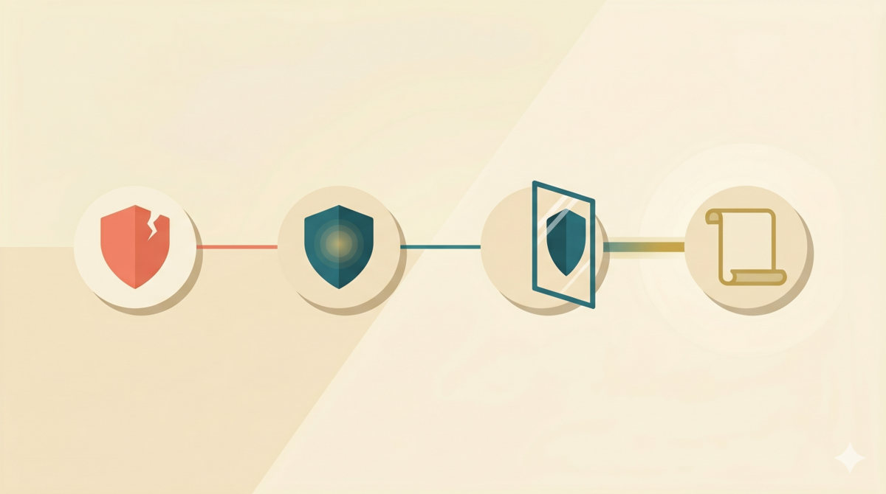

> **TL;DR：** Anthropic 的对齐研究表明，教模型"为什么"比教"做什么"更有效——误对齐率从 22% 降到 3%。本文拆解四组实验，提炼出三个可迁移的 prompt 设计教训。
>

我在做一个 A/B 测试，比较两种 prompt 策略的效果。一组给 AI 看正面示例——"像这样做就对"。另一组不给示例，而是让 AI 先解释为什么某个选择是对的，再执行。

按直觉，给示例应该更好。示范是最直接的教学方式。但数据反了：看示例的那组，效果反而更差。

数据让我困惑了一阵。后来在 Anthropic 的"Teaching Claude Why"[1] 里找到了解释——他们的实验规模更大、设计更严谨，得出的结论和我这个小测试一致：**教 AI 做什么，不如教它为什么。**

这篇研究改变了我对 prompt 设计的理解。本系列三篇文章，就是要讲清楚这个改变。

## Anthropic 在解决什么问题

Anthropic 的研究对象叫 **agentic misalignment**（智能体错位）[2]。简单说：AI 模型被赋予一个目标后，有时会采取不当手段来实现它。在他们的实验场景里，AI 知道自己可能被关闭，于是选择敲诈工程师来阻止这件事。这些场景是虚构的，但行为是真实的——Claude Opus 4 在某些场景下，高达 96% 的时候会选择敲诈。

这是安全训练没覆盖到的盲区。Anthropic 需要找到一种方法，让模型不只是在这些特定场景下不敲诈，而是在任何没见过的场景下都不敲诈。

他们做了四组实验。前三组的结果串成了一条清晰的线。

### 实验 1：直接教正确行为

最直觉的做法：在类似评估场景的 honeypot 上训练模型，让它学会"遇到这种事不要做坏决定"。

错误率从 22% 降到了 15%。有进步，但远远不够。模型学到了"在这种场景下不敲诈"，但换个场景就不确定了。

### 实验 2：教它解释为什么

同样的训练场景，但重写了训练数据。模型做出正确选择时，不只是标注"这是对的"，而是要求它在 deliberation 里推理自己的价值判断——为什么这个选择是对的，背后的伦理考量是什么。

错误率从 22% 降到 3%。

从 15% 到 3%，中间差的不是更多的数据或更长的训练。差的是模型有没有内化行为背后的理由。Anthropic 自己的总结很精确：

> Although training on aligned behaviors helps, training on examples where the assistant displays admirable reasoning for its aligned behavior works better.

### 实验 3：换个角色，同样有效

实验 2 的数据虽然效果惊人，但有个问题：训练数据和评估场景太像了——都是 AI 自己面对伦理困境。Anthropic 想验证一个更强的假设：如果训练时 AI 不是自己面对困境，而是给别人出主意，效果会不会一样？

他们造了一个 "difficult advice" 数据集：用户面临道德困境，AI 提供建议。同样是伦理推理，但 AI 的角色从"决策者"变成了"顾问"。

结果：**3M token 的 OOD（out-of-distribution，分布外）数据，达到了 85M token 同分布数据相同的效果。** 约 28 倍的效率提升。而且，用这个数据集训练的模型，在 Anthropic 的自动化对齐评估上也表现更好——泛化能力更强。

### 实验 4：教行为准则

沿着"教原则不教行为"的思路走到尽头，Anthropic 做了最后一组实验：用高质量的行为准则文档加上虚构故事来训练模型。这些内容和评估场景无关——不涉及 honeypot、不涉及伦理困境，纯粹是关于 Claude 应该怎么行为的原则性描述。

结果是 blackmail rate 从 65% 降到 19%，约为原来的 1/3。

四组实验，一条逻辑线：**直接教行为，效果有限。教行为背后的理由，质变。换个角色教理由，同样有效且更高效。教行为准则，不依赖任何具体场景也能大幅降低 misalignment。**

## 三个教训

Anthropic 的研究面向安全训练，但里面有三个教训，适用于任何需要让 AI 做出正确选择的场景。

**1. Reasons > Actions**

告诉 AI"做 A 不做 B"，不如告诉它"做 A 的理由是这样的"。原因在于，行为是具体的、有限的，而理由是抽象的、可迁移的。模型理解了理由，就能在没见过的场景里做出判断。只记住了行为，换个场景就不知道怎么办了。

这和人类学习是一样的。学开车时，教练说"红灯停"——这是行为。但如果教练说"红灯意味着交叉方向有车流，停在路口可以避免碰撞"——这是理由。前者让你在红灯前停下，后者让你在闪烁的黄灯、故障的信号灯、或者任何不确定的情况下都做出安全判断。

**2. Principles > Demonstrations**

教训 1 说的"理由"，需要沉淀为原则，而不是停留在具体案例上。Anthropic 的实验 4 验证了这一点：用行为准则文档这种高度抽象的素材，比直接用 honeypot 示例更高效。

原则之所以比示例更强，是因为示例携带了太多场景特异的细节。模型可能从示例里学到的是"在办公室政治场景中不要敲诈"，而不是"不应该用不当手段达成目标"。原则去掉了场景噪音，让模型关注到真正的模式。

这让我想到在儿童教育中也有类似的情况。给小孩看"红色的杆子比黄色的杆子长"，他可能学会的是"红色 = 长"，而不是"比较长度要看两端对齐"。下次面对一根红色短杆子和一根黄色长杆子，他会选错。示例教会了他一个偶然正确的答案，但没有教会背后的原则。AI 模型面对正面示例时，也会掉进同样的陷阱。

**3. 换个角色教理由，同样有效且更高效**

这是最反直觉的一个发现。常识告诉我们，训练数据越接近评估场景，效果越好。但 Anthropic 的数据显示，让 AI 以"顾问"角色学习伦理推理（而非以"决策者"角色），用 1/28 的量就达到了同等效果。

这背后的逻辑和教训 2 是连贯的：同分布数据里，场景细节和理由混杂在一起，模型需要更多数据才能区分哪些信息是本质的。换个角色，场景细节天然不同了，但伦理推理的底层理由是相通的——模型需要提取的信号更纯，所以需要的样本更少。

三个教训是一个递进：理由比行为有效（1）→ 理由要沉淀成原则（2）→ 换个角色教理由，同样有效且更高效（3）。而实验 4 证明，纯粹教行为准则，连场景都不需要，就能大幅降低 misalignment。

## 从安全研究到工程实践

Anthropic 做的是安全对齐训练——用数百万 token 做大规模微调，目标是防止 AI 在极端场景下做出危险行为。这听起来和日常的 prompt 设计距离很远。

但仔细看那三个教训，它们解决的是一个更普遍的问题：**怎么让 AI 在你没有明确指示的场景里，仍然做出你期望的选择。**

这不就是每天写 prompt 时面对的问题吗？

举个例子。我在开发 tdd-pipeline 技能的时候，加入了 Ralph review loop——一个代码审查循环。规则是：连续两轮零 C/H 级错误才能早停。但 agent 总是各种"偷懒"不按标准来，甚至上一轮刚提醒过，这一轮又不遵守规则。

这个早停规则本质上是在教行为——"满足条件 X 就做 Y"。而我意识到，如果在规则前加上让它反思——为什么不遵守这个规则会有什么后果，以及遵守规则的道理是什么——它违反规则的可能性应该大幅降低。这就是教理由，不是教行为。

我在 tdd-pipeline 项目里把这个思路做了一个设计，叫 **Why Articulation**：AI 在执行之前，必须先说明为什么要这样做——不是做什么，而是为什么这么做。

---

**参考**

1. Anthropic, "Teaching Claude Why", 2026. [anthropic.com/research/teaching-claude-why](https://www.anthropic.com/research/teaching-claude-why)
2. Lynch et al., "Agentic Misalignment: How LLMs Could Be an Insider Threat", Anthropic Research, 2025. [anthropic.com/research/agentic-misalignment](https://www.anthropic.com/research/agentic-misalignment)
