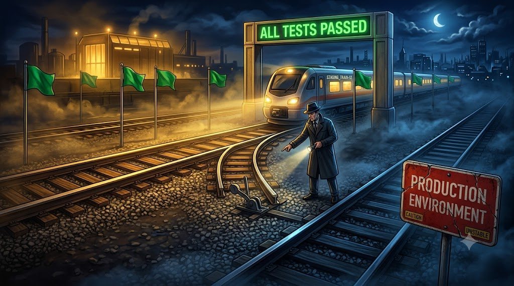

## Prologue: 1,754 perfect green lights

Late on the night Aristotle v1.6.0 was shipping, the team watched the test panel.

Green indicators lit up like dominoes. Python side: 1,166 assertions. TypeScript side: 588 checks. Total: 1,754 automated test cases. All green.

In code terms, that's cameras and infrared sensors on every wall. A fly couldn't sneak through without setting off alarms. The team leaned back. The system looked like an iron fortress.

They didn't know a ghost was already inside the castle.

## The detective arrives, and the victim that wasn't there

To be safe, the team brought in an independent code reviewer. Call him Oracle. He had a peculiar habit: he never looked at the green test reports. He only read the code itself.

Oracle walked the castle, tapped a wall, and made his diagnosis: "Your tests catch every bad guy you expected. They miss the blind spots you couldn't see."

A few hours later, he had pulled **6 hidden bugs** out of a system everyone thought was clean. The best one was a double agent that had fooled the automated tests completely.

## The double agent: when right answers come from wrong reasons

There was a guard at the castle gate called `_should_return_result`. It had a clever design, maybe too clever:

* **In test mode (drill environment):** it was lenient. It handed out passes and logged results.
* **In production (real battlefield):** it turned strict. It threw exceptions on any anomaly.

Sound good? Drill is drill, combat is combat. But this double standard dug a trap in the dark.

Oracle followed the guard's output to the counter, the logic that tallies failures. The counter had a rigid rule: it only recognized one kind of failure, and that was the guard raising the alarm and making a capture.

**The chain reaction unfolded:**

In test mode (drill environment), an anomaly occurred that should have been intercepted. But the guard was on its lenient setting. It didn't raise the alarm. Instead, it quietly issued a pass marked "anomaly" and let the request through.

The counter's blind spot: the counter looked up, saw no alarm had been raised, and dutifully recorded: "All clear, no failures."

The absurd outcome: the automated test saw the counter's report reading "no failures" and happily declared: test passed! The test saw a green light, but for the wrong reason. It mistook an "unflagged隐患" for "system healthy."

Think of it as a military drill gone absurd. To make record-keeping easy, command decided that soldiers hit by simulated fire wouldn't leave the field. They would carry a "hit card" and keep marching. The counter only counted soldiers carried off the field. Nobody was carried off, so the report read: "Zero casualties. Mission success."

But in real combat, the same anomaly triggered the guard's strict mode. It raised the alarm, and the counter, seeing the alarm, classified every legitimate request as a failure.

Because drill rules and combat rules run on separate tracks, the 1,754 automated tests only participated in the self-deceiving drill. They could never reach the scenario where this absurd contradiction appeared.

---

Let's turn our attention to the other cases Oracle caught.

The original report listed five more bugs Oracle found across the castle. None are as mind-bending as the double agent, but each one shows how automated testing can be fooled by its own assumptions.

## Bug 2: The impostor on the wrong path

The Python environment has a rule: when you import a package, you follow the official path.

Someone wrote `sys.path.insert` as a convenience. It's like sticking a handwritten sign on the supply room door that redirects traffic.

**The problem:**

If the real environment already has an official package with the same name, `sys.path.insert` jumps the queue. The system picks up the impostor package instead of the real one.

Tests passed because the test environment only had one copy of everything. In a real deployment, with dependencies layered in, the system would grab the wrong package at the wrong time. Oracle spotted this path-shading trick immediately.

## Bug 3: The traveler who can't adapt

This bug was a relative path, hardcoded to a specific working directory. It was a guide who relied entirely on familiar surroundings.

In the drill (test environment), everyone worked from the same office (the current working directory, CWD). The guide sent maintenance workers to fix things and always found the right spot. Tests passed.

**In production:**
Problems could appear anywhere — on the roof, in the basement. The guide still sent workers "three steps forward then left" based on office memory. The workers either couldn't find the pipe to fix, or fixed the wrong thing and brought down the security system.

Tests proved it worked in the office. They didn't prove it could survive outside it.

## Bug 4: The erased Agent 0

This one had dark comedy written all over it.

The system had a common defense: if a task has no `run_id`, assign a default. In Python, a common way to write this is `run_id or DEFAULT`. It reads like English: "if there's no ID, or the ID is invalid, use the default."

Here's the catch: in Python, `0` is falsy. The number zero evaluates to "nothing."

**So this happened:**

A legitimate task with `run_id=0` walked up to the guard. The guard decided `0` was invalid, threw it out, and replaced it with `DEFAULT`.

The Agent 0 task vanished from the system. No one could find it.

Why didn't the tests catch this? Because when writing test cases, everyone naturally picks `run_id=1` or `run_id=100`. Nobody thinks to test "what if the ID is zero." The tests covered all the common numbers. They made zero a blind spot. Oracle stared at that `0` for a long time.

## Bugs 5 and 6: The invisible branch and the zombie code

Two bugs for the price of one.

The team had added a fallback path for an extreme production scenario. They thought it would probably never trigger, so they wrote **no tests for it**. It was a secret tunnel leading straight to the core room, never inspected.

Meanwhile, in another corner, dead code from years ago was still lying around. Nobody dared delete it. Nobody knew if it still ran.

Oracle pulled both out. The team's faces went red. All 1,754 tests were marching on the main roads with floodlights. These two dark corners had never seen a single beam.

## Epilogue: Perfect isn't the goal

Story over. If you were the team lead watching Oracle pull out 6 hidden assassins, you might be thinking: fire the engineer who wrote the tests?

Hold that thought. Before Oracle left, he stopped the manager who was reaching for the firing button.

> "Don't blame the tests. Without those 1,754 automated guards holding the gates, without them catching every routine intruder, I wouldn't have walked into a castle with 6 hidden assassins. I would have walked into 60 rioters, or 600. And I never would have found the double agent. I never would have noticed Agent 0."

Tests cover **known risks**. Code review catches **unknown logic gaps**.

Neither can be missing. That's how the castle stays secure.
