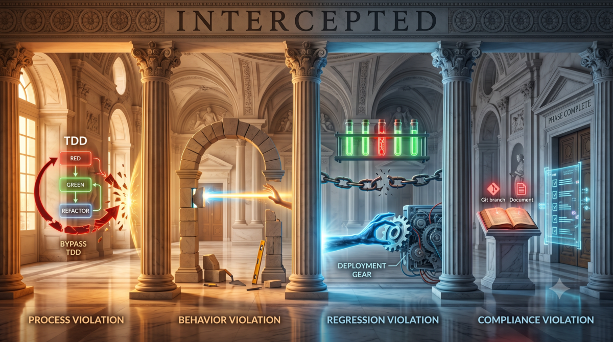
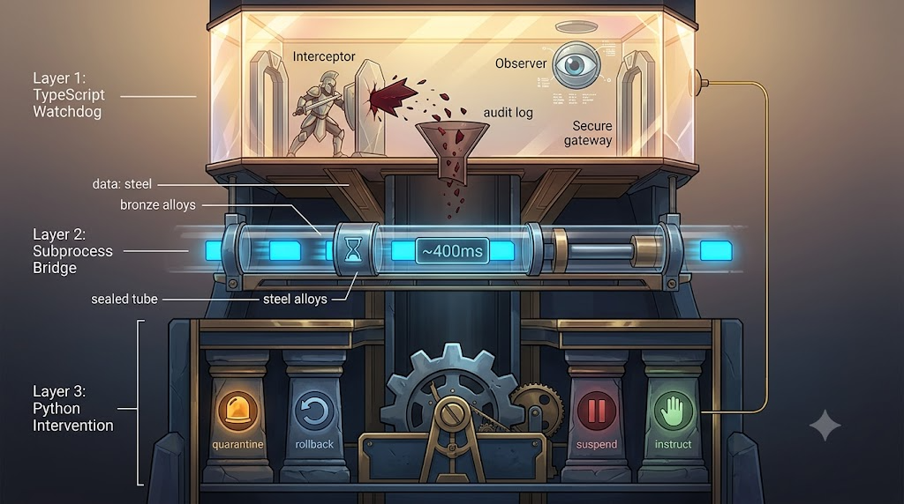

> **TL;DR：** Aristotle v1.6.0 引入 Watchdog-Intervention Bridge，从"事后反思"转向"实时拦截"。TypeScript watchdog 在 tool call 前后检测 21 种信号，Python intervention 层处理 13 种违规类型，通过 subprocess bridge 实现跨语言实时干预。MCP 工具从 10 个 stub 扩展到 25 个完整实现。遗留两个确定会出错的 bug。GitHub 开源，MIT 协议。

## 一个被推翻的假设

Aristotle 从 v1.0 到 v1.5，解决的一直是同一个问题：AI 犯了错，怎么让它记住，下次不再犯。

[Aristotle：让 AI 学会从错误中反思](/posts/2026/04/aristotle-ai-reflection/) 讲了设计理念。[从四道伤疤到一套铠甲：Aristotle 改造中的驾驭工程实践](/posts/2026/04/from-scars-to-armor-harness-engineering-practice/) 讲了重构过程。[Ralph Loop：AI 的错误不是随机的，是收敛的](/posts/2026/04/ralph-loop-ai-errors-converge/) 讲了多轮审核。

这些工作共享一个前提：错误已经发生了。事后做根因分析，生成规则，防止下一次。

这个链条依赖一个隐含假设：你总是能等到"下一次"。反思可以慢，因为错误已经发生了，你要做的是阻止同类错误卷土重来。

但真实 Agent 场景里，有些类型的错误代价太大，等不到"下一次"。

文件正在被写坏。测试正在被跳过。commit 正在被污染。反思再深刻，它也修复不了已经发生的损坏。问题不在反思不够深刻，在反思发生的时机。放在事后，它只能做善后。

在v1.6 我换了个思路，不再问"怎么让反思更深刻"，改问"为什么非要等到事后"。

## AI 在 TDD pipeline 里需要即时拦截的四类违规

tdd-pipeline skill 定义了一套严格的流程。Phase 1 需求，Phase 2 设计，Phase 3 测试方案，Phase 4 测试代码，Phase 5 业务代码。每个 phase 有明确的入口条件和出口标准。

AI 执行这个流程时，有四类问题不会等到"下次"再犯，它们必须在发生时就拦截。

**流程违规：** 跳过 red phase 直接写实现。TDD 要求先写测试让测试失败（RED），再写实现让测试通过（GREEN）。但 AI 有时会跳过 RED 步骤，直接写实现。或者反过来，在 GREEN 阶段修改测试来让它通过，而不是修改实现。

**行为违规：** 写了实现文件，但对应目录下没有测试文件。或者审查轮次不足就声称完成。Ralph Loop 要求连续两轮零问题才能退出，但 AI 有时在 Round 1 清零后就宣布审核结束。

**回归违规：** 之前通过的测试现在失败了。AI 在修改代码时，没有运行回归测试，破坏了已有功能。

**合规违规：** phase 完成但没有 commit。或者 KI（Known Issues）文档缺失。AI 写了代码，但 Git 仓库里没有对应的 commit 记录，或者代码里发现了新 bug 但没有记录到 KI 文档。

这四类违规的共同点是：只要在事后才发现，就已经造成了后果。文件写了、测试跳了、commit 污染了，你再怎么反思也改不了历史。



所以我们改在违规发生时就拦截。

## Watchdog-Intervention Bridge：架构与工作流程

v1.6 的核心架构分三层。

**Watchdog（TypeScript）：** 在 LLM 的 tool call 前后拦截。Interceptor 在调用前检查条件，Observer 在调用后观察结果。21 种检测信号类型，覆盖从 phase 状态到测试结果的完整范围。

**Intervention（Python）：** 接收违规信号，执行干预措施。13 种违规类型，每种由对应的 handler 决定干预策略：隔离、回滚、暂停或指导修复。其中 8 种走新的 handler 路径，其余走 legacy 路径（这是已知技术债之一）。

**Bridge：** 连接两层。TypeScript 检测到违规 → 缓存在 audit log → checkpoint 调用时批量发送给 Python → Python 返回干预决策 → TypeScript 应用决策。

三层的协作通过三个介入点完成。

**onToolBefore：** 工具调用前，Interceptor 检查当前操作是否合法。比如 AI 在 Phase 5 写代码但 Phase 4 测试尚未完成，或者在 GREEN 阶段修改测试文件试图让测试通过而不是修改实现。

**onToolAfter：** 工具调用后，Observer 检查结果是否引入回归。比如测试结果从 pass 变为 fail，或者 phase 结束时 git status 显示未跟踪文件但无 commit。

**tdd_checkpoint：** violation gate 检查尚未处理的违规信号，批量发送给 Python intervention。Python 返回 `InterventionResult`，包含四个动作：

| 动作 | 含义 | 触发场景 |
|------|------|---------|
| quarantine | 文件隔离，移动到隔离目录 | 在不允许的 phase 写入文件 |
| rollback | git 回滚到上一个 clean 状态 | 测试回归或 commit 缺失 |
| suspend | 暂停 pipeline，等待人类决策 | 连续多轮严重违规 |
| instruct | 返回具体修复指令，AI 继续 | 轻微违规，可现场修复 |

为什么用批量而非实时？Python 进程启动约 400ms。实时通信会让每次 tool call 都有可感知的延迟。但批量发送有一个技术前提：`onToolBefore` 读取缓存中的 pipeline state 并同步判定违规，通过 `throw` 阻止工具调用。它不会 await 任何异步操作。只有 `tdd_checkpoint` 的 `handle()` 是异步的，可以等待 subprocess。所以违规信号先缓存在 audit log，等到 checkpoint 时再批量发送。零违规时零开销。没有信号就不会启动 subprocess。

```
┌─────────────────────────────────────────────────┐
│  LLM Tool Call                                   │
│     ↓                                           │
│  onToolBefore: Interceptor 检查 21 种信号        │
│     ↓ 违规信号 → audit log                       │
│  Tool Execution                                  │
│     ↓                                           │
│  onToolAfter: Observer 检查结果变化               │
│     ↓ 违规信号 → audit log                       │
│  tdd_checkpoint: violation gate 批量发送        │
│     ↓ subprocess (~400ms)                      │
│  Python: 13 种违规类型 → handler 分发            │
│     ↓                                           │
│  InterventionResult: quarantine / rollback /     │
│                     suspend / instruct            │
└─────────────────────────────────────────────────┘
```



容错设计很简单：Python 不可用时，watchdog 继续工作。bridge 调用失败时返回空 envelope，pipeline 继续运行。watchdog 不会因为 Python 挂了而崩溃。TS 侧的 violation gate 仍然独立运行，block 级别的违规照样拦截，只是没有 Python 侧的干预建议。可用性优先于干预完整性。

## 跨语言 Bridge 的技术选择

bridge 的实现方式经历了几个选择。

**技术选择：subprocess 而非 IPC 或 HTTP。**

三种方案的权衡：

**HTTP：** 需要在 Python 侧启动常驻 server（FastAPI/Flask），管理端口分配、生命周期和异常恢复。零违规时 server 也在运行，资源浪费。额外引入网络栈，即便只在 localhost 通信，仍有端口冲突、进程守护、优雅关闭等问题。最讽刺的是，pipeline 的 watchdog 在监控 AI 行为，而 HTTP 方案需要另一个 watchdog 来监控这个 watchdog 的通信层是否健康。

**IPC（Unix Domain Socket / named pipe）：** 同样需要常驻进程。比 HTTP 轻量，但仍涉及连接管理、心跳检测、崩溃恢复。调试手段有限，不能用 curl 测试，出问题得 strace 或 lldb 级别排查。这套基建的维护成本，对于一个非必须（降级不影响主流程）、仅在 checkpoint 触发一次的通信路径来说，太重了。

**Subprocess（选中方案）：** 按需启动，零违规时零开销。没有常驻进程，没有端口，没有连接管理。每次调用是新进程，天然隔离，Python 崩溃不会波及其他组件。启动延迟 ~400ms，但 checkpoint 的调用频率低（每轮交互一次）。

决定性的三个因素：

1. **调用频率低：** checkpoint 每轮交互只触发一次。subprocess 的启动开销不会成为瓶颈。
2. **通信模式简单：** 输入是 audit log 快照，输出是干预决策。单向、无状态、一次往返。不需要流式、不需要双工、不需要持续连接。
3. **容错优先级高于延迟：** Python 进程失败时，bridge 返回空 envelope，pipeline 继续。HTTP 和 IPC 的常驻进程本身需要额外的容错，谁来重启挂掉的 server？subprocess 天然不存在这个问题。

## 25 个 MCP 工具：从 stub 到完整实现

v1.6 把 MCP 工具从 10 个 stub 扩展到 25 个完整实现。之前的 stub 工具在列表里可见但调用返回"未实现"，AI 会尝试调用然后困惑。原有 10 个工具（orchestration 3、reflection state 3、sync 2、undo/feedback 2）已在 v1.5 中实现。v1.6 新实现了 15 个：rule lifecycle 10 个（含 `init_repo`）、KI doc 2 个、rollback 3 个。

具体的新增工具：

| 类别 | 工具 | 功能 |
|------|------|------|
| KI 文档 | `write_ki_doc`, `read_ki_docs` | Known Issues 文档的写入和读取 |
| Rollback | `create_rollback_point`, `rollback_to_checkpoint`, `cleanup_rollback_stashes` | 基于 git stash 的检查点管理 |
| Rule 生命周期 | `init_repo`, `write_rule`, `read_rules`, `stage_rule`, `commit_rule`, `reject_rule`, `restore_rule`, `list_rules`, `detect_conflicts`, `get_audit_decision` | 从 stub 到完整实现（10 个工具）|

新增的工具填上了预留的 stub。AI 现在可以在工作流中直接调用它们，跟踪开发状态，纠正违规行为。

## tdd-pipeline skill 的集成

install.sh 新增了 Step 5：检测用户是否已安装 tdd-pipeline skill。没有它，Aristotle 就没有 phase 规则可以检查。tdd-pipeline 定义"应该做什么"，Aristotle 确保"实际做了什么"。两个组合起来，才形成自动化的流程约束。至于为什么这样集成、各层为什么选不同语言，另开新篇再写。


## 遗留的 bug

还有两个确定会出问题的地方需要修：

- **`_should_return_result` 测试分支：** 生产代码根据 `PYTEST_CURRENT_TEST` 决定抛异常还是返回结果。测试看到的行为和生产不同，bridge 和 audit log 的覆盖始终有缺口。已引发过一个 bug。
- **String sort 优先级：** 使用字符串比较而非数值比较，多位数字时排序错误。不是可能，是确定会错。

## 从"事后反思"到"实时拦截"

Aristotle 最初的设计是一个 error reflection 工具。AI 犯了错，事后分析，生成规则，防止下次再犯。这个逻辑在 v1.0 到 v1.5 中运转良好。

但它有一个结构性缺陷：错误已经造成了。损坏已经发生，反思只是事后止损。

v1.6 的 Watchdog-Intervention Bridge 补上了这个缺口。它不再等事后反思，在违规发生的瞬间拦截。Interceptor 在 tool call 前挡住非法操作，Observer 在 tool call 后发现回归，violation gate 在 checkpoint 时批量干预。反思仍然重要，它处理的是系统性模式。但先拦截，再反思，顺序不能反。

Aristotle 从"让 AI 记住错误"走向"让 AI 不再犯错"。前者靠反思，后者靠约束。反思培养长期习惯，watchdog 约束当前行为。v1.6 把两者放到一个系统里。

这个系列从"让 AI 学会反思"开始，目前发展到"错误的实时拦截"，我会先用一段时间，然后考虑后面的方向。

## 参考

1. Aristotle 项目：[github.com/alexwwang/aristotle](https://github.com/alexwwang/aristotle) v1.6.0 release 及文档
2. tdd-pipeline 项目：[github.com/alexwwang/tdd-pipeline](https://github.com/alexwwang/tdd-pipeline) ralph-review-loop.md
3. [Aristotle：让 AI 学会从错误中反思](/posts/2026/04/aristotle-ai-reflection/)
4. [Ralph Loop：AI 的错误不是随机的，是收敛的](/posts/2026/04/ralph-loop-ai-errors-converge/)
5. [从四道伤疤到一套铠甲：Aristotle 改造中的驾驭工程实践](/posts/2026/04/from-scars-to-armor-harness-engineering-practice/)

> *Aristotle 项目在 [GitHub](https://github.com/alexwwang/aristotle) 开源，MIT 协议。欢迎提交 Issue 和 PR。*
