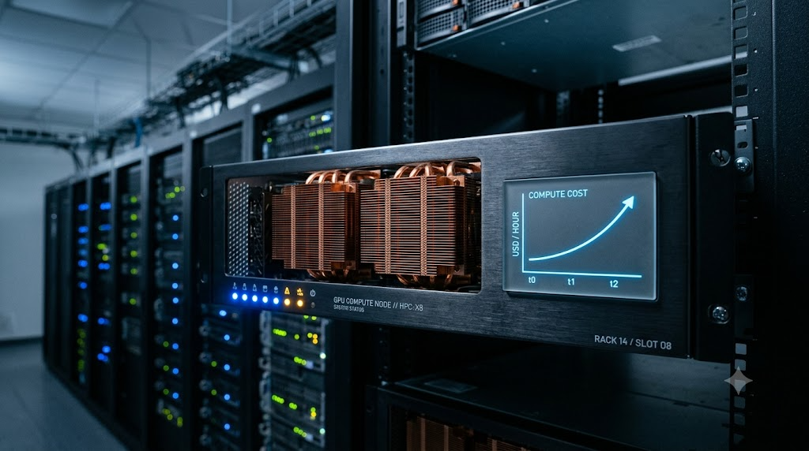
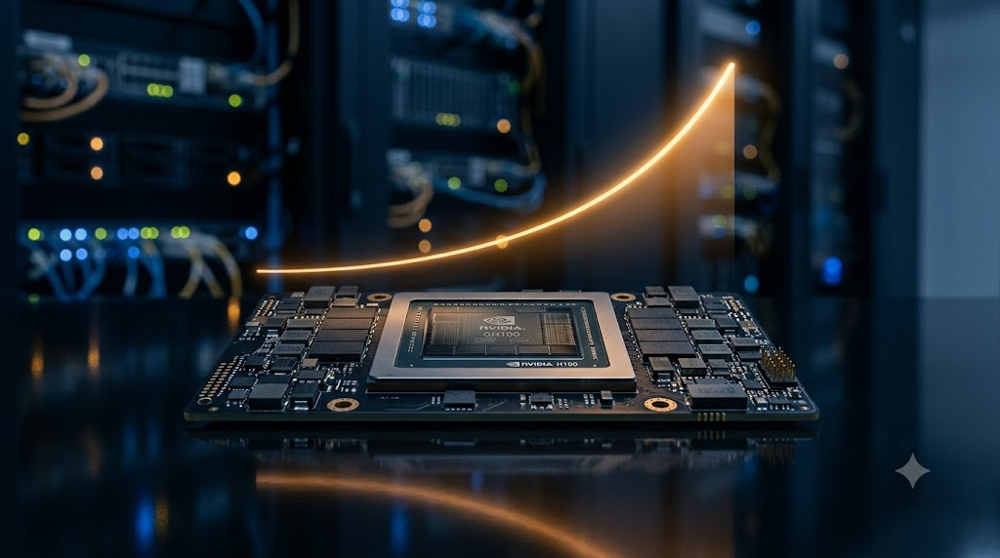
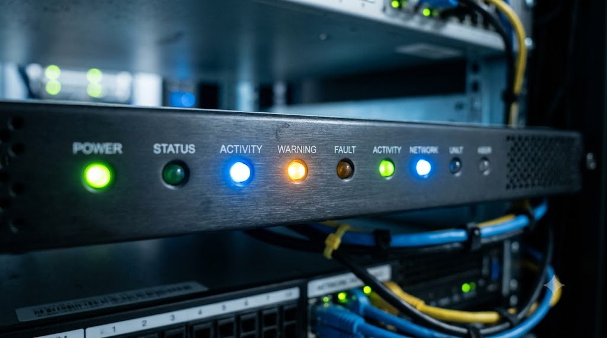

> **TL;DR:** On August 6, 2026, DeepSeek announced a planned API price hike. No single cause: cost pass-through, user filtering, expectation management, free marketing, a shift to value-based pricing, and open-source ecosystem pressure all point at the same move. Rising compute costs are real, but they don't explain the timing or the form of the announcement. The market is moving from subsidies-for-scale to value-based pricing, and seven falsifiable signals before the official plan will confirm or overturn this post's inferences.

A one-paragraph notice about a future price hike might be the signal that China's AI API market is entering a new phase. On August 6, 2026, DeepSeek announced on its website that it plans to raise API pricing overall, "by a relatively large margin," with the specific plan to come.[1] No numbers, no effective date. Just the announcement that a formal plan is on the way.

Taken at face value, this is an ordinary pricing update. Placed on the timeline of the last few months of AI API pricing, it looks like more. Most coverage attributes the hike to rising compute costs, and that is a real factor: GPU supply is still tight, inference demand keeps growing, and every major lab faces the same cost pressure.[2] But a business decision rarely has a single motive. Two questions are worth asking:

- Why is DeepSeek raising prices?
- Why announce it now, this way?

These are not the same question. This post distinguishes facts, observations, and inferences: factual claims come from the official announcement or public sources, and explicit hypotheses come with a checklist of what we should observe if they hold.

## One move, several jobs at once

There's a term for what happens when multiple independent reasons point at the same decision: **overdetermination**. For a company this is closer to the norm than the exception. A new subscription tier can simultaneously mean higher revenue, a reshaped user base, alignment with a product launch, a commercialization story for investors, and pressure on competitors. The goals don't exclude each other. The more of them one move satisfies, the more worth doing it is. So this post isn't hunting for "the real reason." The question is: which factors jointly pushed DeepSeek to this decision? Start with the industry context, then unpack the form of the announcement itself.

## Why this announcement matters

A routine price change wouldn't deserve a long post. This one matters because it's the latest node in a chain of changes in the AI API market over the past few months:

- one vendor raised API prices;
- another launched new tiered plans;
- another started cutting free allowances;[3]
- another suspended sign-ups because demand exceeded capacity.[4]

Separately these look unrelated. Together they point in one direction: **the industry is ending the phase of subsidizing scale and starting to talk about pricing itself.** DeepSeek's notice is part of that trend. So the question worth watching isn't the final percentage. It's what this hike says about how AI commercialization is changing.

## Why the official explanation isn't the whole story

First, a premise: this post is not claiming DeepSeek's cost explanation is false. GPU costs, inference demand, and model scale are real, industry-wide pressures. The problem is: **if cost were the only reason, why would the announcement take this form?** No number, no effective date. Just an early signal that prices are going up. The notice probably does more than pass along cost information.

The explanation has layers. Layer one is the official cost story. It's real, but it doesn't explain the timing. Layer two is what price itself does. Layers three and four are why the announcement uses a preview. Layer five is the direction of the increase. Each layer stands on its own; together they form the full picture.

## Cost pressure is real, but it doesn't explain the timing

DeepSeek's notice frames the change as an overall adjustment to API pricing, with a formal plan to follow.[5] Meanwhile, over the past year neither NVIDIA GPU supply nor global inference demand has eased. Inference has begun to overtake training as the main cost driver for more model companies.[2] OpenAI, Anthropic, Google, and Meta have all talked publicly about inference cost and efficiency.[2] So the compute pressure is real; there's no need to doubt that. It still leaves one question:

- Why not two months ago?
- Why not on the day the formal plan is published?
- Why announce it in advance?

Cost explains "why raise prices." It doesn't explain "why now." Since cost can't explain the timing, the next layer looks at what price itself is doing.

## Price itself is a user filter

AI APIs have an odd property: every call costs real compute, but not every call creates revenue. With generous free tiers or prices persistently below the industry average, you attract trial users, automated tests, benchmark loops, one-off projects, and free-tier farming. All of those consume GPUs, and most never convert to long-term revenue.

### The valuable users are few

Public statistics have suggested that under some measures, a large share of DeepSeek's token consumption comes from free allowances, with paid calls clearly below free calls. (Metrics differ by methodology, so treat this as a trend observation, not official data.) If that holds, a lot of GPU capacity is serving low-value requests, and the people actually building products are only a fraction of the traffic.

That's where price starts to do a second job: not just earning money, but filtering. There's an old line in economics: **price is a filter.**[6] Price works in two ways: it raises revenue, and it redefines who stays. Businesses that genuinely depend on the API don't stop because prices go up 20%; the "just trying it out" traffic drops immediately. The platform gets two results: less GPU pressure, and a remaining request mix that looks more like real production load.

### Why this matters for training data

There's an easy-to-miss angle here. For today's models, the most valuable data is concentrating in agent workflows: a single request chaining search, tool calling, multi-step reasoning, error recovery, and long context. Those requests are fewer but far denser than casual chat. If price naturally filters out one-off trial users, what remains is closer to enterprise usage. Price filters users, and it also filters the future data source.

### Peak/off-peak pricing is filtering too

DeepSeek has already experimented with peak/off-peak pricing.[1] Most people read that as load shifting. There's a second meaning: interactive users want answers "right now," while batch enterprise jobs can run at 3 a.m. Price structure changes user behavior, and what remains is increasingly schedulable, automatable, long-running workloads. If DeepSeek widens the peak/off-peak spread, it's optimizing the overall traffic shape. Revenue is only part of the goal.

### If this layer holds, we should see:

- free allowances tighten further;
- the peak/off-peak spread widen;
- more enterprise plans;
- more discounts aimed at agent scenarios.

If none of that happens, the "price as filter" inference needs revisiting. And if the price structure is already filtering users, the cadence of the preview is probably engineered too. Which brings us to the next question: why announce the hike without the numbers?

## Why announce a hike without the numbers?

This might be the most interesting part of the whole notice. If the price is decided, why not publish it? One plausible answer: **DeepSeek is managing expectations first.** Telling everyone "prices are going up" without a number gets the market to adjust its mental baseline. When the plan lands, the conversation shifts from "why the surprise increase?" to "more or less than I expected?"

It's a familiar rhythm from internet product launches: split one price shock into two news cycles. Announce the hike, then announce the number. Each gets media coverage, while the backlash is diluted. It's also how many SaaS companies update pricing.

Managing expectations explains half the cadence. The other half is distribution: the preview is itself free marketing. That's the next layer.

## The announcement is itself free marketing

A price-hike notice has a side effect that's easy to overlook: it spreads almost by itself. If DeepSeek had quietly updated its API pricing page today, many developers wouldn't notice for days. Instead the company announced:

> "Prices are going up."

Media reports, developers discuss, social platforms speculate, competitors pay attention. The whole industry enters a waiting state for the formal plan. For a tech company, that kind of attention is a scarce resource.

### Why "will raise prices" spreads better than "raised prices"

Internet products have a classic property: uncertainty drives discussion. An Apple keynote generates more buzz before the event than on the day, because everyone is guessing. A price preview creates three questions:

- How much?
- When?
- Who's affected?

Until the answers arrive, the discussion doesn't stop. A few dozen words of announcement can buy days or weeks of exposure.

### One message, different audiences

For developers:

> Should I top up my balance early?

For enterprises:

> Should I lock in a budget?

For the press:

> Will this reset China's API price structure?

For investors:

> Is the company finally commercializing?

For competitors:

> Should we launch a migration promo during the window?

One announcement, many groups activated. That's a wider reach than a typical product launch.

### The subject being spread is DeepSeek

Everyone discusses "the price hike"; the exposure accrues to DeepSeek. Many developers hadn't visited DeepSeek's site in months; the notice brings them back to check pricing, compare models, read docs, re-evaluate migration. The announcement pulls developers back to the product. From an attention standpoint, that's a successful reflow.

### If a new flagship model is coming, the story completes itself

Suppose within two weeks of the preview, DeepSeek ships a new flagship, formal prices, new plans, enterprise options. Then today's notice isn't an isolated event. It's step one of a product launch. Many tech companies follow the same cadence: a signal on day one, the product a few days later, prices after that, a one-to-two-week cycle. Three rounds of media, three rounds of community discussion, three rounds of exposure. Compared to dumping everything in one day, the drip is more efficient.

To be clear: marketing is not the primary purpose. The marketing effect is an important byproduct of the announcement format. Mature internet companies design business decisions to capture both benefits. If a move improves revenue and earns industry attention, there's no reason to leave the second on the table.

### If this layer holds, we should see:

- the official account publishing more API and model-capability content;
- developers invited to beta-test a harness product;
- technical blog posts replacing price explanations;
- online talks, livestreams, or developer events;
- the price change bundled into a broader product update.

As of publication, per a post on Reddit's r/DeepSeek, DeepSeek has started inviting developers to beta-test a harness product; the news is unconfirmed.[7] The other signals haven't moved yet.

If the result is just a price notice with no supporting moves, the marketing effect is more likely incidental than planned.

Cadence and form covered. That leaves direction: where does the price level come from? That's about product value.

## Value-based pricing

Now the other question: why are so many AI companies revisiting pricing? Because the product changed, not the GPU. For the past year, the biggest competitive advantage among models was one word: **cheaper.** Everyone cut prices, grew free allowances, lengthened context, and raced for market share. That strategy has a premise: a company willing to subsidize long-term. As the industry enters the next phase, the question becomes: what capabilities are users willing to pay for?

That's value-based pricing.[8] A model that only answers questions is hard to charge more for. A model that completes agent, tool-use, coding, research, and workflow-automation tasks is selling productivity, and the object of the price discussion changes with it.

Software has been through this cycle before. Early SaaS grew on free tiers, ultra-low prices, and subsidies; later the metrics that mattered were ARPU, paid conversion, retention, and enterprise revenue. Many SaaS products raised prices after shipping new capabilities, because the conversation changed from "why is this more expensive" to "what are these capabilities worth." AI is repeating the process, just faster.

If DeepSeek's next flagship lands near the hike window, the story switches from "cost pressure" to "product upgrade": the classic value-pricing narrative, and the classic software-industry price upgrade. Whether that story holds depends on the signals before the formal plan, which is the observation checklist in the next section.

## The two weeks before the official plan matter more than the final number

For developers, the per-million-token price matters. For industry watchers, what matters is: **what does DeepSeek do before the formal plan?** Business decisions rarely start at the official announcement; changes happen early. The signals below will decide which of this post's inferences hold and which need revision.

### Signal 1: Do free allowances tighten first?

This is the most important signal. Compared to reworking the whole price system, cutting free allowances has almost no technical cost, and it immediately reduces GPU pressure, thins out the free-tier farmers, reveals user churn, and tests the market. If DeepSeek faces inference-resource pressure, **free allowances likely change before official prices.** That's the top signal in this window.

Fewer free tokens means the company cares about GPU utilization. Unchanged free allowances with a pure price increase means commercialization is the bigger goal.

### Signal 2: Does a new flagship land in the hike window?

Many SaaS companies pair a product upgrade with a price upgrade. The value-pricing logic: when a model gets visibly better, users accept a price increase more easily. The question to watch: **does DeepSeek release a new flagship before the formal price increase?** If yes, the story shifts from "the same product suddenly got more expensive" to "a new product, a new price." This is falsifiable: if no model upgrade arrives within a month, the value-pricing inference needs reassessment.

### Signal 3: How is the official notice worded?

Everyone watches the numbers; the wording matters too. "Price increase" and "promotional pricing ends" feel very different. If the official language emphasizes "returning to standard pricing," part of today's increase is just a promo ending;[9] if it says "an overall price adjustment," a new price system has formed. Many SaaS companies spend a lot of time on that one sentence. The narrative is part of the product.

### Signal 4: Do competitors start poaching?

Watch the other vendors. Everyone will see the window: migration promos, free allowances, SDK compatibility, one-click migration. All of it lowers switching cost. If a wave of "DeepSeek-API-compatible" marketing appears, the industry has already treated this hike as a user-acquisition window.

### Signal 5: Do third-party inference platforms get more aggressive?

This is the biggest difference between DeepSeek and closed models: the weights are public, so users never have to leave DeepSeek. They only have to leave the official API. Watch whether Alibaba Cloud, Volcano Engine, SiliconFlow, Together AI, and OpenRouter start emphasizing cheaper, more stable, DeepSeek-compatible offerings. If that happens at scale, the official API is fighting the whole inference ecosystem, and other models are only part of it.

### Signal 6: The community starts doing math

Every price change gets re-calculated by the community: old per-million-token prices, the delta after "returning to standard," the extra annual budget for enterprises, spreadsheets across HN, Reddit, and X. Those discussions feed back into the official messaging. Don't underestimate developer communities; they're part of the price system.

### Signal 7: Stability problems may precede the price

A rarely discussed angle: even before the official price, if GPUs get tight, users feel slowdowns first. The hike comes later. First-token latency climbing, request queuing, rate limits, more errors, peak-hour jitter. If these appear before the price, resource pressure is more urgent than commercial strategy. This is one of the most worth-watching technical signals in this post.

## These signals will confirm or refute the hypotheses

The real value of tech analysis is proposing falsifiable predictions. This post is an attempt at business observation: placing DeepSeek's price preview into the industry cycle, unpacking the multiple goals it may serve, and listing falsifiable signals. If the signals show up over the window, the user-filter, value-pricing, marketing-cadence, and commercialization-turn analyses gain credibility. If none of them show up, the post should be revised. What DeepSeek does consecutively during the window will directly test these inferences.

## Price is becoming part of the AI product again

Zoom out, and DeepSeek's hike isn't an isolated event. Over the past year, nearly every major lab, domestic and international, went through the same arc. Phase one: compete on **who's cheaper.** Prices fell,[3] free allowances grew, context lengthened, some quotes approached or went below cost to buy developer growth. Back then, everyone was buying market share.

That model has a natural end. When model capabilities converge, inference demand grows, and GPUs stop being infinite, the industry has to answer: **who will actually pay?** Competition shifts from "who's cheaper" to "is it worth it." The AI API market is moving from subsidies-for-scale to value-based pricing, and DeepSeek's hike is a node in that turn. Over the next few years, the question stops being which model benchmarks 2% higher, and becomes which company can build its own price system. Price is part of the product; it tells the market where the company believes its value is.

Developers are buying outcomes, not tokens. The old API discussion was about per-million-token price. The future discussion may be what a completed agent, a coding task, or a report costs. Users buy results, not inference.[10] What sustains a price increase shifts from more parameters to a stronger ability to complete work.

DeepSeek's challenge may be just beginning. If its biggest advantage was extreme cost-performance, then after the hike it must answer: **besides being cheap, why should developers stay?** That question matters more than the size of the increase: a price advantage lasts a year; a product advantage lasts many. Meanwhile, open source gives DeepSeek a unique constraint: closed models can raise API prices and users have few alternatives; open models are different. When the official API goes up, developers can self-host or migrate to a third-party inference platform running the same model. So what limits DeepSeek's pricing power isn't just OpenAI, Anthropic, Kimi, and GLM. It's the entire open-source inference ecosystem. It is competing with the people running its own models. That's the shared problem of all open-source commercialization.

## The bottom line

Back to the original question: why is DeepSeek raising prices? The most accurate answer: **when compute costs, commercialization pressure, product upgrades, financing windows, competition, marketing, and the industry cycle all point at the same move, the hike becomes the natural choice.** No single factor is the cause. For industry watchers, the direction is worth recording: AI is slowly ending the era of subsidizing growth.

## References

1. [DeepSeek API Documentation: Pricing](https://api-docs.deepseek.com/quick_start/pricing/)
2. [Reuters, via Bloomberg: "Chinese AI startup DeepSeek developing own AI chip, Reuters says" (2026-07-07)](https://www.bloomberg.com/news/articles/2026-07-07/chinese-ai-startup-deepseek-developing-own-ai-chip-reuters-says)
3. [Axios: "DeepSeek's new bargain model accelerates AI's race to zero" (2026-08-01)](https://www.axios.com/2026/08/01/deepseek-model-cheap-ai-price-war)
4. [AP News: "China's Moonshot AI halts new subscriptions after surging demand"](https://apnews.com/article/kimi-k3-china-ai-model-us-4c66a2e0f557ce79d3cc2d769c9a6226)
5. [DeepSeek API Documentation: Updates](https://api-docs.deepseek.com/updates/)
6. [Nagle & Müller, *The Strategy and Tactics of Pricing*, Routledge](https://www.routledge.com/The-Strategy-and-Tactics-of-Pricing-A-Guide-to-Growing-More-Profitably/Nagle-Muller-Gruyaert/p/book/9781032016825)
7. [Reddit r/DeepSeek: developers invited to beta-test a harness product (community post, unconfirmed)](https://www.reddit.com/r/DeepSeek/s/p4b4BAdCm8)
8. [Ramanujam & Tacke, *Monetizing Innovation*, Wiley](https://www.wiley.com/en-us/Monetizing+Innovation:+How+Smart+Companies+Design+the+Product+Around+the+Price-p-9781119240860)
9. [Reuters: "China's DeepSeek slashes prices for new AI model" (2026-04-27)](https://www.reuters.com/world/china/chinas-deepseek-slashes-prices-new-ai-model-2026-04-27/)
10. [Chen et al., "The Price Reversal Phenomenon: When Cheaper Reasoning Models End Up Costing More", arXiv](https://arxiv.org/abs/2603.23971)
