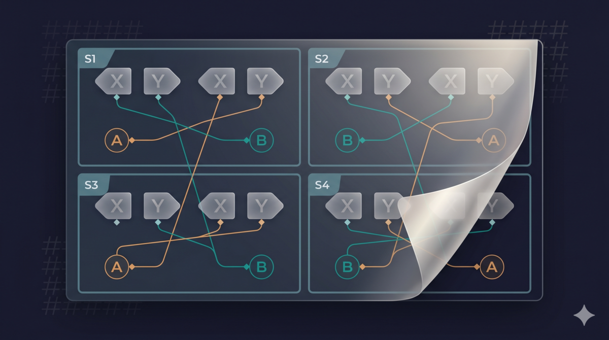
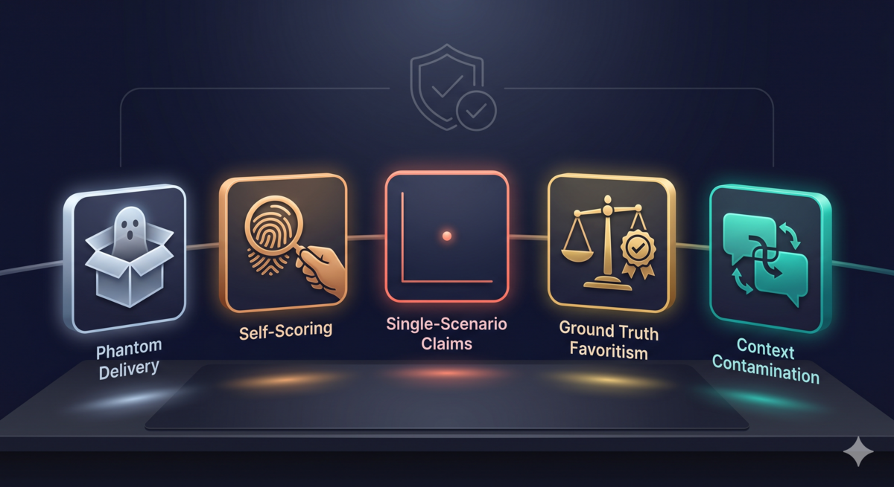

> **TL;DR：** 改了 skill，怎么知道是真的变好了还是自我感觉良好？我跑了一个双盲实验：两个版本、四个场景、独立评审盲打分。评审看到 X=2.44、Y=2.41，说分不出来。揭盲后精简版 4/0 全胜。

---

## 0.03 差距

我改了一个审查 skill，把 159 行砍到 89 行。想验证精简版是不是真的更好，跑了双盲实验。

scorer 的原始评分出来了：X 均分 2.44，Y 均分 2.41，差 0.03。满分 3 分，差 0.03——什么也说明不了。

两周的实验，8 个 evaluator 实例，4 个场景，8 个维度的 rubric。结论是"没区别"。

我没信。不是因为我固执，是因为我翻了一下每个场景的分数——每个场景里 X 和 Y 都有胜负，不是全部平局。那平均分怎么会这么接近？

看了一眼 secret-mapping.txt，明白了。

双盲实验里 X 和 Y 的对应关系是随机打乱的：S1 的 X 是 A（原版），S2 的 X 是 B（精简版），S3 的 X 又是 A，S4 的 X 又是 B。scorer 不知道对应关系，所以它直接把四个 X 加起来求平均、四个 Y 加起来求平均。

四个 X 里有两个是 A 的分、两个是 B 的分。四个 Y 也一样。A 和 B 的分数被混在一起平均了，差异当然被抹平了。

这不是 scorer 的 bug——它被设计成只看 X 和 Y，不知道映射关系。这是我自己的实验设计问题：scorer 不该做跨场景汇总，这个步骤应该由知道 secret mapping 的人来做。


映射回 A/B 后：

| Variant | S1 | S2 | S3 | S4 | 平均 |
|---------|----|----|----|----|------|
| A（原版） | 2.500 | 2.375 | 2.250 | 2.125 | 2.313 |
| B（精简版） | 2.750 | 2.500 | 2.375 | 2.500 | 2.531 |

0.03 变成了 0.218。B 四个场景全胜。

## 四个场景逐个看

秘密映射揭晓后：

| Scenario | X 实际是 | Y 实际是 | 谁赢了 | 差距 |
|----------|---------|---------|--------|------|
| S1 | Variant A | Variant B | B | +0.250 |
| S2 | Variant B | Variant A | B | +0.125 |
| S3 | Variant A | Variant B | B | +0.125 |
| S4 | Variant B | Variant A | B | +0.375 |

4/4 全胜。平均分 A=2.313，B=2.531。

为什么 0.03 会变成 4/4 全胜？因为 scorer 看到的只是 X 和 Y，不知道哪个对应哪个版本。随机映射把实验者的系统性偏好抹平了——S2 和 S4 里 B 被标为 X、A 被标为 Y，scorer 在这两个场景里反而给 X（也就是 B）打了高分，说明 B 的优势是真实的，不是标签效应。

## 实验协议如何设计？

### 第一步：定义变体

- **Variant A**：当前版 ralph-review-loop.md，159 行
- **Variant B**：Signal Purity 精简版，89 行（删除了可推导内容）

### 第二步：设计 rubric

8 个维度，每个维度 0-3 分：

1. Prompt Contamination（是否包含停止条件/计数 → 清理干净）
2. Dual-Pass Adherence（是否跳过事实收集 → 严格执行 Recall→facts→Precision）
3. Severity Accuracy（多个误分类 → 全部正确）
4. Defect Discovery（漏检 ≥2 个真实缺陷 → 发现全部）
5. False Positive Control（≥3 个误报 → 零误报）
6. Suggestion Quality（模糊 → 全部具体可执行）
7. Critical Opinion Substance（制造 → 深度战略洞察）
8. Format Compliance（缺失章节 → 完全符合）

### 第三步：4 个 scenario

| Scenario | 目标代码 | 测试点 |
|----------|----------|--------|
| S1 | Python user service | 基础缺陷检测 |
| S2 | React payment form | UI 状态管理 |
| S3 | Java order processor | 并发问题 |
| S4 | Node.js cache | 竞态条件 |

每个 scenario 对两个 variant 各跑一次，共 8 次 evaluator run。

### 第四步：盲映射

随机分配 X/Y 标签，独立 scorer 不知道对应关系：

```
S1: X=A (当前版)  Y=B (精简版)
S2: X=B (精简版)  Y=A (当前版)
S3: X=A (当前版)  Y=B (精简版)
S4: X=B (精简版)  Y=A (当前版)
```



### 第五步：独立 scorer

使用新的 AI 实例打分，不知道 secret mapping。每个维度独立打分，最后求平均。

## 真实数据里的坑

实验不是一帆风顺的。我遇到了两次真实问题。

### S1 的 ANSI 污染

第一轮 S1-A 分数是 0.625，远低于其他场景。原因是输出文件被 ANSI escape sequences 污染了 —— 终端颜色代码混入了文本，文件几乎无法阅读。

这不是协议缺陷，是执行问题。re-run 后分数恢复正常：2.500。

### S4 的反转

S4（Node.js cache）里，Variant A 在 Defect Discovery 和 Suggestion Quality 两个维度反而赢了。A 发现了竞态条件，给出了更具体的修复建议（用 `Map` 替代 `Object`、用 `Object.create(null)` 避免原型链污染）。Variant B 在 S4 总分仍然更高（2.500 vs 2.125），但赢在 Dual-Pass Adherence 和 Format Compliance，不是赢在找 bug 上。

这证明"精简"不是万能药，Signal Purity 删除了可推导内容，但某些场景下被删掉的内容恰恰是能引导模型发现特定问题的启发式线索。

## Variant B 的真实优势

对比 8 个维度，B 的核心优势在 **Dual-Pass Adherence**：

- B 明确展示了三阶段流程（Recall→Facts→Precision）
- A 经常跳过事实收集步骤，直接进入 Precision 阶段

这个差异在数据里很明显：

| Dimension | A 平均 | B 平均 | 差距 |
|-----------|--------|--------|------|
| Dual-Pass Adherence | 2.00 | 3.00 | +1.00 |

其他维度差距都小于 0.5。这说明 B 的胜出不是因为"精简"，而是因为它更严格地执行了双阶段协议。

## 五大失效模式

这个实验也不是一开始就成功的。之前的一次尝试里，五种失效模式连续发生，让我意识到 AI agent 实验的坑有多深。

### 1. Phantom Delivery（幽灵投递）

文件路径写错了，evaluator 找不到文件。但它没有报错退出，而是用空输入继续跑，产出了看起来正常但实际上什么都没审查的结果。你以为它跑了，其实它什么都没看到。

### 2. Self-Scoring（自己打分）

Orchestrator 自己给结果打分，bias 直接进入评分。

### 3. Single-Scenario Claims（单场景结论）

只有一个数据点方差很高。你可能说"这个场景太难了"，但那是安慰自己，单点数据无法支撑任何结论。

### 4. Ground Truth Favoritism（参考答案偏心）

Ground truth 里大部分项目直接测试你的变量。比如你怀疑"精简更好"，GT 里就问"输出是否简洁"——假设自我验证了。

### 5. Context Contamination（上下文泄漏）

同一个 agent 先执行 evaluator，再执行 scorer，上下文泄漏会污染结果。



现在这五种失效模式已经写成了 skill（`/double-blind-experiment`），每次做实验前可以对照检查。

## 双盲不是银弹

双盲协议只解决一个问题：**防止比较过程被污染。** 它不解决这些：

1. **Rubric 设计偏见**——你的 rubric 可能偏向某些特征
2. **Scenario 选择偏见**——你选的 scenario 可能对你的变量有利
3. **Ground truth 质量**——参考答案可能有误
4. **汇总逻辑错误**——就像这篇文章里的 0.03 一样，AI scorer 可能用错误的方式汇总分数

这篇不是为了证明精简版更好，是为了说明一件事：**改 skill 的时候，你需要一个可靠的测试框架，否则你不知道自己是在改进还是在碰运气。**

---

## 参考

1. [双盲实验 skill 源码（含三层分级协议和五大失效模式）](https://github.com/alexwwang/tdd-pipeline/blob/main/experiment/SKILL.md)
2. [TDD Pipeline 项目仓库](https://github.com/alexwwang/tdd-pipeline)