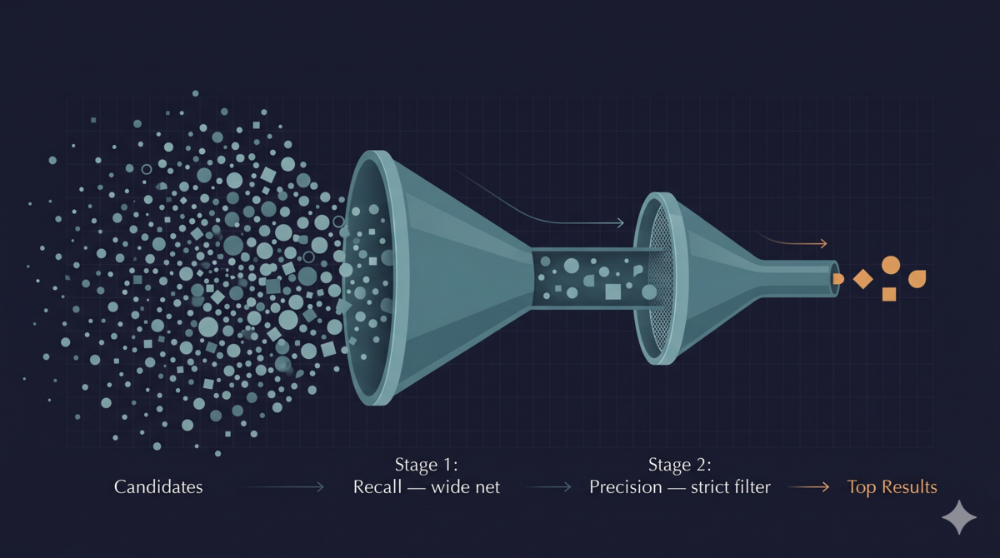
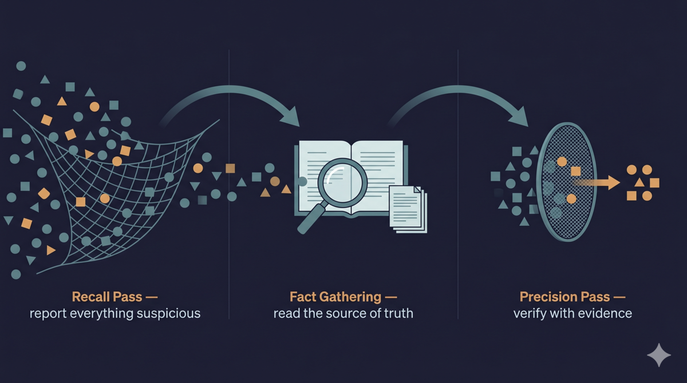

> Series: Classic Theory Meets Agent Practice (Part 1)

> **TL;DR:** A design review agent needs to find every issue AND avoid false positives. One agent can't do both. Borrowing cascade retrieval from information retrieval — a 15-year-old method — I split it into two: a Recall Pass that casts a wide net, and a Precision Pass that filters strictly. Real defects get caught earlier, and the risk of rework during development drops.

This series is about one thing: how classic theoretical frameworks directly guide AI agent engineering. The first post starts with cascade retrieval — a 15-year-old method from information retrieval (IR) — and the much older Recall vs. Precision tradeoff it sits on top of. The 1966 Cranfield II experiments proved these two goals fight each other. Applying that old problem's newer solution to design review made a striking difference.

## Results first

The first three stages of my TDD Pipeline are design stages — writing requirements, producing a design spec, and defining a test plan. How well these documents are written directly determines whether downstream development goes smoothly. So after the design documents are done, I have another AI agent review them for gaps and contradictions.

Originally one review agent was enough. The problem: it had to both find every issue (recall) and make sure every issue was real (precision), and ended up mediocre at both. The fix is simple — split it into two. One agent only finds problems (Recall Pass). The other only filters false positives (Precision Pass).

Measured results from a quant trading project's design review — same design doc, single-pass vs. dual-pass head-to-head. Caveat: this is one task's observation, not large-scale statistics. Trust the direction, don't fixate on the exact numbers.

| Metric | Single Pass | Dual Pass | Change |
|--------|-------------|-----------|--------|
| Raw findings per round | 16 | 25→12 (after filtering) | More found, 12 kept |
| Critical real issues | 2 | 2 | Same, but higher confidence |
| Critical false positives | 1 | 0 | Eliminated |
| Valid find rate | ~75% | ~92% | +17 percentage points |
| AI calls per round | 1 | 2 | Doubled |
| Expected review rounds | 5-7 | 3-5 | 30~40% fewer |

The call count doubled, but review rounds dropped 30-40%. Total tokens spent are roughly the same, while the valid find rate climbed from 75% to 92%. Tokens spent per real issue found actually decreased.

More importantly, review behavior stabilized. The first pass always casts wide. The second pass always filters hard. No more of the single-pass pattern — aggressive reporting in early rounds, timid reporting in later rounds, behavior all over the place.

Design issues caught early mean less rework downstream. The dual-pass review intercepts problems at the design stage — no need to wait until code is written to discover a design flaw.

Unexpected win: the dual-pass mode caught a real design defect that single-pass missed — leftover pre-migration scoring dimension references (`baseline_score`/`graham_score`) in the requirements doc that were never updated in the design spec. Single-pass's 16 findings didn't include this. The dual-pass Recall Pass flagged it among 25 findings, and the Precision Pass confirmed it.

## Why thoroughness and accuracy are at odds

Search engines have a well-known principle: **finding everything and being right about everything are fundamentally opposed.**

Thorough = don't miss any suspicious issues, at the cost of lots of false positives. Accurate = every report is a real issue, at the cost of missing some. Try to do both at once and you usually end up mediocre at both. This isn't a capability problem — the objectives themselves conflict.

Textbooks illustrate this with a single chart. The horizontal axis is Recall, the vertical axis is Precision. Crank one up, the other usually drops [1].

Same thing with reviews. Loosen the review criteria, you find more issues, but many are false positives. Tighten the criteria, false positives drop, but real issues get filtered out too.

This is a core tradeoff in search engines, spam filters, medical diagnosis. Over 60 years of literature — the 1966 Cranfield II experiments conclusively proved the inverse relationship between Recall and Precision [4], and it's been foundational in IR evaluation ever since.

### Cascade Retrieval: how search engines solved it

Information retrieval's answer to this tension is **Cascade Retrieval** — splitting one retrieval task into multiple stages, each with a different objective.

In 2011, Wang, Lin, and Metzler proposed a cascade ranking model at SIGIR [2]. Their starting point was efficiency: use simple functions to quickly filter out most irrelevant documents, and only run complex models on a small number of candidates. The cascade architecture naturally produces a "wide early, strict late" structure.

Dang, Bendersky, and Croft in 2013 articulated the recall/precision split more explicitly [3]: **the first stage is recall-oriented, the second is precision-driven.** Two objectives split across two stages, each optimized independently. This is the exact idea the dual-pass review borrows.

It's not just search. Every time YouTube recommends a video, TikTok queues the next clip, or Facebook picks an ad, the same architecture runs: recall first, then precision ranking. The first pass pulls candidates from a massive pool (don't miss). The second pass uses complex models to pick what you're most likely to engage with (don't be wrong). Search, ads, recommendation — the entire stack runs on this framework.

**Key analogy:** Search/recommendation picks the content you'll engage with out of a massive pool. Design review picks real issues out of a design spec. Different candidates, same problem — don't miss the valuable ones. Cascade retrieval applies to both.

### Why splitting works for design review

Design spec issues are subtler than code bugs. It's not "does this code have a bug?" — it's "are the requirements complete?", "is the design consistent?", "are edge cases covered?"

A single prompt asking for two things simultaneously — "find all design issues" and "make sure every issue is real" — contains contradictory instructions. The model gets pulled in two directions within one prompt.

Split into two passes, each optimizing one objective.

The Recall Pass prompt says one thing: **report everything, miss nothing.** Not sure? Report it. Half-convinced? Report it. Pure intuition? Report it. "The requirements doc might be missing a scenario" — report it.

The Precision Pass prompt also says one thing: **verify every finding against evidence.** Only keep what has evidentiary support. No evidence? REJECT.

Between the two passes, I insert a fact-gathering step. This gives the Precision Pass objective evidence to work with, instead of using one guess to judge another guess.

### What happens between the two passes

What does fact gathering do?

- Read the requirements doc from prior stages (verify cross-stage consistency)
- Check completeness against the requirements checklist
- Read the project's coding conventions / RULES.md (verify best-practice findings)

With those facts, the Precision Pass shifts from "I have a hunch this requirement is missing something" to "the requirements doc has no acceptance criterion for this case — CONFIRM." The former is a guess. The latter is a check.

The `baseline_score`/`graham_score` defect was caught this way. The Recall Pass flagged "requirements doc appears to retain old scoring dimensions" among 25 findings. The fact-gathering step checked: both identifiers were still referenced in the requirements doc but never updated in the design spec. The Precision Pass confirmed it as a real issue.

The single-pass review's 16 findings didn't include it — the single-pass mode hesitated on "report or not" and filtered it out.

## How I got here

The insight came from watching the review agent's behavior across rounds.

After running several rounds, I noticed a pattern: the same review agent tended to over-report in early rounds (afraid of missing things) and under-report in later rounds (afraid of false positives). Same prompt, same design document, different review behavior depending on the round.

At first, fewer errors per round made me happy — I thought it was convergence, a good sign. I even wrote a whole post about how review loops need to converge ([AI Errors Converge, They Don't Randomize](/posts/ralph-loop-ai-errors-converge/)).

After using it for a while, I realized I'd only understood half of it. Fewer issues and convergence are necessary, sure, **but convergence shouldn't come from the model chickening out.** What actually happened: review rounds dragged on forever, and each later round squeezed out maybe a few stray findings — sometimes duplicates of what earlier rounds had already reported.

This told me the model understands the difference between "find everything" and "be right about everything." It's just that a single prompt asking for both objectives forces the model to balance them internally.

Each review round is independent — the model doesn't know what round it is or how many rounds are left. But as the design doc gets revised, the obvious issues get fixed. What's left is the edge cases the model itself isn't sure about. Under a single prompt asking for both recall and precision, the model hesitates on these "report or not?" calls and leans conservative.

Instead of letting the model balance both objectives on its own, I split the balance. The first pass is fixed to "cast wide." The second pass is fixed to "filter hard."

I'm not the first to apply this to LLM reviews. G-Research's Data and Analytics team wrote a blog post in May 2026 [5] about building an internal code review tool, where they use a two-pass LLM call — first pass for recall, second pass for precision. Their key takeaway is exactly that: "separate recall and precision; two simple passes outperform one complex prompt." When I read it, a light went on — that's cascade retrieval. I took the same idea from code review to design review, and connected it back to the 15-year-old cascade retrieval literature in IR — which itself rests on a 60-year-old Recall/Precision tradeoff.

### Not just design review

I also ran the dual-pass approach on code review — and replicated G-Research's findings: valid find rate from ~75% to ~92%, critical false positives from 1 to 0. Same caveat: a single task's observation, not a statistical conclusion. But replicating G-Research's result on a different codebase with different review rules, and watching the same approach transfer cleanly to design review — that's not the shape of a one-off lucky fit.

## One open question

Dual-pass review solved the unstable review behavior problem. But it introduced a new one — what the "find everything" agent reports and doesn't report is still influenced by how the prompt is written. A poorly written prompt could systematically miss an entire category of design issues.

So what should go in a prompt, and what shouldn't?

I also assumed that more detail, more constraints, more examples would make the model perform better. Turns out, the opposite is true.

Next post.

> [Next in the series →](/posts/signal-purity-less-is-more/)

## References

1. Manning, C. D., Raghavan, P., & Schütze, H. *Introduction to Information Retrieval*, Cambridge University Press, 2008, Chapter 8. [https://nlp.stanford.edu/IR-book/information-retrieval-book.html](https://nlp.stanford.edu/IR-book/information-retrieval-book.html)
2. Wang, L., Lin, J., & Metzler, D. "A Cascade Ranking Model for Efficient Ranked Retrieval," *SIGIR*, 2011, pp. 105–114. [https://dl.acm.org/doi/10.1145/2009916.2009934](https://dl.acm.org/doi/10.1145/2009916.2009934)
3. Dang, V., Bendersky, M., & Croft, W. B. "Two-Stage Learning to Rank for Information Retrieval," *ECIR*, 2013, pp. 423–434. [https://link.springer.com/chapter/10.1007/978-3-642-36973-5_36](https://link.springer.com/chapter/10.1007/978-3-642-36973-5_36)
4. Cleverdon, C. W., Mills, J., & Keen, E. M. *Factors Determining the Performance of Indexing Systems, Volume 2: Test Results*, Aslib Cranfield Research Project, College of Aeronautics, Cranfield, 1966. (The Cranfield II report; first conclusive evidence of the inverse Recall/Precision relationship.) [https://dspace.lib.cranfield.ac.uk/items/aa7d3ba6-091b-47ff-aa96-8d9511a3d263](https://dspace.lib.cranfield.ac.uk/items/aa7d3ba6-091b-47ff-aa96-8d9511a3d263)
5. G-Research, "Building a code review tool: The LLM patterns that actually work," May 2026. [https://www.gresearch.com/news/building-a-code-review-tool-the-llm-patterns-that-actually-work/](https://www.gresearch.com/news/building-a-code-review-tool-the-llm-patterns-that-actually-work/)
