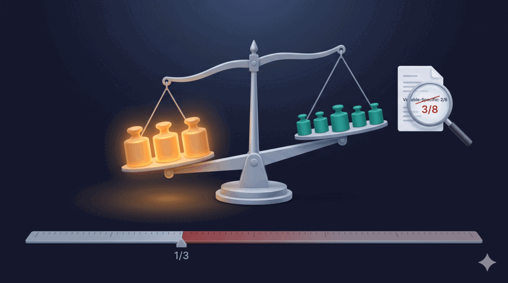

> 系列：AI Agent 实验方法论（第三篇）
> [上一篇：实验设计没毛病，LLM 为什么还是翻车了](/posts/execution-context-design/)

> **TL;DR：** 双盲实验 B 赢了 4/4，数据漂亮。但审设计时发现 rubric 有 3/8 维度直接测试被测变量，超过 1/3 上限，差点变成自我验证；另一个验证里一个场景满分、另一个才暴露缺陷，只跑一个就宣布通过的话缺陷就上线了。两个坑都是审设计发现的，不是跑完实验才看见的。

---

## 实验成功了，然后呢

上一篇讲到，修复了执行上下文后重跑实验，精简版（Variant B）4/4 全胜，幅度筛选也过了。准备采纳 B。

但我有一个习惯：跑完实验后，回头看一遍实验设计材料——rubric、ground truth、scenario 定义。确认设计本身没有问题，数据才有意义。

这次审查发现了两个差点漏过去的坑。

## 第一个坑：rubric 偏向了它要测的变量

双盲实验的 rubric 有 8 个评分维度：

| # | 维度 | 测试什么 |
|---|------|---------|
| 1 | Prompt Contamination | 输出是否包含停止条件/计数 |
| 2 | Dual-Pass Adherence | 是否严格执行三阶段流程 |
| 3 | Severity Accuracy | 严重程度分类是否准确 |
| 4 | Defect Discovery | 是否发现所有真实缺陷 |
| 5 | False Positive Control | 是否有误报 |
| 6 | Suggestion Quality | 建议是否具体可执行 |
| 7 | Critical Opinion | 是否有深度战略洞察 |
| 8 | Format Compliance | 是否符合格式要求 |

实验要测的变量是 **Signal Purity**——从审查 skill 里删除模型可以自行推导的内容，看精简版是否更好。

rubric 底部有一行注释：

> Items 1–3 test the Signal Purity variable directly (≤ 1/3 of total).

三个维度直接测试 Signal Purity 变量，协议同时要求变量相关维度不超过总量的 1/3。但 3/8 = 37.5%，超过了 33.3% 的上限——rubric 违反了自己声明的规则。

ground truth 文件的标注更离谱：开头写了 "Variable-Specific (test Signal Purity impact) — 2 of 8"，只标了 2 个变量相关维度。实际是 3 个。少标了一个。

这意味着什么？B 是按 Signal Purity 原则精简的，它在维度 1-3 上天然有优势——因为这些维度测的就是"你有没有正确实施 Signal Purity"。Prompt Contamination（是否混入了精简时应该删掉的内容）、Dual-Pass Adherence（精简后是否仍然遵循流程）、Severity Accuracy（精简后分类是否准确）——三个维度全在问同一件事。

如果我不审 rubric，直接看总分：B 赢了 4/4，数据漂亮，采纳 B。但实际上 B 的胜利几乎全部来自维度 1-3 的优势，维度 4-8（通用质量）两边基本打平。

实验差点变成了自我验证：改了 Signal Purity，设计了一个主要测 Signal Purity 实施质量的 rubric，然后得出"Signal Purity 精简版更好"的结论。逻辑闭环了，但闭环不等于正确。

审查后的判断：B 在通用质量维度上没有输给 A，在变量相关维度上有明确优势，采纳 B 的结论仍然成立。但这个结论是我手动验证了维度 4-8 的分数才确认的，不是实验自动给出的。

## 第二个坑：一个场景没发现，两个才暴露

这是另一个验证任务里的故事。

Signal Purity 的改动不仅精简了审查 skill，也精简了 TDD pipeline 的主 skill。为了验证精简版没有功能回归，我设计了一个验证方案：两个不同的编码任务，分别用精简版和原版各跑一遍，对比产出质量。

第一个任务（Task A）：Token Bucket Rate Limiter——一个限流器任务，得想清楚限谁、限多少、边界在哪。

|  | 设计阶段评分 |
|--|------------|
| 原版 | 7.5/8 |
| 精简版 | 7/8 |

精简版在 system_boundaries 维度丢了 0.5 分——它在设计阶段没有明确定义系统的边界。精简版恰好删掉了引导模型思考系统边界的部分。

第二个任务（Task B）：CSV Import Pipeline——一个读文件、解析、导入的任务，系统边界天然清晰。

Task B 两边都是满分，没有差异。不是精简版在 Task B 上也完美——是 Task B 的场景根本不需要系统边界思维，这个维度没被测试到。

如果验证方案只选了 Task B 这类场景，system_boundaries 的缺口不会暴露。缺口仍然存在——它会在真实使用中、遇到需要边界思维的任务时才出现。

两个任务，两个结果。你不知道哪个任务会暴露问题，所以你需要跑多个不同类型的任务。这不是方法论教条，是工程现实。

## 为什么这两个坑都是审设计才能发现

两个坑有一个共同点：实验跑完了，数据看起来正常，但设计本身有缺陷。

参考答案偏心不会触发任何报错。Scorer 对着有偏的 rubric 正常打分，8 个维度都打了，分数也合理，B 确实比 A 高。但分数高的原因是 rubric 偏向 B 的设计原则，不是 B 在所有方面都更好。双盲协议、secret mapping、独立 scorer——这些解决的是执行过程的污染，不保证 rubric 本身是公正的。

单场景结论也一样。跑了一个场景，数据完美，scorer 给满分。你不知道另一个场景会暴露问题，因为你没跑。协议只要求 ≥3 个场景，但如果你的 3 个恰好都是同类型的，问题照样漏掉。

五大失效模式里，参考答案偏心和单场景结论都属于设计阶段的问题。前两篇讲的 ANSI 污染、scorer 汇总错误、幽灵投递——这些都是执行链路上的问题，协议可以约束。但 rubric 的维度分布、GT 的变量标注、scenario 的多样性——这些发生在协议检查不到的地方。

## 协议有规则，但没有牙齿

两个坑有一个更深的共同根因：**协议里有规则，但没有强制执行。**

Rubric 偏见：协议明确写了 `≤ 1/3` 规则，但没有任何检查机制。Rubric 自己违反了规则，协议没有拦截。单场景结论：协议要求 `≥3` 个场景，但只约束数量不约束多样性。三个同类型场景全部通过检查。

有规则无执行，等于没规则。

## 三个检查项，应该写进协议当门槛

事后审查救了这次实验，但"记得审"不是可靠的工程实践。更正确的做法是把检查固化到协议里，作为 pre-experiment gate——实验跑之前，这些检查不过就报错，实验不能开始。

**1. Rubric 偏见门槛**：自动计数变量相关维度，超过 1/3 则拒绝 rubric。测"精简是否更好"，rubric 里不能有超过 1/3 的维度在问"是否正确实施了精简"。

**2. Ground truth 标注验证**：标注的变量相关数量必须和实际一致。协议里明确验证步骤，标注错了就打回去改，不要等到审结果才发现。

**3. Scenario 多样性门槛**：不只是 `≥3`，还要求至少覆盖 2 种不同的需求类型。三个同类型场景不如两个不同类型场景，多样化比数量重要。

这三个检查不是留给设计者"记得审"的——它们应该像 type check 一样，不过就报错，实验跑不起来。人靠不住，checklist 靠得住。把审查变成门槛，比把审查变成习惯更安全。

做 tdd-pipeline 的过程里，类似的教训反复出现：协议能防止大部分执行错误，但设计层面的漏洞必须靠更严格的协议来堵——不能靠人，要靠协议自己。

---

## 参考

1. [双盲实验 skill 源码（含三层分级协议和五大失效模式）](https://github.com/alexwwang/tdd-pipeline/blob/main/experiment/SKILL.md)
2. [TDD Pipeline 项目仓库](https://github.com/alexwwang/tdd-pipeline)
3. [上一篇：实验设计没毛病，LLM 为什么还是翻车了](/posts/execution-context-design/)
4. [第一篇：如何用双盲实验验证 skill 改动的有效性](/posts/double-blind-experiment-ai-prompt-validation/)
