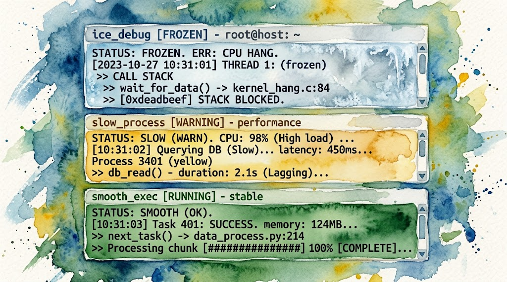
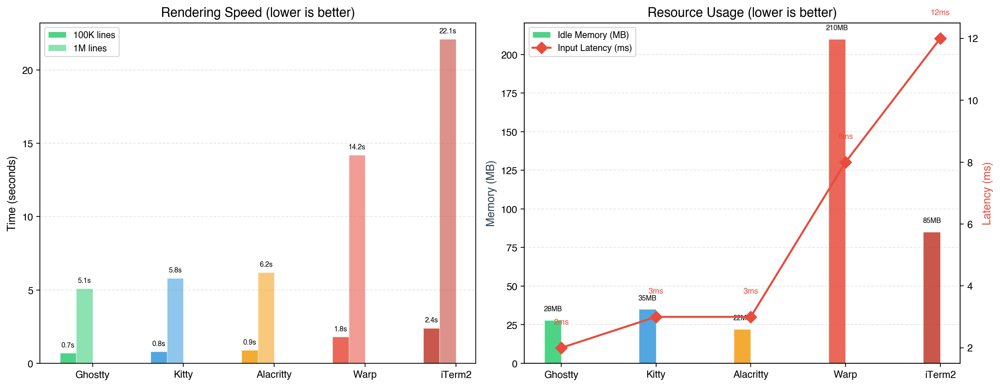
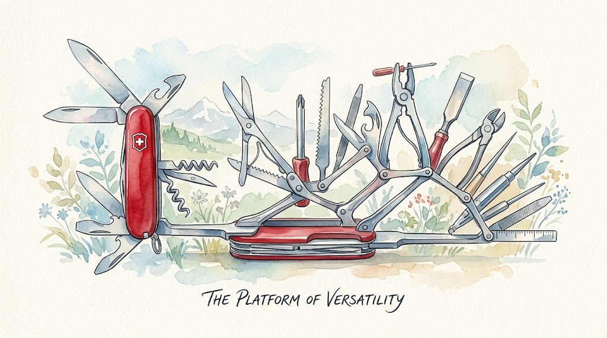

> Spending the entire day inside OpenCode made my terminal my IDE. But when even typing became a problem, switching was the only option.

This started with a very specific, very annoying problem: **Chinese IME freezing**.

Inside Warp running OpenCode, typing Chinese was nearly unusable. Every three to five characters, the system would freeze for seconds. Input stopped responding. When it recovered, it would swallow some of the characters I'd typed. At first I blamed OpenCode, thinking maybe it was consuming too many resources. But I checked other applications and typing was perfectly fine there.

That narrowed it down to something specific to **Warp + OpenCode + Chinese input** — neither the system nor the input method alone was the problem.

---

## The Diagnosis

My debugging process was straightforward:

1. Warp + OpenCode + Chinese IME → **severe freezing, nearly unusable**
2. Warp + OpenCode + English only → **also lags, just less severe**
3. macOS Terminal.app + OpenCode + Chinese IME → **fine**

The problem wasn't OpenCode, and it wasn't the input method alone: **Warp itself was unstable**, and Chinese IME plus OpenCode just amplified it.

I didn't dig into the root cause: whether it's Warp's block-based rendering pipeline interfering with IME event handling, or its GPU compositing layer conflicting with the input method. All I know is it didn't work, and my daily workflow depends on this combination.

## Enter Kitty

I had installed Kitty years ago alongside Ghostty and Alacritty, around v0.24 (early 2022). Tried all three, eventually deleted the other two, and Kitty sat untouched for years. Warp I installed shortly after its release in 2024, and the Chinese IME issue was there from the start.

I dug out Kitty and launched it: **v0.24 worked fine out of the box.** So I upgraded it to the latest version[^4]:

```bash
curl -L https://sw.kovidgoyal.net/kitty/installer.sh | sh /dev/stdin
```

Then I opened Kitty, launched OpenCode, and switched to Chinese input.

**It just worked.** Smooth, fast, no freezes, no swallowed characters, no nothing.

The result far exceeded my expectations. I sat there for a moment. Weeks of frustration, solved by switching terminals. No configuration or tuning needed, no workaround required. Just a different terminal emulator.

The feeling was a mix of relief and confusion. Relief that I could finally work normally. Confusion about why Warp couldn't do the same.

At that point I didn't know Kitty's performance numbers. I just knew it felt fast, stable, and unobtrusive.



## Since I Switched: Let's Look at the Numbers

After the switch, I looked up Kitty's official performance docs and third-party benchmarks. Turns out the numbers back up the feel:

### Kitty Official Benchmarks (Linux/X11)

Kitty ships a built-in benchmark tool (`kitten __benchmark__`) that measures parser throughput. Higher is better (MB/s)[^1]:

| Terminal | Total throughput |
|----------|-----------------|
| **Kitty 0.33** | **134.55** |
| GNOME Terminal 3.50.1 | 61.83 |
| Alacritty 0.13.1 | 54.05 |
| WezTerm 20230712 | 48.50 |
| Konsole 23.08.04 | 27.48 |
| Alacritty + tmux | 24.73 |

Kitty's throughput is **more than 2x** the next best terminal. These measurements are on Linux/X11 and focus on pure parser speed (rendering suppressed). On macOS the relative ranking may differ, but the architecture, with SIMD-accelerated escape code parsing and GPU-cached character rendering, is the same.

Kitty's docs also cite third-party measurements showing it has "best in class keyboard to screen latency."

### Third-Party Benchmarks (macOS, 2026)

[DevToolReviews](https://www.devtoolreviews.com/) ran a comprehensive test on an M3 Max MacBook Pro[^2]:

| Benchmark | Ghostty | Kitty | Alacritty | Warp | iTerm2 |
|-----------|---------|-------|-----------|------|--------|
| 100K lines cat | 0.7s | 0.8s | 0.9s | 1.8s | 2.4s |
| 1M lines cat | 5.1s | 5.8s | 6.2s | 14.2s | 22.1s |
| Input latency | ~2ms | ~3ms | ~3ms | ~8ms | ~12ms |
| Idle RAM (1 tab) | 28MB | 35MB | 22MB | 210MB | 85MB |
| 8 tabs after 4hrs | 95MB | 110MB | 45MB | 380MB | 290MB |

Observations:

- **Throughput**: Ghostty and Kitty are nearly tied. Warp is ~2x slower. iTerm2 is ~3x slower.
- **Input latency**: Ghostty at 2ms and Kitty at 3ms, both below perception threshold. Warp's 8ms is noticeable to fast typists. iTerm2's 12ms is clearly felt. The Chinese IME freezing I experienced was far worse than these numbers suggest — *full seconds* of unresponsiveness, not milliseconds.
- **Memory**: Warp uses **6x** the idle RAM of Kitty, **7.5x** of Ghostty. I routinely run 5-6 tabs each with an OpenCode session. That difference adds up to hundreds of MB.
- **Pure parser throughput (Kitty official Linux test)**: 134.55 MB/s vs Alacritty's 54.05 MB/s.

Kitty's official Linux benchmarks and third-party macOS benchmarks rank differently because they measure different things:
- Kitty's own benchmark measures **pure parser throughput** (escape code parsing, no rendering), where its SIMD-parallel parser dominates.
- Third-party tests measure **end-to-end rendering** (cat a file → display on screen), where the GPU rendering pipeline becomes the bottleneck. Ghostty's custom Metal engine is optimized for this path.

For heavy TUI refresh cycles (like OpenCode's frequent partial re-renders), Kitty's parser advantage matters. For scrolling through large file dumps, Ghostty is marginally faster. The real-world difference is small; both feel instant.



---

## My Actual Setup

After migrating, I did two things: clean up the UI, and set up session save/load shortcuts.

### Clean UI

Keep the tab bar at the top for switching sessions, give everything else to OpenCode:

```bash
# kitty.conf key settings
font_family      Iosevka Fixed Slab
font_size        15.0

# Hide unnecessary UI
hide_window_decorations titlebar-only
tab_bar_style      powerline
tab_bar_edge       top

# Performance
input_delay        3
sync_to_monitor    no
```

### Session Config

A daily workspace session: one command brings everything back after a reboot:

```bash
# ~/.config/kitty/sessions/daily_work.kitty-session
new_tab
cd ~/Projects/vibe-quant
launch omo

new_tab
cd ~/Projects/blog
launch omo

new_tab
cd ~/Develop
launch omo

new_tab
cd ~/Projects/daily-stats
launch

focus_tab 2
```

### Key Bindings

Two shortcuts to save and load the current session state:

```bash
# kitty.conf
map ctrl+cmd+s save_session ~/.config/kitty/sessions/last_session.kitty-session
map ctrl+cmd+shift+s load_session ~/.config/kitty/sessions/last_session.kitty-session
```

Each tab sits in its own directory running its own OpenCode instance, completely independent. Warp doesn't have a session feature, so recovery after a reboot was always manual, another small friction point.

I didn't even touch Kitty's layouts or unbind any default shortcuts. The defaults were good enough. I just needed a stable *host* for OpenCode. Kitty happened to be exactly that.

## Other Options I Considered

I had tried several other GPU-accelerated terminals 4+ years ago. Kitty and iTerm2 were the ones I kept. This time around I checked their current status too, and ultimately chose Kitty.

**Ghostty** leads on raw performance: lowest latency (~2ms), smallest memory (28MB idle), fastest cold start (68ms). Created by Mitchell Hashimoto (HashiCorp). I have fondness for HashiCorp (did some ecosystem development around it), but I tried Ghostty back in 2022 and deleted it, keeping Kitty instead. Maybe I'll give it another shot someday.

**Alacritty** has the lowest memory footprint (22MB idle) and an ultra-minimalist design. But Shift+Enter and similar modifier-key combos often don't register correctly in AI terminal apps[^3], though this isn't an Alacritty-exclusive issue; every terminal handles Kitty keyboard protocol differently, and most need manual escape sequence configuration.

**iTerm2** is the feature-rich veteran, with Metal GPU rendering. But the numbers speak: 22.1s for 1M lines, 12ms input latency, 290MB RAM after sustained multi-tab usage[^2], last in every category.

Kitty was the Goldilocks choice.

---

## Warp vs Kitty: Design Philosophy

There's no universal "better" here — they embody fundamentally different design philosophies:

Warp's philosophy: the terminal should be redesigned from scratch: add AI, add collaboration, add cloud sync, add team features. It's a full-course meal.

Kitty's philosophy: the terminal should be efficient, reliable, and extensible: let the tools do their own work. It's a great pan. What you cook with it is up to you.

It comes down to which philosophy fits your workflow.

If the terminal runs **your own commands** (git, docker, ssh, npm), Warp's AI completion and block output genuinely boost productivity.

But if the workflow looks like mine, where **the terminal runs an AI agent and that agent handles all CLI interaction**, then the terminal's own AI is redundant. What's needed is a stable, lightweight, well-rendered *host*.

Kitty is that host.



## When a Tool Becomes a Platform

Warp went from a terminal emulator to an "agentic development environment." This transition may make sense for their business model, but for someone who just needs a terminal, it means constant bloat, distraction, and friction.

Kitty did the opposite: spend a decade doing one thing well. It stays focused on terminal emulation. It avoids hype-chasing, feature bloat, and platform lock-in. It wins on the fundamentals: GPU-accelerated rendering, keyboard protocol, graphics protocol, and extensibility. It lets users decide what to do with it.

Switching terminals is a small thing. But afterward, I had one less tool to worry about. That feels surprisingly good.

---

## Epilogue

The migration began with a broken input method. I tried a terminal I'd installed years ago, found it solved the problem, and the results far exceeded expectations.

An expected discovery too: Warp's value-add features became **completely redundant**. Inside OpenCode, the AI agent handles all CLI interaction: smart completion, AI command search, error explanation, all of it. The terminal went back to doing what a terminal should do: render TUI output and pass through keystrokes.

The unexpected benefit: **one less tool to worry about.** No login prompts or tuning required, and no update announcements to track. It just sits there, quietly rendering OpenCode, letting me type.

For someone who lives in the terminal, that feeling of "not being there" might be the best kind of experience a tool can offer.

---

## References

1. [Kitty Official Performance Documentation](https://sw.kovidgoyal.net/kitty/performance/)
2. [DevToolReviews — Best Terminal Emulators 2026](https://www.devtoolreviews.com/reviews/best-terminal-emulators-2026)
3. [OpenCode Docs — Keybinds / Shift+Enter](https://opencode.ai/docs/keybinds/#shiftenter)
4. [Kitty Official Install Documentation — Binary Install](https://sw.kovidgoyal.net/kitty/binary/)
