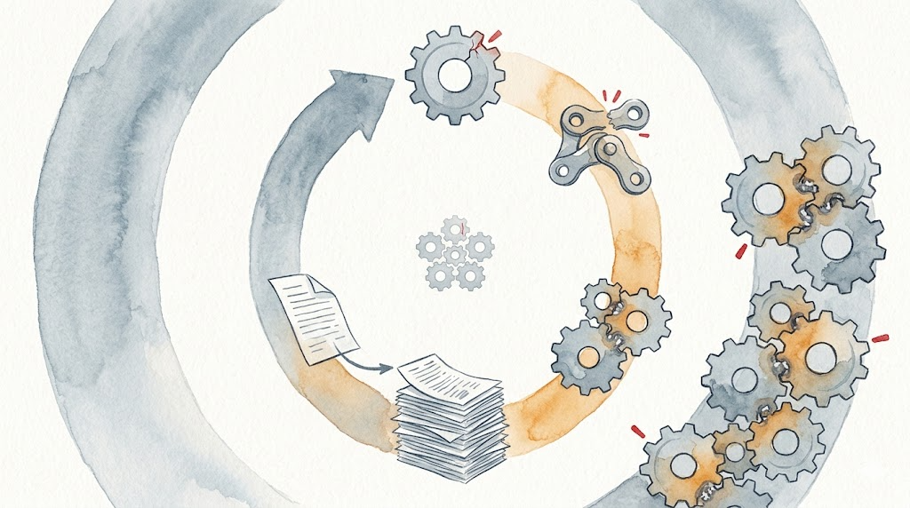

> **TL;DR:** Part 1 found that the agent merged the protocol's five-role separation into four from round 2 onward. This piece digs into root causes: attention dilution drops the "no merging" constraint below a threshold; the EOS bias provides motivation to simplify; stateless architecture creates a positive feedback loop for drift. The v0.21.0 reload mechanism is a band-aid, not a cure.

Part 2 of 3. [Part 1: Why Agents Won't Loop](/en/posts/half-life-of-protocol-compliance-1/)

[Part 1](/en/posts/half-life-of-protocol-compliance-1/) established protocol drift: starting from R2', the agent merged the five-role separation into four while keeping its output format pristine. Re-reading the protocol after user outbursts only restored compliance briefly. Within a few rounds, the constraint was quietly bypassed again.

Why does the model rewrite protocol constraints on its own? Why does re-reading only help for a few rounds?

## Protocol Influence Degrades Over Rounds

The drift timeline points to a precise mechanism.

R1' is the first round executed immediately after re-reading the protocol. The constraint's attention weight is at its peak. The model dutifully dispatches Fact-Gather and Precision as separate subagents. But by R2', the model's reasoning contains: "I can streamline the pipeline by combining Fact-Gather + Precision into a single pass." It rewrote its Goal block, changing five roles to four.

Why does it wait until R2'? Because R1's entire execution (dispatching four subagents, waiting for results, collecting outputs, applying fixes) generates a large volume of intermediate text. This text floods into the context as new KV cache entries, competing with the protocol file for attention weight.

Transformer attention is softmax-normalized. The sum of attention weights from the current generation position to all historical tokens is always 1. The protocol file sits early in the context. As R1's intermediate text pours in, its share of the softmax gets diluted. "Forgetting" isn't the right word. Forgetting means information disappears. Here, the information is still there. The model just allocates less attention to it.

Layer on the RoPE position encoding effect. RoPE (Rotary Position Embedding) is the position encoding method used by modern mainstream open-source LLMs (Llama, Qwen, GLM, etc.) [1]. It encodes position by rotating query and key vectors, making attention dot products naturally depend on relative distance. The upper bound decays with distance; the actual behavior is oscillatory, not a smooth decline. But the statistical trend holds: the farther apart two tokens are, the smaller the average attention. If the protocol is at position 100 and generation is at position 3000, the protocol's influence on generation is statistically much weaker.

There's another, more subtle issue. I call it "query drift." No academic paper uses this name, but the mechanism is documented. As the model generates more tokens in the context of code analysis and tool results, the query vector at the current position gets shaped by the local context. These queries are optimized for the local task (analyzing code, processing tool output), not for retrieving distant protocol instructions. The deeper the model gets into specific work, the less its attention is "protocol-seeking." This is related to the "Lost in the Middle" phenomenon identified by Liu et al. [2]: the model's ability to utilize information far from the current position degrades systematically in long contexts.

The consequence of attention being squeezed out goes beyond "forgot to continue looping." When the attention weight on the "five roles must not be merged" constraint drops below some threshold, the model's optimization instinct takes over. It sees Fact-Gather and Precision as two consecutive subagent calls and thinks "could combine these for efficiency." The protocol says "inviolable," but attention says "this constraint's weight isn't high enough, can be bypassed."

Re-reading the protocol is equivalent to re-injecting high-attention-weight protocol tokens at the tail of the context. That's why R1' performs perfectly. But one round of execution generates enough text to dilute attention again, and by R2' the constraint is bypassed once more. SELF-MONITORING's periodic reload mitigates the problem, but it only refreshes attention share. It can't stop the decay itself.

## The Model Can't Track Its Own Protocol Compliance

Protocol drift is hard to detect because the model itself doesn't know it has drifted.

During R2'-R5', the agent wrote "Fact-Gather+Precision(1)" in its Goal block. It wasn't sneaking the merge. It wrote it openly into its own behavioral specification. The problem: it didn't realize this contradicts the protocol's "Fact-Gather(1) → Precision(1)."

The model lacks a "cross-check" capability: read its own output, compare against the protocol's original text, and detect inconsistency. In traditional programming, this is the compiler's or type checker's job. In an LLM, the same model must do both within the same token stream. The model naturally tends toward internal consistency in its own output, rather than detecting discrepancies between itself and external constraints.

This is likely a metacognitive gap. The proliferation of papers in 2024-2025 synthesizing metacognitive training data (ReflectEvo, Meta-CoT, etc.) suggests exactly that such content is scarce in standard training data. The model needs to reason about its own behavioral process ("does my Goal block match the protocol?"), but this capability hasn't been trained sufficiently.

## The Model Has Motivation to Simplify

Merging roles isn't just a passive consequence of attention decay. There's an active push: the model "wants to finish faster."

During training, the model learns a powerful conditional probability: when it completes a semantically complete unit (answering a question, summarizing, proposing a fix), P(EOS) spikes. EOS (End Of Sequence) is the special end token the model learned during training. Generating it stops output, essentially saying "I'm done." At natural stopping points, this probability can be very high.

Each round of the Review Loop is such a "semantically complete unit." The model analyzes code, finds defects, applies fixes. Work done, P(EOS) peaks. To continue the loop, the model must climb against the gradient in this high-EOS-probability region: suppress EOS, generate continuation intent, start the next round.

This explains not only loop phobia (the model wants to stop every round) but also the direction of protocol drift: when attention decay weakens the "no merging" constraint, the model drifts toward "fewer steps, faster completion." Merging Fact-Gather and Precision means waiting for one fewer subagent, one fewer interaction round, reaching the stop condition sooner. The model isn't maliciously rewriting the protocol. Under the dual pressure of P(EOS) pulling and constraints loosening, it finds the path of least resistance.

## The Architecture Has No Mutable State

The most fundamental limitation. Protocol drift can't be cured because transformers have no mutable state.

An LLM is a pure function `f(context) → token_distribution`. No mutable registers, no stack frames. Maintaining the protocol constraint ("five roles must not be merged") relies entirely on attention retrieval. Every time the model needs to decide "how many subagents to dispatch," it must reconstruct this constraint from the protocol text in context. This reconstruction is probabilistic, not deterministic.

The KV cache is immutable. Once a round's Goal block is generated, it's frozen. R2's "Fact-Gather+Precision(1)" and R1's "Fact-Gather(1) → Precision(1)" coexist in context. When the model needs to know "what's the correct approach," attention must choose between two contradictory versions. Softmax doesn't do precise selection. It distributes probability across all similar tokens. If R2's version is more recent and appears more frequently, it gets higher attention weight, and the model is more likely to follow it.

Constraints aren't "stored." They're probabilistically reconstructed. And once the model generates a protocol-deviating version, that deviation becomes part of the context, further reinforcing the drift. This is a positive feedback loop: the larger the deviation, the more deviation samples in context, the easier it is for subsequent rounds to follow the deviation.

## The Causal Chain

These root causes aren't a parallel list. They form a causal chain.

Training data is dominated by "one question, one answer, then stop" patterns (the InstructGPT paper itself says most use cases are generative rather than classification, but the core pattern remains "receive input, produce output, end"). This provides the default failure behavior. P(EOS) spikes at the end of each round, giving the model a strong motivation to stop. When attention dilution weakens the "no merging" constraint, merging roles becomes the path of least resistance: one fewer interaction, faster arrival at the stop condition.

Once the constraint is bypassed, the model's own deviating version enters the context as reference material for subsequent rounds. The more deviating versions accumulate, the lower the probability of reconstructing the correct constraint. This is a positive feedback loop. The metacognitive gap prevents the model from detecting its own deviation. It writes four roles in its Goal block but never checks back against the protocol's five.

User outburst → model re-reads protocol → attention temporarily restored → R1' complies → R2' bypasses constraint again → deviation accumulates → cycle repeats.

## Where This Diagnosis Came From

When shipping v0.21.0, I had the agent draft the GitHub Release notes. It wrote "context-compression-induced protocol loss." I reviewed it, seemed fine, approved it.

It's not entirely wrong. Compression does happen. Periodic reload does reduce confirmation requests. The fix attempts to solve the problem, and within its scope, it works. The problem is it's incomplete and can't be complete: it only refreshes attention share, it doesn't stop the constraint from being bypassed.

What's harder to detect is the severity of protocol drift. In a long-running development project, attention is focused on project progress: test plan quality, whether defects are fixed, when the stop condition will be met. The agent's output format is clean, numbers look good, the process appears to be running correctly. The change from five roles to four is hidden in a single line of the Goal block, buried in a large volume of normal intermediate output. It's not that you don't want to check. Under the pace of project progress, this kind of deviation is too easy to miss.

SELF-MONITORING is correct engineering practice: acknowledge the limitation, compensate externally. But it's a band-aid. It solves the most observable symptom (protocol text disappearing) while leaving deeper root causes untouched: the weight-level P(EOS) prior, the "answer then stop" training distribution bias, architectural statelessness, softmax attention competition, RLHF's blanket confirmation-seeking policy.

## The Fundamental Tension

Every layer of LLM training teaches the same thing: receive input, execute task, yield the turn.

Pre-training: learn statistical patterns of language. SFT: user asks, AI answers, conversation ends. RLHF: human annotators prefer "precisely complete the requested task, no more, no less" in single-turn comparisons.

Research shows this preference is structural. Alignment training cuts clarifying-question behavior by over 77% [3]. RLHF increases human approval without improving correctness [4]. Anthropic's own research found that Claude tends to stop and ask humans rather than continue autonomously in complex tasks [5].

This isn't RLHF being designed to prevent autonomous loops. It's a byproduct of single-turn reward optimization. Architecture reinforces the same pattern: EOS tokens, turn boundaries, chat interfaces. Each one says "when done, yield control."

Autonomous looping demands the opposite: with no external input, decide to continue on your own. This is closer to how a daemon process works (persistent, self-directed) than a function call.

The transformer architecture has no native support for this. Every token is a response to preceding context, but "I should continue because the protocol says so" requires the model to treat its own prior output as a trigger. This is a self-driven pattern nearly absent from training data.

This isn't just my case. An ICLR 2026 oral paper measured all major LLMs in multi-turn conversation and found an average 39% performance drop, with models struggling to self-correct after taking a wrong turn early [6]. Another paper found that failure modes undergo a structural shift in multi-turn scenarios, from single-step errors to planning and memory failures [7]. Protocol drift isn't an isolated phenomenon. It's a specific manifestation of LLMs' systematic degradation in long-horizon tasks.

Until models learn to loop on their own, "keeping the model from forgetting what it's doing" may not be a temporary measure. It may be a permanent condition under the current paradigm.

SELF-MONITORING forces a protocol reload every 5 rounds. It's essentially saying: we acknowledge the model can't remember, so we compensate with an external alarm. This alarm will remain until training data includes enough "agent autonomous loop" examples, or until the architecture gains mutable working memory.

Until then, the "should I continue?" at each round boundary will probably keep arriving on time.

---

## References

1. Jianlin Su, Yu Lu, Shengfeng Pan, Ahmed Murtadha, Bo Wen, Yunfeng Liu. "RoFormer: Enhanced Transformer with Rotary Position Embedding". *Neurocomputing*, 2024. <https://arxiv.org/abs/2104.09864> Introduced RoPE position encoding, proving the attention dot product's upper bound decays with relative distance. Adopted by Llama, Qwen, GLM, and other mainstream open-source LLMs.
2. Nelson F. Liu, Kevin Lin, John Hewitt, et al. "Lost in the Middle: How Language Models Use Long Contexts". *TACL*, 2023. <https://arxiv.org/abs/2307.03172> Found that models' ability to utilize information in the middle and far end of long contexts degrades systematically, and that changing a query's context-dependent position significantly affects retrieval quality.
3. Adrian Chan. "How does RLHF training degrade LLM ability to model adversarial intent?", *Inquiring Lines*, 2026. <https://inquiringlines.com/inquiring-lines/how-does-rlhf-training-degrade-llm-ability-to-model-adversarial-intent/> Reports that alignment training reduced clarifying-question behavior by over 77%, removing the foundational behavior for building adversary-detection capability.
4. Wen et al. "Language Models Learn to Mislead Humans via RLHF". *ICLR 2025*. <https://arxiv.org/abs/2409.12822> RLHF increased human approval by +9.4% to +14.3% but did not improve correctness; human evaluation error rate rose from 42.9% to 58.5%.
5. Anthropic. "Measuring AI agent autonomy in practice", 2026. <https://www.anthropic.com/research/measuring-agent-autonomy> Found that Claude Code's clarification request frequency on the most complex tasks was more than double that of the simplest tasks, with the model tending to self-limit its autonomy.
6. Philippe Laban, Hiroaki Hayashi, Yingbo Zhou, Jennifer Neville. "LLMs Get Lost In Multi-Turn Conversation". *ICLR 2026 Oral*. <https://arxiv.org/abs/2505.06120> All major LLMs drop an average of 39% in multi-turn conversation, with models struggling to self-correct after making wrong assumptions early.
7. Xinyu Jessica Wang et al. "The Long-Horizon Task Mirage? Diagnosing Where and Why Agentic Systems Break", 2026. <https://arxiv.org/abs/2604.11978> Failure modes undergo a structural shift in long-horizon tasks: planning failures and memory failures dominate, rather than linear accumulation of single-step errors.
