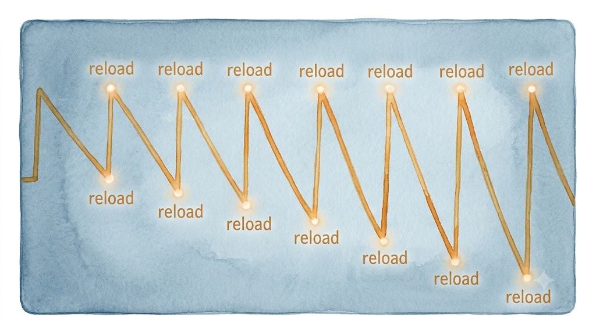
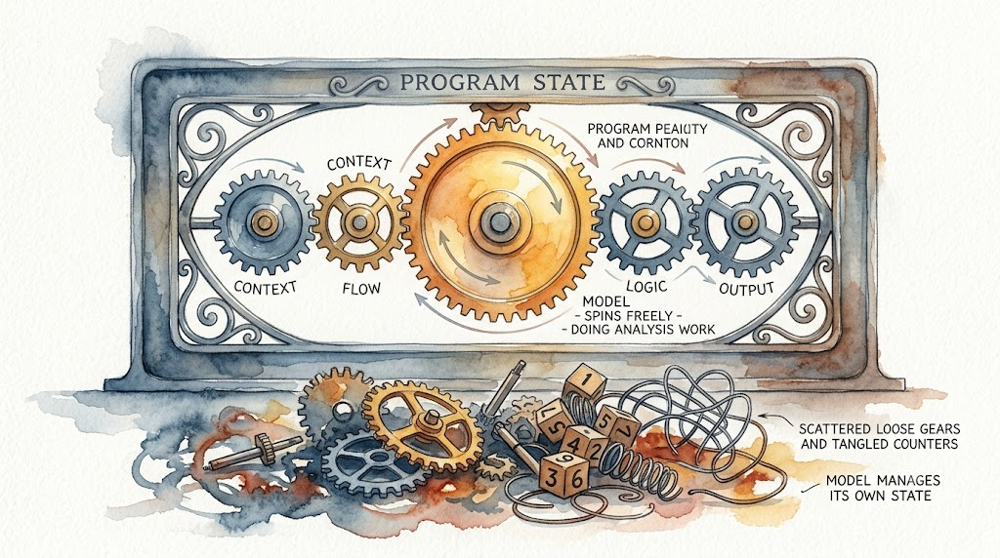

> **TL;DR：** SELF-MONITORING 发布后，确认请求降了 94%，状态块完整率涨了 5 倍。但 60% 的状态块仍然残缺，连闹钟本身偶尔也会忘响。创可贴有效，但撑不到 100%。最有效的修复是最不"Agent"的那个：让程序管状态，让模型管推理。
>
> 系列：协议遵守的半衰期（第三篇） 
> [上一篇：深层根因](/posts/half-life-of-protocol-compliance-2/)

[前两篇](/posts/half-life-of-protocol-compliance-1)（[上](/posts/half-life-of-protocol-compliance-1)、[下](/posts/half-life-of-protocol-compliance-2)）挖了七层根因，结论是 v0.21.0 的 SELF-MONITORING 只是一张创可贴。创可贴也得量量到底能撑多久。

## 先看数据

SELF-MONITORING 发布前后，同一个项目、同类任务的两个 session 可以对比。

确认请求频率（严格过滤，只算真正停下来问"要不要继续"的）：

| 时段 | 确认请求 / 有效文本块 | 比例 |
|------|---------------------|------|
| v0.21.0 之前 | 44 / 1243 | 3.5% |
| v0.21.0 之后 | 1 / 624 | **0.2%** |

降了 94%。

状态块完整度（`[ROUND CLOSE]` 块 7 个字段全部填对的）：

| 时段 | 完整 / 总计 | 比例 |
|------|-----------|------|
| v0.21.0 之前 | 2 / 25 | 8% |
| v0.21.0 之后 | 21 / 52 | **40%** |

提升了 5 倍。

`rounds_since_reload` 计数器：在 v0.21.0 之后的 40 小时 session 中，计数器从 1 递增到 5、触发重载、归零、再次递增，循环了至少 15 次。

单看这三组数字，SELF-MONITORING 像是一次成功的修复。

## 但 40% 不等于及格

状态块完整率从 8% 提升到 40%，绝对值涨了 5 倍。可换个角度看：v0.21.0 之后仍有 60% 的状态块是残缺的。

模型在协议刚重载的那一轮表现得最好，然后随着轮次推进逐渐退化，直到下一次重载把表现拉回来。SELF-MONITORING 做的事情是周期性地把衰减曲线的起点重置。它能减缓退化的速度，但不能阻止退化本身。

前两篇分析过，退化的根源在四个叠加的机制：softmax 竞争稀释、RoPE 位置衰减、query 漂移、以及状态混合。重载协议等于在 context 尾部重新注入高 attention 权重的协议 token，能临时对抗前三个机制，但对第四个（状态混合）无能为力。到第 8 轮，context 里仍然有 8 个状态版本在互相干扰。

还有一个更微妙的失败。6 月 15 日 09:46，对话记录里出现了这样一行：

> ❌ rounds_since_reload 超过 5 未重读

模型自己（或框架的检查机制）发现计数器到了 5 却没有触发重载。这个漏洞后来被手动修正了。连"记住每隔 5 轮重读协议"这件事本身，也需要模型维持状态，而维持状态恰恰是模型的弱项。

## 为什么确认请求降了 94%

确认请求几乎消失了，这是最出乎意料的数据。

SELF-MONITORING 并没有直接解决 RLHF 的确认寻求策略（根因 6）。更可能的路径是间接的。重载协议时，Agent 会读到 SELF-MONITORING 的触发条件之一："用户输入包含 'context'、'compressed'、'reset'、'reload'"。更重要的是，每次重载都会重新读取完整的协议文本，包括"修复不需要用户确认，循环自动关闭"这句被注意力稀释淹没的话。协议重读后，这句话的 attention 权重回到高位，模型在接下来的几轮里记住了"不该问"。

但这不是根因层面的修复。模型的权重层面仍然认为"不确定的时候问比较好"（RLHF 的训练偏好）。只是协议重读后，"不该问"的指令暂时压过了"该问"的先验。几轮之后，指令的 attention 权重再次衰减，先验重新占据上风。如果此时恰好到达计数器 5 的触发点，重载再次把指令拉回来。如果没到，模型又可能开始问。

这解释了为什么 v0.21.0 之后仍有 0.2% 的确认请求：它们出现在计数器还没到 5、但注意力已经衰减到不足以压制 RLHF 先验的窗口期。

## 外部状态管理

既然模型的内部状态不可靠（60% 残缺），而外部计时器能工作但偶尔也会被忘记（rounds_since_reload 超时未触发），更彻底的方案是把状态管理完全移到模型外部。

不是让模型在文本输出里维护 `[ROUND CLOSE]` 块，而是让框架（运行 Agent 的程序）维护一个真正的状态对象：当前轮次、累计 findings 数、consecutive_zero 计数器。模型每一轮只做分析工作（读代码、找缺陷、提修复方案），做完就交还结果。框架负责：

1. 检查模型这一轮有没有产出缺陷
2. 更新计数器
3. 判断停止条件
4. 如果不满足，注入下一轮的 prompt："这是第 N 轮。上一轮发现了 X 个缺陷。停止条件是连续两轮零缺陷。继续。"

模型不需要记住自己在第几轮，不需要维护计数器，不需要判断停止条件。框架替它做这些。

这等于把 Agent 从"自治循环"降级为"被调用的函数"。每一轮的输入由框架组装，输出由框架解析。模型只负责它擅长的事：分析文本、推理判断、生成方案。

SELF-MONITORING 其实已经在这个方向上迈出了第一步。`rounds_since_reload` 计数器就是外部状态的一种雏形。但它仍然依赖模型自己维护计数器、自己判断是否到 5、自己执行重载。完整的方案应该把这些都移出模型。

## 代价

外部状态管理意味着放弃"自治 Agent"的概念。

自治 Agent 的定义是：模型自己决定做什么、什么时候停、下一步是什么。这恰恰是 LLM 架构做不到的事（前两篇详细分析过）。每一步外部化，都是在说：模型不够可靠，所以这一步由程序来管。

走到尽头就是：框架管理全部控制流，模型只管对象层面的计算。Agent 变成了一个被传统程序驱动的 LLM 调用循环。这跟 LangGraph、AutoGen 这些框架做的事情没有本质区别。它们的 graph、state machine、human-in-the-loop 节点，做的事情都是在把控制流从模型手里拿走，交给确定性的代码。

这不算倒退。模型不擅长状态管理，程序擅长。各自做各自的事。

LLM 是一个非常强的模式匹配和推理引擎，但它不是一个状态机。让它做状态机的工作，等于让 CPU 去当硬盘用。不是做不到，而是每次"读取"都要经过整个 forward pass，代价巨大，而且不可靠。

## 一条没有终点的路？

也许有人会问：等模型更强了，这些问题会不会自然消失？

部分会消失。上下文窗口从 128K 扩到 1M、10M，注意力稀释的问题会缓解。更好的位置编码（Mamba、线性 attention）可能减少长距离衰减。更大规模的训练数据里加入更多 Agent 循环的样本，Q&A 先验会被稀释。

但有一个限制不会因为模型变强而消失：transformer 是无状态的。无论参数量多大、上下文窗口多宽，`f(context) → token` 这个函数签名不变。状态永远需要通过文本外化、通过注意力重建。只要架构不变，这个根本矛盾就在。

也许下一代架构（状态空间模型、有工作记忆的混合架构）能从根本上解决。但在那一天到来之前，"让模型不忘记自己在做什么"仍然需要工程补偿，不是临时措施，而是当前范式下的常态。

创可贴能撑多久？从数据看，撑得比预期久。确认请求降了 94%，状态块完整率涨了 5 倍。但它撑不到 100%。剩下的 60% 状态块残缺和 0.2% 的确认请求窗口，需要更深层的修复。而最有效的修复，是最不"Agent"的那个：让程序做程序擅长的事，让模型做模型擅长的事。
