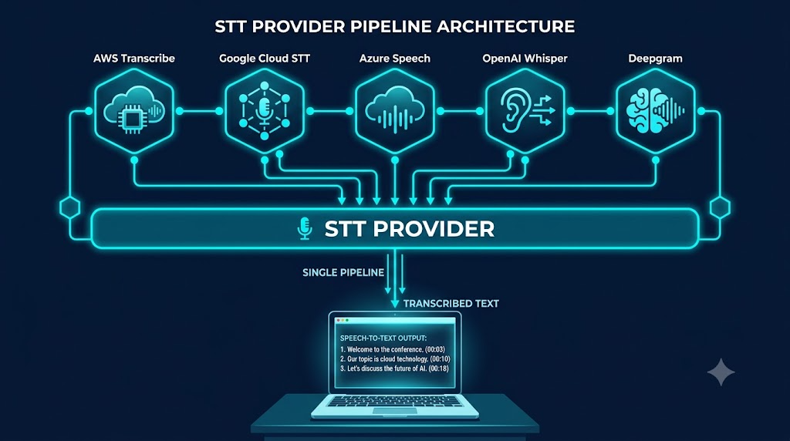
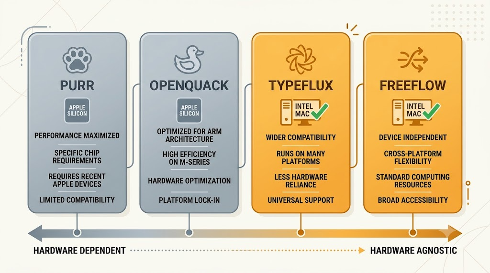

## Why Voice Input

Typing speed averages 50-80 WPM. Natural speech runs at 150-180 WPM. For emails, notes, and even code comments, the gap is hard to ignore.[1]

What pushed me to actually look was **vibe coding**, the "describe and decide, let AI write the rest" style of programming. The bottleneck shifts from "how fast can I code" to "how fast can I articulate what I want." Rewrite a prompt, tweak a parameter, jump to another app to type. All of it breaks flow. Voice input closes that loop. Speak the intent, stay in flow.

Commercial solutions are not in short supply. Google Docs has voice typing, Otter.ai transcribes meetings, and Zoom has live captions. Voice input is everywhere. But these features share two problems:

1. **Privacy and freedom:** Google Docs voice typing runs on Google models. Otter.ai runs its own. You are locked into each vendor's ecosystem: their quality, their privacy policy, their data pipeline. No backend switching, no local model option. Feature changes, pricing changes, or shutdowns are out of your control. Closed source means no recourse.

2. **Bundled, not standalone:** These are voice features tucked inside larger applications: a word processor, a meeting tool, a transcription service. None is a dedicated voice input tool that you can point at any app and start dictating.

Every option I looked at shared the same pattern: closed source, fixed model, audio sent to the vendor's servers by default.

I wanted something **open source**. I wanted to inspect the code, choose the ASR engine, run locally if needed, or hook into a better cloud service. And it had to support Chinese and English voice input that inserts text at the cursor position. No copy-paste, no app switching.

One more constraint: my machine is a 2020 Intel MacBook Pro (MacBookPro16,2). Core i5 at 2GHz, 4 cores, 16GB RAM. No Apple Neural Engine. A lot of tools are Apple Silicon exclusive.

Four projects on GitHub came up: iamarunbrahma/purr, mylxsw/typeflux, larryxiao/openquack, zachlatta/freeflow. I went through all four.

## The Four Projects

### purr

- GitHub: https://github.com/iamarunbrahma/purr
- Stack: SwiftUI, WhisperKit
- Focus: Minimal macOS menu-bar voice input, record, transcribe, insert

purr's README states macOS 14+ on Apple Silicon and lists Intel as not supported.[2] Its WhisperKit dependency requires the same: Apple Silicon (M1+) and macOS 14+.[2] So on this Intel Mac, purr cannot run at all.

purr itself is well-designed, with a clean UI and smooth interaction. But it is built for Apple Silicon.

### openquack

- GitHub: https://github.com/larryxiao/openquack
- Stack: Swift, WhisperKit, Core ML
- Focus: Free, open-source, privacy-first local transcription

openquack also uses WhisperKit and Core ML. Its project page is upfront about it: Whisper runs locally via WhisperKit on Apple Silicon, and no audio, text, or telemetry leaves your Mac.[3] openquack requires Apple Silicon, so it cannot run on this Intel Mac.

### typeflux

- GitHub: https://github.com/mylxsw/typeflux
- Stack: Swift, multiple STT backends
- Focus: "Hold to talk, release to insert" for zero context-switch voice input

typeflux originally only supported Apple Silicon, but PR #65 (May 2026) added native Intel Mac support.[4] Instead of baking in one inference engine, it abstracts an STT provider layer:

| Provider | Type | Best For |
|---|---|---|
| Typeflux Cloud | Cloud | Zero-config, balanced accuracy |
| Local Model | Local | Privacy, offline use |
| Alibaba Cloud ASR | Cloud streaming | Low latency, Chinese |
| Doubao Realtime ASR | Cloud streaming | Chinese optimization |
| Google Cloud Speech | Cloud | Multi-language, enterprise |
| OpenAI (Whisper API) | Cloud | High accuracy |
| Groq | Cloud | Fast inference, low cost |
| Free Models | Cloud | Bring-your-own endpoint |

For local inference, typeflux supports SenseVoice Small, FunASR (Paraformer), WhisperKit Medium/Large, and Qwen3-ASR. SenseVoice Small (234M params, about 350MB) runs via sherpa-onnx and has about 2-3 seconds of latency on Intel Mac, acceptable for short dictation sentences.[5]

### freeflow

- GitHub: https://github.com/zachlatta/freeflow
- Stack: Swift, Groq Whisper API
- Focus: Minimal menu-bar voice input, cloud transcription

freeflow relies on the Groq Whisper API by default (large-v3 and large-v3 Turbo), though settings accept any OpenAI-compatible provider, including local or self-hosted ones.[6] Groq LPU hardware runs Whisper at 189-216x real-time, so one hour of audio transcribes in about 17-19 seconds.[6]

Hardware does not matter. Intel Mac and Apple Silicon have identical experiences because the compute happens on Groq servers. Chinese WER is about 4.1%, English about 2.1%.[7] Good for everyday use, but not as good as Chinese-native engines like Alibaba Cloud Paraformer.[8]

For Intel Mac users, freeflow is the lowest-friction option: register a Groq account (free credits available), paste an API key, done. The tradeoff is no offline capability. All audio goes to Groq servers.

## Side by Side

| | purr | openquack | typeflux | freeflow |
|---|---|---|---|---|
| CPU Inference | ❌ (cannot run on Intel) | ❌ (unusable) | ~2-3s | ❌ (cloud-only) |
| Apple Silicon Experience | ✅ | ✅ | ✅ | — (cloud only) |
| Chinese + English | ✅ | ✅ | ✅ | ✅ |
| Chinese-Specific Optimization | None | None | Yes (AliCloud/Doubao/SenseVoice) | None |
| Offline Capable | ✅ | ✅ | ✅ | ❌ |
| Cloud Backends | None | None | Multiple options | Groq |
| Hardware Requirement | Apple Silicon + macOS 14+ | Apple Silicon | macOS 13+, x86_64 | macOS 12+ (cloud-only) |
| Setup Complexity | Low | Low | Low | Low |
| Stars | ~63 | ~31 | ~302 | ~2k |
| License | MIT | MIT | AGPL-3.0 | MIT |

> purr and freeflow take the single-backend path (WhisperKit and Groq respectively). openquack is Apple-ecosystem only. typeflux abstracts the backend layer, so it supports the widest range of hardware and providers.

## The Decision

On Intel Mac, only typeflux and freeflow are viable. freeflow is simpler but more limited: one Groq API key, fixed recognition quality.

I went with typeflux for three reasons.

1. **Chinese recognition:** freeflow's Groq Whisper at 4.1% WER is fine in quiet conditions. typeflux can use Paraformer-realtime-v2 (Alibaba Cloud), a non-autoregressive engine optimized for Mandarin, or Doubao Realtime ASR, another Chinese-native engine; the Paraformer family's Chinese benchmarks beat Whisper.[8] You can also run SenseVoice Small locally, no network required. More options are better.

2. **Persona system:** typeflux ships with two built-in personas: "Typeflux" and "English Translator." Default is Typeflux: it transcribes verbatim whatever language you speak. Switch to English Translator from the menu bar, and regardless of what language you speak, the output is in English at the cursor position. No copy-paste needed.

3. **Fallback paths:** typeflux STT Router has a fallback chain: if the primary STT fails, it degrades to Apple Speech (the system-level recognizer).[9] On Intel Mac, where local model latency is unpredictable, this prevents hangs.

## Installing typeflux

The latest release offers two download options: the full bundle (about 190MB, including SenseVoice model files) and the app-only version (about 12MB, with models downloaded on first launch).

I installed the app-only version. Drag to /Applications. Local models are not automatic though. Go to Settings, Model, and click "Prepare Local Model." It downloads in a few minutes. Model files land in ~/Library/Application Support/Typeflux/. Total disk usage is about 377MB (45MB app plus 332MB models and data).

If you use OpenCode or similar AI coding tools, you can offload the download and installation: open a new session and tell the agent "download typeflux and install it to /Applications." It handles the rest. Configuration is still manual.

Three permissions required:
- **Microphone**: for recording
- **Accessibility**: for text injection
- **Speech Recognition**: for Apple Speech fallback

Default hotkey is Fn. But Fn is also needed for function keys (F1-F12), so I changed it to Control+Fn. Double-press Fn is the default input source switch in macOS, so I mapped Ask Anything (voice Q&A or content rewriting) to double-press Option instead.

One thing about Apple Speech: it is in Settings → Advanced Settings, the last item, "Enable Apple Fallback." It is off by default. You need to toggle it on manually. Once enabled, Apple Speech steps in as a system-level fallback when all other STT options fail. A few caveats:

- Apple Speech is a macOS system-level service. Audio ultimately goes through Apple servers, so it requires network access.
- Privacy: audio is uploaded to Apple servers for processing.

## Current Setup

typeflux has been running on my Intel MacBook Pro for a while now. My daily workflow:

- **Default backend**: Typeflux Cloud (built-in, zero config)
- **Offline**: SenseVoice Small (local, kicks in when offline)
- **Fallback**: Apple Speech (auto fallback via STT Router)
- **Personas**: Two built-in, "Typeflux" and "English Translator"

Typeflux Cloud latency is about 0.5-1 second. SenseVoice Small takes about 2-3 seconds on Intel Mac. I use the cloud version daily; local handles offline scenarios.

## Freeflow, if You Want Simple

If you just need basic English and Chinese voice input and do not want to configure multiple backends or manage model files, freeflow plus Groq is the fastest way to get working. Groq offers free credits on signup; whisper-large-v3 is $0.111/hour, whisper-large-v3-turbo is $0.04/hour.[10] An hour of daily use costs a few dollars a month.

freeflow's editing touches up dictated text (Edit Mode, context-aware cleanup), not full persona workflows, and it has no Chinese-specific optimization.

## References

1. Speech-to-text throughput advantage is well-documented. See Karat et al., "Patterns of entry and correction in multimodal interaction with a speech style dictator" (1999), and more recent studies from Microsoft Research and Google. WER data from the Hugging Face Open ASR Leaderboard and vendor benchmarks.

2. purr README support matrix: macOS 14+ on Apple Silicon (M1, M2, M3, M4) supported; macOS 14+ on Intel not supported. https://github.com/iamarunbrahma/purr. WhisperKit system requirements: Apple Silicon (M1+), macOS 14+. https://github.com/argmaxinc/WhisperKit

3. openquack project description and README: Whisper runs locally via WhisperKit on Apple Silicon; no audio, text, or telemetry leaves your Mac. https://github.com/larryxiao/openquack

4. PR #65: "feat: add Intel release packaging", merged May 2026. Intel (x86_64) artifacts ship from pre-release-69 and v0.3.0. https://github.com/mylxsw/typeflux

5. SenseVoice Small: 234M params, about 350MB, FunASR Chinese benchmark CER 7.81%. https://github.com/modelscope/FunASR

6. Groq Whisper benchmark: 189x real-time (large-v3), 216x (large-v3 Turbo). Artificial Analysis, January 2025. https://artificialanalysis.ai. freeflow README: Groq by default; OpenAI-compatible providers, including local or self-hosted models (Ollama, LM Studio), configurable in settings. https://github.com/zachlatta/freeflow

7. SayToWords multilingual benchmark (January 2026): Whisper large-v3 Chinese WER 4.1%, English 2.1%. https://www.saytowords.com/blogs/Whisper-V3-Benchmarks

8. Paraformer-realtime-v2 (Alibaba Cloud) uses a non-autoregressive architecture optimized for Mandarin Chinese. The Paraformer family's non-autoregressive design is documented in the Paraformer papers (arXiv:2206.08317, arXiv:2409.17746) and in the FunASR model zoo (model IDs with the nat suffix). FunASR's Chinese benchmark (184 long-form files) reports Paraformer-Large at 10.18% CER versus Whisper-large-v3 at 20.02%. Doubao Realtime ASR (Volcengine) is the streaming speech recognition service of ByteDance's Doubao Voice model line. https://github.com/modelscope/FunASR; https://arxiv.org/abs/2206.08317; https://arxiv.org/abs/2409.17746; https://www.volcengine.com/docs/6561/80818

9. typeflux STT fallback: STTRouter routes failed transcriptions to AppleSpeechTranscriber. Source: Sources/Typeflux/STT/STTRouter+Fallbacks.swift.

10. Groq pricing as of June 2026: whisper-large-v3 at $0.111/hour, whisper-large-v3-turbo at $0.04/hour, distil-whisper at $0.02/hour. https://console.groq.com/docs/model/whisper-large-v3
