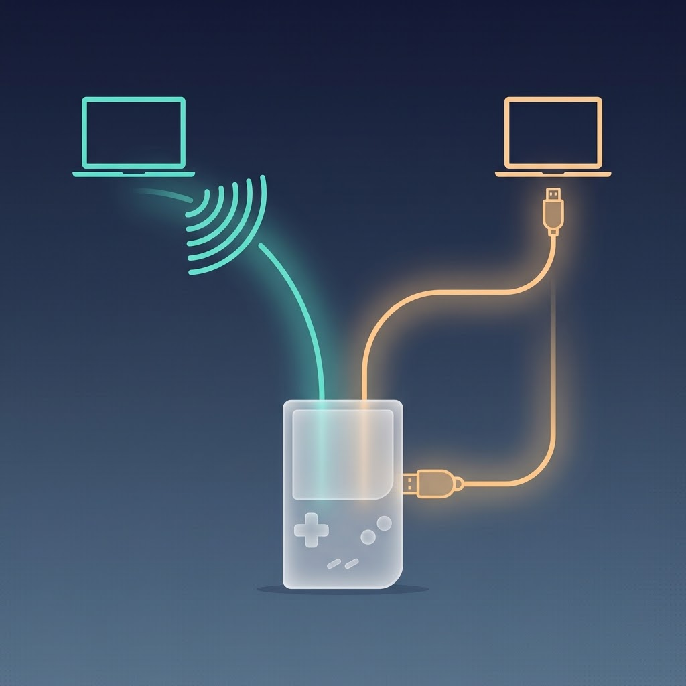
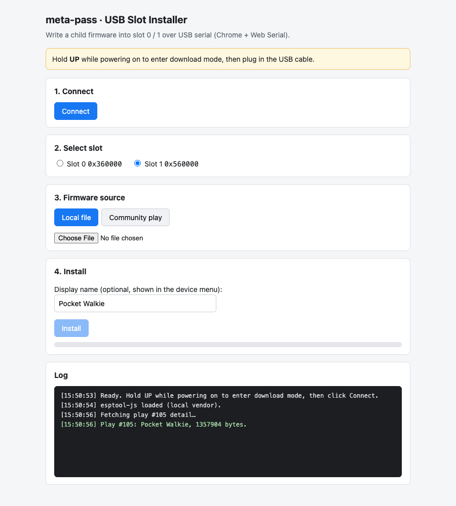
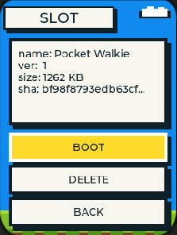
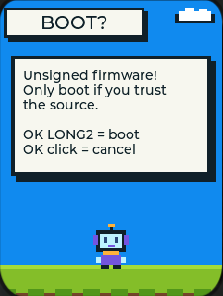
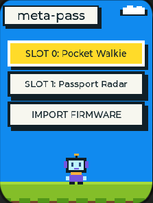

Last week I got a FoloToy AI Passport, an AI conversation toy driven by an ESP32. It has a plays marketplace with quite a few firmware toys[1]. A couple caught my eye: one turns the device into a walkie-talkie over Bluetooth, another uses BLE for a radar treasure hunt. Plenty of community work worth trying too.

Lots of toys, but one awkward reality: **the device runs only one firmware at a time**. Switching from the walkie-talkie to the treasure hunt means opening a laptop, plugging in a cable, and reflashing the entire chip. Once you reflash, the previous toy is gone. Out in the park with my kid, one minute it's the walkie-talkie; if the next minute calls for the radar game, too bad. That has to wait until we get home.

The device has 8MB of storage. Most firmware I've seen is under 2MB. It all fits. So why does the device get to have only one soul at a time?

Then an idea popped up: what if firmware worked like game cartridges? Plug several in, play whichever you want.

That is where meta-pass started: a multi-firmware launcher burned into the factory partition. It lives on the device permanently, invites other firmware into local flash slots, and boots whichever one you pick. No more full reflashes. From idea to a working, released MVP: two days.

AI pair-programmed the whole thing with me, but this was my first SoC project, and I learned a lot of new things. Worth writing down.

## From "Switch Freely" to Three Concrete Questions

"Flash several, switch freely" sounds like one sentence. It breaks down into three questions: where does the firmware live, how does it get in, and how do you get back.

### Where to Put Them: OTA Partitions Are Ready-Made Slots

ESP32 flash can hold several app partitions. The system ships with a mechanism called OTA that picks which partition to boot from, and after a restart the bootloader loads the firmware from there[2]. OTA was designed to "keep a fallback when updating online." Look at it sideways, though, and it is a row of ready-made cartridge slots.

So the layout: the meta-pass launcher sits in the factory partition and never moves. OTA partitions become slots, one child firmware per slot. The launcher scans the slots and shows a list; when you pick one, `esp_ota_set_boot_partition()` sets it as the boot partition, `esp_restart()` reboots, and the child firmware comes up. Switching went from "reflash everything, a few minutes" to "reboot, a few seconds."

### How to Get Them In: Cable-Free Wi-Fi, and One USB Cable

Two install channels.

Channel one needs no cable. The device opens a Wi-Fi hotspot (SoftAP), and the screen shows a random password plus a 6-digit one-time pairing code. Connect a phone or laptop to the hotspot, visit http://192.168.4.1 in a browser, and upload a `.bin` file — but note this channel only takes pre-unpacked app bundles, not full flash images (we weighed unpacking but skipped it). Security rests entirely on that pairing code: it only appears on the device screen, so only someone holding the device and reading the screen has permission to push firmware in. After upload comes verification; on failure the whole slot gets erased. No half-written firmware.

Channel two needs one data cable. Hold UP while powering on and the device enters ROM download mode. On the computer, Chrome opens an install page and writes the firmware straight into the slot through Web Serial. Web Serial is the browser's way of talking to a data cable, and by security rule it only works on localhost or HTTPS pages[3]. The device's own `http://192.168.4.1` page doesn't qualify, so this page lives on the computer, which conveniently made it more capable and nicer to use. The writing is done by esptool-js[4], verified after writing.

Why a second channel? Because the community marketplace only ships "full package" flash images, which need unpacking to get the application part out. And its API lacks CORS headers, which blocks direct browser requests and requires a local relay. The computer-side install page happens to do both jobs: a local server relays marketplace data, the page unpacks the image in JS, and after downloading it computes a fingerprint (SHA-256) to compare against the one the marketplace publishes. A match means the file was not swapped.

### How to Get Back: Automatic Rollback Keeps It Safe

Playing with other people's firmware, the big fear is bricking (flashing something bad and the device won't boot). OTA's built-in rollback is the ready-made answer[2]: a freshly booted firmware must call `esp_ota_mark_app_valid_cancel_rollback()` to announce "I'm alive." Otherwise, after any restart (crash, power loss, or freeze), the bootloader falls back to the last working partition.

That mechanism sets two house rules:

- **Cooperative firmware (adapted)**: passes its self-check, tells the system "I'm fine," and stays across reboots. To return to the launcher, press the agreed key.
- **Uncooperative firmware (unadapted)**: never says "I'm fine," so it counts as a trial run. Play once, and any restart, for any reason, returns to the launcher.

Bricking protection needs no cooperation from third-party firmware. Firmware that has never heard of meta-pass is still safe to flash.

## Three Designs Forced by Boundary Constraints

Once feasibility was confirmed, the interesting part began. Microcontrollers mean limited resources. This section records the designs I came up with under hardware and platform limits.

### Combo Keys Don't Physically Exist, So Long Press Got Two Levels

The original plan for returning to the launcher was a key combo, like "press UP and OK together." One look at the hardware specs revealed a dead end.

The three buttons on this device share a single wire (GPIO0), distinguished by voltage level. Press two at once and the voltage collapses into one of them: UP plus anything reads as UP, DOWN plus OK reads as DOWN. Combo keys physically do not exist on this machine. GPIO0 also moonlights: in the instant of power-on, its state decides which mode the chip boots into[5]. So holding a key during power-on to recover, the usual trick, is out too.

One path left: play with how long a key is held. Enter two-level long press. Hold OK a bit longer for in-app back. Hold it twice as long to return to the launcher (only adapted child firmware can do this; unadapted firmware can't, so power-cycle to get back to the launcher). The button system gained a `BSP_BTN_LONG2` event. The original long press behaves exactly as before.

### NVS Wouldn't Take the Name, So It Went into the Slot's Tail

When the launcher lists the slots, what name should it show? Ideally the firmware's real name, like "Pocket Walkie." But real names live on the marketplace web page. Inside the firmware file, the `project_name` field is usually the compile template's default. Community firmware uniformly says `FoloToy-AI-Passport`. Scanning the image gets you no real name.

Could I record the name at install time? Sure, but where? AI suggested NVS (ESP32's key-value storage), which sounds natural. But when the USB channel is at work, the device sits in ROM download mode, where esptool can only write raw flash, not structured NVS data. AI then suggested building in a list of marketplace names. I called that silly and uneconomical: every new marketplace firmware makes the list stale.

The final answer: write the name into the slot itself. Reserve the last 4KB block at the slot's tail. At install time, write the display name there with an `MNAM` marker, a length, and a checksum. When the launcher scans, a passing checksum shows the stored display name; if the blob is missing or the checksum fails, the launcher falls back to the header's default project name. The name travels with the firmware. Deleting a slot erases the whole region, name included. Clean and complete.

### Existing Firmware Won't Rebuild for You, So Signatures Became Optional

The easiest security posture is to run only signed firmware. But not one existing marketplace firmware carries a signature. Demanding they all adapt would sentence this project to playing with its own firmware forever.

So the rule became "integrity is mandatory, signatures are optional." Every firmware passes a check on the way in: is the file header right, is it built for ESP32-C3, is the size within bounds, is the internal segment structure intact. Then a full SHA-256 fingerprint shows on the confirm page, ready for an eyeball comparison against the publisher's fingerprint. Signed firmware gets a "signed" badge. Unsigned firmware still runs, just behind an extra warning page and a long-long press.

This principle ran through the whole project: **new mechanisms make no demands on old firmware**. Trial runs work this way. Optional signatures work this way. Name blobs work this way too. An old firmware without a blob still installs and boots, just with an uglier name.

## Two Pitfalls

No matter how detailed the design document is, real-world hardware testing inevitably reveals unforeseen edge cases. Version one recorded two pits. Both live on the USB install page.

**First real-device test: the page froze solid.** The install page's first version downloaded esptool-js from a CDN at runtime. Why a CDN? Because the install page is a pure static page with zero build step, double-click and it runs, and a CDN link is the laziest way to pull a third-party library into a browser. The cost: a runtime dependency on the outside internet, invisible on a developer machine. Then the first real test hit an unreachable CDN. The page hung on the download. Full white screen. The fix: vendor esptool-js into the project. Three files, just 81KB, no network needed.

Behind the same white screen, the AI-written code hid a second bug: the server's whitelist was missing `name-blob.js`, so the page's module failed to load at all. Why does a whitelist exist? This little local server does two jobs for the install page: read the files the page needs from your computer and serve them, and relay marketplace data. The risk sits in job one. The server reads files from your computer, and it can't tell who's asking. Any web page open in your browser can quietly ask it for things. If it read and served any path, any strange web page could walk off with any file on your computer. Clearly unsafe. So the whitelist acts as a fence: servable files are registered one by one, and anything unlisted gets nothing. Registration was manual. A file got added, nobody registered it, and the page died too. Both bugs fixed, the white screen was gone.

**The docs' API name and the package's didn't match.** When the install page called esptool-js to write to flash, AI followed the Python esptool habit and wrote `write_flash`. It errored. Checking the locally installed package revealed that esptool-js 0.5.6 uses camelCase: `writeFlash`. The lesson from this pit: what AI remembers is knowledge it learned during training, and that doesn't necessarily match the version actually installed on your machine. So when writing library calls, prompt the AI to verify the interface in the locally installed package first.

## Two Days Later

Done, and verified end to end in a simulator: assembled a full image with Pocket Walkie and Passport Radar preloaded into the two slots, uploaded it, booted. The slot list showed both real names. I picked a slot, got the unsigned warning page, long-long pressed, and the walkie-talkie's WALKIE UI ran. Power off and on, and since the walkie-talkie is unadapted community firmware that never says "I'm fine," rollback returned to the launcher. The official Radar firmware's menu buttons also worked fine, which proved that booting through meta-pass leaves a child firmware's button handling intact.

Some spots testing didn't cover. The Walkie's buttons didn't respond in the simulator, but they don't respond when flashed standalone either, so meta-pass didn't cause it; later verified fine on the real device. Radar's main feature depends on BLE, which the simulator doesn't support, so that was verified on the real device too.

Looking back at the idea from two days ago, "flash several, switch freely" is real: the kid's toy now holds two games, picked from a list in the launcher, switching in seconds. Tired of the walkie-talkie? Swap to treasure hunt. Tired of that? Swap back. Neither erases the other. Later I expanded it from two slots to three and fixed a latent bug exposed by the slimming. That is the next post's story.

## What I Took Away

**Constraints are where designs come from.** Nearly every design in this project traces back to a hard limitation: no physical combo keys, no NVS access in download mode, and no mandatory signatures for existing firmware. Each wall pushed the design somewhere simpler. Without these constraints, designing in a vacuum, I'd likely have built something more complex and more fragile.

**Make no demands on what already exists.** Asking existing marketplace firmware to change for you equals having no marketplace. Make adaptation an optional bonus instead of a mandatory threshold, and every existing firmware is your friend. This goes beyond firmware. Building any plugin mechanism, any platform, one question is worth asking first: what do the current players have to change for me? When the answer is "nothing at all," people will come.

The meta-pass code is open source (MIT). The design doc has the full partition table, decision log, and acceptance checklist: [github.com/alexwwang/meta-pass](https://github.com/alexwwang/meta-pass).

## References

1. [FoloToy AI Passport plays marketplace](https://ai-passport.folotoy.cn)
2. [ESP-IDF Over The Air Updates (OTA) API docs, including rollback](https://docs.espressif.com/projects/esp-idf/en/latest/esp32c3/api-reference/system/ota.html)
3. [MDN: Web Serial API (secure context required)](https://developer.mozilla.org/en-US/docs/Web/API/Web_Serial_API)
4. [espressif/esptool-js: esptool in JavaScript](https://github.com/espressif/esptool-js)
5. [ESP32-C3 Datasheet (strapping pins GPIO0/GPIO8/GPIO9)](https://www.espressif.com/sites/default/files/documentation/esp32-c3_datasheet_en.pdf)
