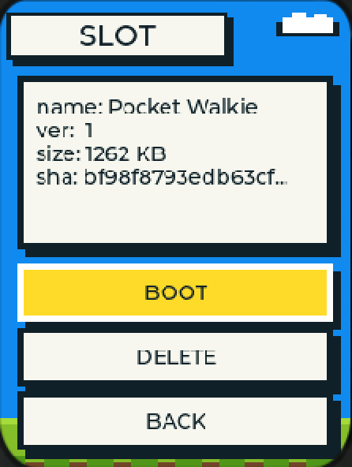
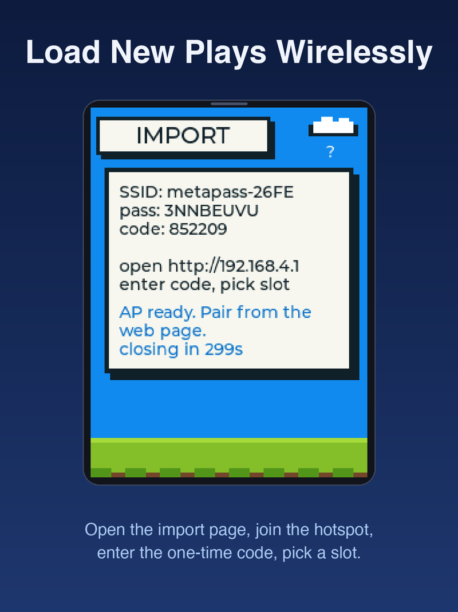
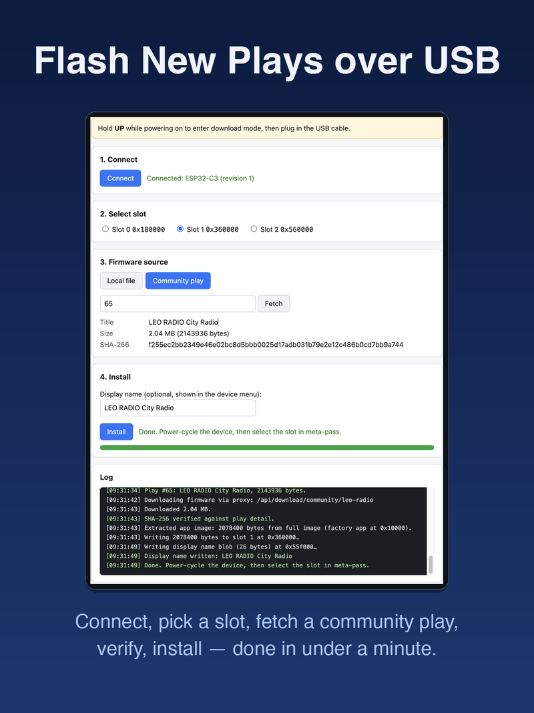

meta-pass is a multi-firmware launcher I wrote for AI Passport: a persistent launcher sits on the device, firmware images are installed into Flash slots, and you select which one to boot from a startup list instead of reflashing the whole device every time. The two-day MVP process is documented in [the previous post](/en/posts/2026/09/meta-pass-multi-firmware-launcher/).

> Not useful. This thing takes up 3MB, leaving only two 2MB slots. Anything slightly practical won't fit.

It was mostly right. Over the next six days, I submitted 90 commits, working through eight comments one by one, and ground meta-pass from MVP to v1.0: three slots, signature badges, backup and restore, single-file firmware, data-safe upgrades, bootloader hardening and a USB speedup. Most of the v1.0 changes were forced out by those comments.

## The Space Problem

The complaint on September 12 hit the root cause: the launcher took 3MB, the two remaining slots were each 2MB, and larger gameplay firmwares simply would not fit.

The second MVP build produced an 8MB combined image, but over 80% of that was empty slot space. The actual firmware code was only a small fraction of the total, and reserving 3MB of Flash for the launcher image was wildly inefficient. In v1.0 I ran compression optimizations and pushed the core factory down to under 1.44MB, freeing enough space to make slot 0 reach 1.84MB.

Once the factory shrank, the previously unused gap in front of the cardid region on Flash could be put to work, and it was large enough to fit a third slot.

A user on September 15 asked: Is each partition capped at 2MB? Can we assign sizes freely?

No. By the manufacturer specification, the cardid identity region is fixed in the middle of the Flash and cannot move. It splits the available space in half, and the addresses and sizes of all three slots are calculated from that fixed position. The gap in front holds 1.84MB, which became the first slot. The space behind cardid is aligned to 64KB boundaries; the second slot stays at 2MB, and the third takes the remaining 2.61MB.

The largest goes to the most space-hungry gameplay, and it can double as storage for a voice-recording firmware. Now the walkie-talkie, the radar treasure game, and the third community project can all coexist on the device without deleting one before adding another.

## Changed the Name, Still Booted as AI Passport

Someone changed the display name, but the device still displayed AI Passport when it booted up.

I traced the root cause and could not find a definitive answer. The display-name blob write logic had existed since the MVP, so it should have worked. I do not know exactly which link in the chain broke, and I have no evidence to point to, so I will just admit the symptom was real and the cause remains unclear.

v1.0 closes the loop completely. The USB install page now auto-fills the name with the gameplay's English title or local filename, and the Wi-Fi import page gained an optional name input field. This scenario should not recur.

## Can We Add a Bypass for Unsigned Firmwares

Someone asked whether the long-press confirmation could be skipped for unsigned firmwares, saying the repeated pressing was annoying.

That option is not getting added. The warning page is the last gate, and if it can be bypassed, the signature mechanism becomes meaningless.

But the long-press was genuinely awkward for new users. I changed it to a short press instead: the warning page pops up, use the direction keys to highlight BOOT, press OK to confirm, and the default cursor sits on Cancel so a casual stream of OK presses does not accidentally boot an unsigned firmware. Signed firmwares skip the warning page entirely and go straight to boot on OK.

## Users Didn't Understand How to Use It

Someone said they could not figure out how to use it, thinking they needed to install the downloaded gameplay together with meta-pass itself.

The market page did not explain the flow clearly enough. That is a content gap on the market side.

In v1.0 I rewrote meta-pass's own market introduction page and laid out the usage steps plainly: how to install, how to use, how to switch firmwares. Users should not have to guess.

## Improvements Nobody Asked For

These next items were not prompted by comments, but they are all about making the experience feel reliable enough to use without anxiety.

The install page can now package all slot firmwares, slot-attached data, and the system storage area into a single zip. On restore, each item is validated against its fingerprint before writing; mismatched fingerprints are rejected, insufficient space is rejected explicitly, and a partial write never leaves the device in a corrupted state. The system storage area is handled automatically: packed on backup, written back on restore, without the user needing to know what it is called.

Backups require reading entire slot regions, and speed determines whether this feature is usable at all. Before the fix, reading a 1MB payload over USB took three minutes and failed frequently. After raising the communication speed to 921600 baud and adding a three-tier automatic recovery strategy (retry with resynchronization, downgrade speed, full link reset), a 1MB backup now completes in about one minute, and transient USB disturbances trigger automatic retries instead of forcing a restart.

Upgrading the launcher itself does not touch any data. The web page reads back the device partition table first, compares it byte-by-byte with the upgrade package, then only writes the allowed regions: bootloader, partition table, and launcher application. System storage, the identity region, and all three slots are left untouched. Installed gameplay firmwares and user data survive intact.

The last item fixes an old wound from the MVP period. In the original rollback mechanism, a firmware specified its own persistent run policy. Under the old scheme, a gameplay compiled from an outdated template that declared a persistent run would lock the device inside that gameplay forever, with no error message and no way back even after power cycling. Moving the policy into the bootloader layer forces it to run before any firmware executes, and no gameplay can bypass it. A device stuck in that state recovers after a single power cycle once it boots this version. The exclusion process and byte-level decision rules are documented in [another post](/en/posts/2026/09/esp32-bootloader-single-session-policy/).

## Lessons From Six Days

Ninety commits in six days produces a few durable observations.

**Do not leave Flash space on the table.** The MVP combined image had 80% empty space. After compressing the factory to under 1.44MB, the gaps in front of and behind the fixed cardid region could each absorb a slot, giving slot 0 a comfortable 1.84MB and slot 2 a generous 2.61MB. All of that came from reclaimed dead space.

**More retries alone do not fix Flash read errors.** Bumping retries from five to eight still dropped packets at the higher baud rates. The fix required three tiers: retry with resynchronization, fall back to a lower speed, then reset the entire link. Only with all three in place did the problem disappear.

**NVS, cardid, slot, and otadata are four different things.** NVS stores Wi-Fi credentials and app configuration. The slot stores firmware images. The cardid stores the device identity and must not be touched. The otadata records which slot is currently selected. Corrupt any one of them during a launcher upgrade and you lose credentials, identity, or boot selection in different ways.

**Do not assume community firmwares follow conventions.** Display names may be absent, signatures may be missing, and unported firmwares will still run if given the chance. The protocol layer passes only the minimal information it needs and never pretends the other side will comply.

## How to Get It

Search for meta-pass on the market, or visit the install page at <https://metapass.chuanxilu.net>.

Source code and documentation: <https://github.com/alexwwang/meta-pass>

---

## References

1. MVP development retrospective: [Building a Multi-Cartridge Launcher for My Kid's AI Toy](/en/posts/2026/09/meta-pass-multi-firmware-launcher/)
2. Bootloader single-session policy: [Writing the Boot Policy Into the ESP32 Bootloader](/en/posts/2026/09/esp32-bootloader-single-session-policy/)
3. meta-pass repository: <https://github.com/alexwwang/meta-pass>
4. FoloToy market meta-pass page (source of user comments): <https://ai-passport.folotoy.cn>
