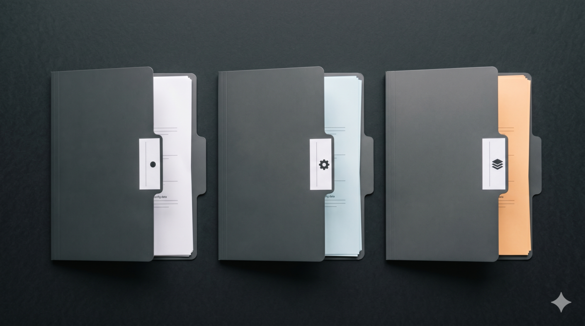

## 为什么我需要三套 OpenCode 配置

我的 `~/.config/opencode/` 目录下有三个 `opencode.json`。起因很简单：我想同时跑 `oh-my-openagent`（以下简称 omo）和 `oh-my-opencode-slim`（以下简称 oms），对比着用，搞清楚各自的边界在哪。

omo 是完整版——插件自带一批内置 agent（Sisyphus、Atlas、Prometheus、Oracle、Explore、Librarian、Metis、Momus 等），加上我自己按需注册的。核心是 fallback 降级链和 Sisyphus 编排器：一个重构任务丢给 Sisyphus，它拆给 Prometheus 做规划、Atlas 执行计划并分发子任务、Explore 搜代码、Oracle 做分析，最后汇总回来。oms 是精简版——同样有一个 orchestrator 作为主 agent 负责执行任务，差别在于评审环节：oms 用 council 多模型共识，多个 councillor 并行审查结果，由 Council agent 综合各 councillor 的输出得出最终结论。两套插件的编排理念不同：omo 是中心编排、逐级分发，oms 是主 agent 执行 + council 评审。光看文档说不清差异，得实际跑才知道哪个场景该用哪个。

但两套插件不能同时加载——它们各自注入 hooks、tools、agents、MCP server，混在一起会互相干扰。所以每次切换都要改配置文件，改完还要重启。来回改了几次就烦了。

于是加上第三套：纯净模式。什么都不加载，只保留 provider 和 MCP。测试自己开发的插件时用纯净模式——omo 和 oms 都会往环境里注入东西，需要一个干净的基准来排除干扰。

三套配置，三种场景，用环境变量一键切换。

## 方案：环境变量切换

OpenCode 启动时读取 `OPENCODE_CONFIG` 环境变量，指向不同的配置文件。这是官方支持的机制，不需要任何 hack。

设计原则只有一条：**让最常用的场景路径最短。**

我大部分时间在处理项目，所以 omo 是默认。敲 `omo` 直接进完整版，不需要额外参数。需要测试插件时敲 `opencode` 进纯净模式，需要轻量多模型时敲 `oms`。

```
omo         → omo 完整版（默认）
opencode    → 纯净模式
oms         → oms 精简版
```

如果你不开发插件，只是日常写代码，保持 omo 默认就行。按自己使用频率调整。

## 文件结构

```
~/.config/opencode/
├── opencode.json              # 默认配置（纯净模式）
├── opencode-slim.json         # oms 精简版
├── opencode-omo.json          # omo 完整版
├── oh-my-openagent.jsonc      # omo 插件配置
├── oh-my-opencode-slim.jsonc  # slim 插件配置
└── launch.sh                  # 启动切换脚本
```



三个 JSON 文件共享 provider 配置，但 MCP servers 和 plugins 各不相同。provider 是基础设施，API Key 写在一个地方就行——如果每个配置都维护一份完整的 provider，改了忘了改另外两个，迟早出事。

### 纯净模式 `opencode.json`

```json
{
  "provider": { ... },
  "mcp": {
    "aristotle": {
      "type": "local",
      "command": ["uv", "run", "--project", "~/.config/opencode/aristotle", "python", "-m", "aristotle_mcp.server"],
      "enabled": true
    }
  },
  "permission": { ... }
}
```

没有 plugin 字段。干净。`aristotle` 是 MCP server，负责错误反思的底层能力。但没有安装 `aristotle-bridge` 插件，所以 Aristotle 只能同步运行——反思操作由主 agent 直接调用 MCP 完成，会占用对话上下文。omo 和 oms 通过 bridge 插件实现了异步：Aristotle 在独立子 agent 中执行反思，不污染主对话。这是纯净模式的取舍：干净，但少了异步反思能力。

### oms 精简版 `opencode-slim.json`

```json
{
  "provider": { ... },
  "mcp": {
    "aristotle": { ... }
  },
  "permission": { ... },
  "plugin": [
    "oh-my-opencode-slim@latest",
    "@mohak34/opencode-notifier@latest",
    "@warp-dot-dev/opencode-warp",
    "file:///Users/xxx/.config/opencode/aristotle-bridge/index.js"
  ]
}
```

注意 `plugin` 是数组格式，不是对象。`aristotle-bridge/index.js` 是本地插件，不是 npm 包——它由三个包（core、reflection、watchdog）打包而成，把 MCP 的同步调用转为异步子 agent 执行，并监控管道状态。`aristotle` 仍然在 MCP 中注册，bridge 插件在此基础上增加异步调度能力。两者配合使用，不是替代关系。

### omo 完整版 `opencode-omo.json`

```json
{
  "provider": { ... },
  "mcp": {
    "aristotle": { ... }
  },
  "permission": { ... },
  "plugin": [
    "oh-my-openagent",
    "@mohak34/opencode-notifier@latest",
    "@warp-dot-dev/opencode-warp",
    "file:///Users/xxx/.config/opencode/aristotle-bridge/index.js"
  ]
}
```

omo 和 oms 的差异只在 plugins 声明——omo 用 `oh-my-openagent`，oms 用 `oh-my-opencode-slim@latest`。MCP 配置完全相同。

## 两种编排理念

omo 和 oms 不只是"重"和"轻"的区别，它们的编排理念根本不同。理解这个差异，才能选对场景。

### omo：Sisyphus 中心编排

omo 用 Sisyphus 作为中心编排器。你给它一个任务，它负责拆分、分发、收集、汇总。下游 agent 各司其职：Prometheus 做任务规划，Atlas 执行计划并分发子任务，Oracle 做架构咨询和深度分析，Explore 搜代码，Librarian 查文档。每个 agent 只关心自己的领域，Sisyphus 负责协调它们之间的上下文传递。

这种模式的好处是：任务拆分质量高，agent 之间不会打架。缺点是：Sisyphus 本身是个瓶颈——它理解错了，后面全错。而且多了一层编排开销，简单任务用 omo 反而比直接对话慢。

### oms：orchestrator 执行 + council 评审

oms 有一个 orchestrator 作为主 agent，负责接收任务、调用工具、执行代码——和 omo 的 Sisyphus 类似。差别在评审环节：任务完成后，多个 councillor 并行审查结果，独立给出意见，由 Council agent 综合所有输出得出最终结论。councillor 数量可配，每个可以用不同厂商的模型，互不知道对方的输出。

这种模式的好处是：评审环节通过冗余降低单模型的误判率。一个模型幻觉了，另外两个能纠正。缺点是：评审阶段 token 消耗是 councillor 数量的倍数，成本更高。而且 Council agent 的综合质量取决于它自身的能力——如果综合模型也理解偏了，多个 councillor 的输出可能被错误地合并。

### 怎么选

| 特性 | 纯净模式 | omo | oms |
|------|---------|-----|-----|
| 插件 | 无 | oh-my-openagent | oh-my-opencode-slim |
| Agent 数量 | OpenCode 默认 | 插件内置 + 自定义 | 插件内置 + 自定义 |
| 编排方式 | 无 | Sisyphus 中心编排 | orchestrator + council 评审 |
| 适用场景 | 插件测试（排除干扰） | 复杂项目，多 agent 协作 | 快速任务，单一 agent 执行 |


我的经验法则：需要多步拆分、跨模块协调的复杂任务用 omo（比如从零搭项目、大规模重构）；目标明确、一两步能搞定的快速任务用 oms；测试自己的插件用纯净模式。强行用一个配置打天下，最后会在每个场景上都妥协——重的嫌慢，轻的嫌弱，纯的嫌没功能。我自己试过只用 omo，结果测试插件时每次都要 `bunx` 卸载再重装，烦得不行。也试过只用纯净模式，写正经项目时少了 agent 编排效率直接腰斩。三套配置看着麻烦，实际上是把"什么时候用什么工具"这个决策提前做了，用的时候不用再想。

两套插件的 fallback 机制差异很大——omo 是五层管线逐层降级，oms 是启动选模型 + 运行时 abort 重试。配置模式、最佳实践和实战示例单独写了一篇：**[omo vs oms：Fallback 链深度解析](/posts/opencode-fallback-chains/)**。

## 启动脚本

`launch.sh` 放在 `~/.config/opencode/` 下，source 到 shell 里即可：

```bash
#!/bin/bash

# 纯净模式
oc-clean() {
  OPENCODE_CONFIG="$HOME/.config/opencode/opencode.json" opencode "$@"
}

# omo 完整版
oc-omo() {
  OPENCODE_CONFIG="$HOME/.config/opencode/opencode-omo.json" opencode "$@"
}

# oms 精简版
oc-slim() {
  OPENCODE_CONFIG="$HOME/.config/opencode/opencode-slim.json" opencode "$@"
}

# 短别名
alias omo="oc-omo"
alias oms="oc-slim"
```

在 `.zshrc` 里加一行：

```bash
source "$HOME/.config/opencode/launch.sh"
```

之后 `opencode` 进纯净模式，`omo` 进完整版，`oms` 进精简版。带参数也行——`omo --resume ses_abc123` 会用 omo 配置恢复指定 session。

## 踩过的坑

### 1. 配置漂移

`bunx` 安装插件时，`opencode-omo.json` 里的 plugin name 偶尔会被覆盖。写的是 `oh-my-openagent`，装完变成 `oh-my-openagent@latest`。功能不受影响，但 git diff 会报变更。排查问题时容易误判"我改了什么"。

**解法：** 安装后手动检查 plugins 字段，确认 name 没被篡改。或者写个 postinstall hook 自动修正。

### 2. oms 重复加载

`oh-my-opencode-slim` 有时会和主配置里的插件条目重复注册。症状是启动时看到两条 `loading oh-my-opencode-slim...` 日志。不影响功能，但白跑了一遍初始化。

**解法：** 确保 `opencode-slim.json` 里只出现一次 plugin 声明。不要在全局配置和 slim 配置里同时写。

### 3. `t` MCP 重复注册

三套配置如果都声明了同一个 MCP server（比如 `t`），启动时可能注册两次。表现是 MCP 调用返回两份结果，或者 tool 列表里出现重复条目。

**解法：** 把共享的 MCP server 从 omo 和 oms 的配置里移除，只在纯净模式的 `opencode.json` 里保留一份。omo 和 oms 通过插件内部机制引用。

### 4. Sisyphus 的模型适配

omo 的 Sisyphus 编排器为不同模型准备了专属 prompt 变体——Claude Opus 4.7、GPT-5.4/5.5、Gemini、Kimi K2.6 各有独立文件。比如 Gemini 版本有"corrective overlays"，专门纠正 Gemini 倾向于跳过工具调用、避免委托、未验证就声称完成的毛病。文档里明确写了"Sisyphus strongly recommends Opus 4.7"，Kimi K2.6 是次选。

我的实际感受是：不同模型跑 Sisyphus 确实有差异，但都在可用范围内。我主力用 GLM 系列模型，编排质量完全可以接受——omo 的 per-model prompt 适配不是摆设，确实拉平了不同模型之间的差距。如果你有 Opus 的 Key，效果当然更好；没有的话，GLM 或 Kimi K2.6 也完全够用。

### 5. Hephaestus 不可用

Hephaestus agent 设计上需要特定的高能力模型。我的 provider 里没有对应模型的 Key。fallback 链里直接跳过它，用下一个备选 agent。功能上少了一个"自动修复"能力，但不影响其他 agent 的正常工作。如果将来接入了对应的 provider，补上配置就行。

## 实际使用频率

三套配置里 omo 用得最多——大部分时间在处理项目，Sisyphus 的多 agent 编排确实省心。纯净模式主要在测试自己的插件时切过去。oms 偶尔用一下，简单任务跑个 council 共识。比例因人而异，取决于你日常做什么类型的工作。

这个比例因人而异。如果你不测试插件，纯净模式可以不配，omo + oms 两套就够。但我建议至少保留一个最简配置作为基准环境——即使不测试插件，遇到诡异问题时切到纯净模式排除干扰，也省得抓瞎。

## 几个值得注意的点

- **API Key 管理**：三套配置共享 provider，API Key 写在一个地方。不要在每个 JSON 里复制一份，改一个忘了改另外两个，迟早出安全事故。
- **成本控制是有意的**：Explore 和 Librarian 用弱模型（model-z）不是随便选的。这两个 agent 调用频繁，用强模型一次 session 的 token 费用能差出几倍。
- **版本要求**：`OPENCODE_CONFIG` 环境变量需要较新版本的 OpenCode 才支持。低版本可能静默忽略，启动时注意确认实际加载了哪个配置文件。
- **备份**：改配置前 git commit。三个 JSON 看着简单，但 fallback 链和 agent 映射关系攒起来要好几天。丢了重建很痛。
