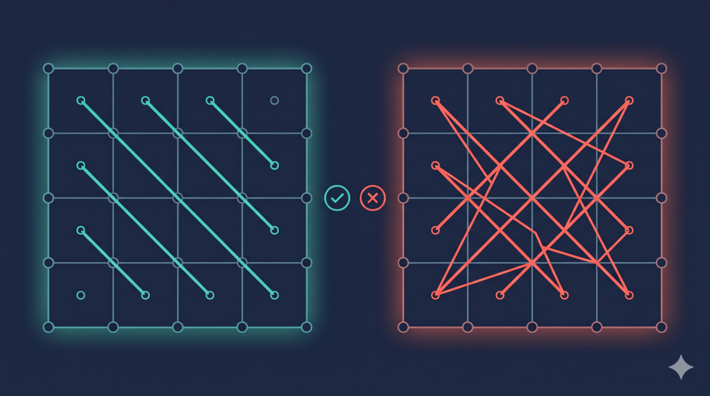
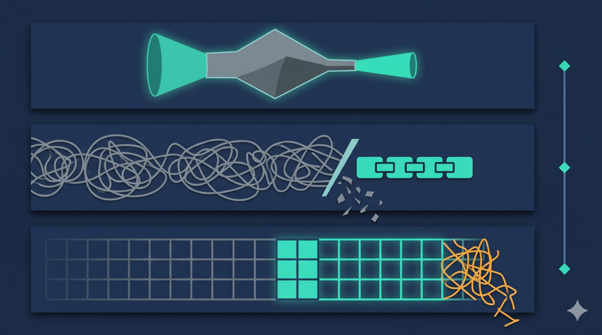

> Series: Classic Theory Meets Agent Practice (Part 3)
> [Part 1: Dual-Pass Review: Why You Can't Have Both Recall and Precision](/en/posts/2026/05/dual-pass-review-recall-precision-tradeoff/) · [Part 2: Strategy Genes: Pruning Review Prompts with Genetic Algorithm Thinking](/en/posts/2026/05/signal-purity-less-is-more/)

> **TL;DR:** Two controlled experiments. Code review dimensions went from 8 to 11, and known-issue detection went from 1/6 to 6/6. Design review introduced axiomatic design dimensions, and detection also went from 1/6 to 6/6. But the version with a math formula proved that more dimensions are not always better — computation consumed review attention, and findings dropped 35%. Run controlled experiments with known issues as reference, and you learn which dimensions actually work.

The previous post solved "what to put in the prompt" — remove inferable redundant content, keep only strategy genes, and review quality improved 29%. But one question remained: are the review dimensions complete enough?

No matter how refined the strategy genes are, if the dimensions are not enough, the model still won't see certain issues.

## Results first

Two controlled experiments. Same approach: collect previously confirmed issues that existing dimensions had missed, add dimensions, and measure how many get recovered.

### Experiment 1: Code review dimension enhancement

Code review originally had 8 dimensions. The controlled experiment found only 1 out of 6 known issues.

Added 3 dimensions (security depth, test gap analysis, resource safety), bringing the total to 11.

Result: **6/6 — all found.**

### Experiment 2: Design review dimension enhancement

Design review originally had 11 dimensions. Only 1 out of 6 known issues was found.

Introduced Axiomatic Design, adding 3 dimensions (independence axiom, information axiom, requirement purity), bringing the total to 14.

Result: **6/6 — all found.**

Both experiments seem to reach the same conclusion: add dimensions, get better results. But that is not the full picture. A third experiment showed the opposite.

## Controlled experiment methodology

Both experiments used the same methodology. I wrote a double-blind experiment skill for this, so the AI agent runs a standardized process.

### Control variables

Only review dimensions changed each time. Same codebase, same known issues, same model. Everything else stayed constant. Change one thing, measure the difference.

### Known issues as reference

The reference set consists of previously confirmed real issues that existing dimensions had missed.

These are not "potentially problematic." They are "definitely problematic." Each one was manually confirmed with a clear error description and fix.

Using verified issues as reference gives the experiment an objective yardstick.

### Measurement metric

Known-issue detection rate: how many previously missed issues the experimental group reported.

Why not just look at "how many issues were reported" (total findings)?

Because total findings can be inflated by lowering the bar. A dimension that reports 100 findings might have 90 false positives. Lower bar = more reports = nice numbers but poor quality.

Known-issue detection rate measures something different: **how many genuinely valuable issues were found.** These issues were previously missed, meaning they are not easy to detect. Whether new dimensions can find these "hard-to-detect issues" is the real test of dimension effectiveness.

### Why use known issues as reference

A typical review experiment would use manual annotation as reference. I did not, for a simple reason — I did not have the time to annotate.

But it turned out to be better this way. Known issues are not "annotated problems." They are "previously confirmed and actually fixed problems." Their existence is already verified. No need to find someone to confirm "is this really a problem?"

## Axiomatic Design

Experiment 2 introduced Axiomatic Design — a theoretical framework I had not heard of before. A quick introduction.

Axiomatic Design is a design theory proposed by Nam P. Suh at MIT.[1] The core is two axioms:

1. **Independence Axiom**: less coupling between functional requirements means better design
2. **Information Axiom**: among solutions satisfying the Independence Axiom, the simplest one is best

The two axioms have an order. Satisfy independence first, then choose the simplest solution.

### How the Independence Axiom applies to review

The Independence Axiom says: in a good design, each Functional Requirement (FR) is implemented by an independent Design Parameter (DP). If two FRs share a DP, changing one function affects the other. That is coupling.

Putting this check into a review dimension: map the correspondence between FRs and DPs, and see if it is one-to-one. If many-to-many relationships appear, the design has coupling.

Pure correctness review does not check this. "Is the function correct?" and "is there coupling between functions?" are two different questions. Correctness dimensions only check the former.

### Two versions of the Information Axiom

The Information Axiom says: if multiple solutions all satisfy independence, choose the simplest one. I=-log₂(p), where p is the probability of success. Higher success probability = simpler solution.

I made two versions: the concise version is just one line — "choose the simplest solution." The formula version requires the model to do the full I=-log₂(p) calculation. Which is better? That comes later.

## How I got here

### Starting point: problems the review did not see

The first two posts solved two problems. First post, how the review cycle runs — dual-pass review. Second post, what goes in the prompt — strategy genes.

After dual-pass review and strategy gene optimization, review cycles converged faster. Fewer rounds, higher valid find rate per round.

But there was another phenomenon: after convergence, regression testing always revealed issues the review had never reported. Not "reported but not fixed." The review simply did not see them — there was no corresponding check item in the dimensions.

### A typical known issue

SQL query `ORDER BY created_at` with no tiebreaker or secondary sort column. When multiple records share the same `created_at`, the database may return them in a different order each time.

This is not a logic error — the query results are correct in most cases. It is not a security issue or a performance issue. None of the existing 8 dimensions covered it.

The "correctness" dimension does not check for this. "Security" does not check. "Performance" does not check. A new dimension was needed to catch this kind of problem. So I added the "test gap analysis" dimension.

### The controlled experiment

Ran one round using the methodology described above: 6 known issues as reference, only changing review dimensions.

First step, added 3 dimensions (security depth, test gap analysis, resource safety). Got 1/6. Not enough.

Examining the 5 remaining misses, I saw the dimension was on the right track — "test gap analysis" did cover the ordering determinism problem. But the model did not know what to look for.

So I changed the wording. Instead of "check test gaps," I told the model specifically what to look for: when the sort field has ties, is there a tiebreaker column? Does the query condition skip leading columns of a composite primary key, causing index inefficiency?

Ran again. 6/6.

This iteration process itself demonstrates something: dimension design is not "think of it and it works." You get the direction right, but still need to verify. Verification reveals the direction is correct but not specific enough, so you add more specific guidance.

### The Axiomatic Design inspiration

The dimension iteration above solved the "right direction but not specific enough" problem. After fixing the wording, tiebreaker and index issues could both be found.

At this point, I had added every dimension I could think of. But issues like coupling — I had never paid attention to them before. I did not know this was a gap. I had not even realized it was a dimension.

Coincidentally, Twitter mutual [@goldengrape](https://x.com/goldengrape) mentioned during a conversation about memory system design that Axiomatic Design has a design matrix — iterate it to upper-triangular form and you guarantee design quality. It sounded interesting, so I looked into the core ideas of this theory (introduced earlier in the "Axiomatic Design" section), then decided to experiment — I added FR-DP coupling checks to the review dimensions to see what would happen.

Ran an experiment. The results were unexpected — it found issues every previous dimension missed. Coupling was not something I set out to find. The experiment told me it mattered.

Of course, going from theory to usable review dimensions is not a direct transplant. Suh's method also includes a quantitative comparison formula. I tried that too. The result...

### The lesson of the rejected formula version

When I put the math formula into a dimension, I was confident. Mathematically rigorous, semantically precise — the model should be able to calculate "which solution is simpler."

The results surprised me.

33 findings, 35% fewer than the concise version. Recall also dropped by half.

Looking back, the reason is clear: I=-log₂(p) requires the model to do mathematical reasoning. Estimate success probability, take the logarithm, compare. This computation consumes far more attention than one line of "choose the simplest solution."

This is the strategy gene principle from the second post, manifesting at another level. It is not just prompt text that has redundant content. **Dimension design itself has redundant content.** The Independence Axiom's checking framework is a strategy gene — it guides the model toward valuable checks. The math formula is redundant content — it makes the model do things unrelated to review.

## The series: one common pattern

Three posts done. A quick look back.

First post, dual-pass review. Problem: one review agent optimizing both "find everything" and "get it right" does neither well. Solution: split them. Theoretical basis: the tension between Recall and Precision in information retrieval.

Second post, strategy genes. Problem: the prompt was too long, model attention diluted. Solution: remove inferable redundant content, keep only strategy genes. Theoretical basis: Holland's building blocks concept from genetic algorithms and Wang et al.'s strategy genes research.

Third post, dimension experiments. Problem: review dimensions were incomplete, systematically missing certain categories of issues. Solution: controlled experiments to verify dimension effectiveness, using known issues as reference. Theoretical basis: controlled experiment methodology and Axiomatic Design.

Three posts, three different classic theories. IR, genetic algorithms, Axiomatic Design. They seem unrelated.

But they are really telling one pattern: **when adapting classic theories for AI agent design, the most important skill is distinguishing strategy genes from redundant content.**

- Dual-pass review: the Recall-Precision tension is a strategy gene. "The model should weigh them itself" is redundant content.
- Strategy genes: constraints and negative examples are strategy genes. Step descriptions and positive examples are redundant content.
- Dimension experiments: the Independence Axiom's checking framework is a strategy gene. The math formula is redundant content.

Every post's "rejected version" tells the same story: something that looks important in theory may not be useful in an agent. The key is whether it has an actual effect on output. No effect, however elegant, is redundant content.

This judgment can only be made through experiments. Remove it, observe whether output changes. Add it, observe whether recall rises. No shortcuts.

## References

1. Suh, N. P. *The Principles of Design*, Oxford University Press, 1990. [https://global.oup.com/academic/product/the-principles-of-design-9780199259796](https://global.oup.com/academic/product/the-principles-of-design-9780199259796)
