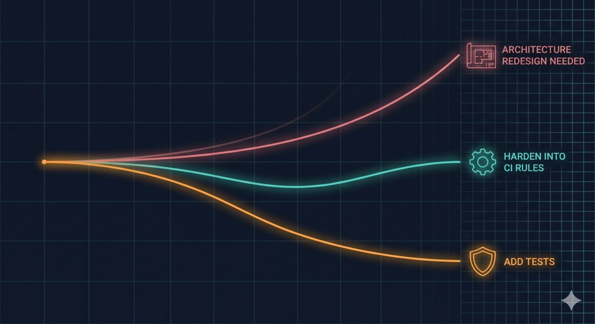

> Series: Breaking to Build: TDD Process Iterations (Post 3)
> Previous: [Using the Method to Improve the Method](/en/posts/tdd-pipeline-v07-refinement-experiment/)

> **TL;DR:** Phase 6 already does diagnostics at the integration level — drilling into each bug's root cause. What it doesn't do: cross-defect pattern scanning, component gap checking, execution order analysis. Those belong to Phase 7. In small systems, Phase 7 catches a few more bugs. As the system grows, those same three tasks produce something different — building test infrastructure, hardening CI rules, driving architectural evolution. Phase 7 doesn't make architecture decisions. But it provides the scarcest input for those decisions: evidence-based problem localization.

## Threads From the First Two Posts

The first post covered the V0.8 experiment [1]. Refining Phase 6 didn't meet expectations. But the refined version showed stronger project-level awareness than the original.

The second post went back to V0.7 [2]. Refining Phases 1 through 5 worked. The model independently reconstructed the deleted steps.

V0.7 succeeded. V0.8 failed. Same strategy, different outcomes. What's the difference?

## It's Not That Phase 6 Falls Short

Phase 6 already does principle-driven integration defect diagnosis.

It doesn't ask about function logic. It asks about component wiring, configuration passing, process startup intersections. From "can this component start independently" to "does the full real flow work end to end" — it eliminates possibilities layer by layer. Every bug gets drilled to root cause with a fix proposal.

This method has been validated in earlier posts [3][4].

Phase 6's problem isn't capability. **Its only activity type is diagnosing individual defects.**

It's good at answering "what's the root cause of this bug." It doesn't answer other questions — like whether 18 bugs share a common pattern, whether some component gaps have never been checked, or whether the validation chain's execution order has a design flaw.

The V0.8 refined version scored better on project-level awareness precisely because it wasn't anchored to the "diagnose one bug at a time" rhythm. It had bandwidth to scan for cross-bug patterns. But that capability shouldn't come from weakening Phase 6's operational constraints. Phase 6's diagnostic precision depends on those constraints.

The right move: keep Phase 6 as is. Add a layer on top that does a different type of work.

## Phase 7: Pre-Release Systematic Scan

Phase 7 runs after Phase 6 completes. It doesn't do diagnosis — that's Phase 6's job. It does what Phase 6 was never designed to do: scan the whole system for things individual diagnosis can't find.

### Three Tasks, Three Directions

**Component Gap Check.** Enumerate every interacting component pair in the system — direct API calls, indirect data flows, lifecycle coupling, path deviations between test and production. One rule: if a pair of interacting components exists in the system but isn't on your list, that's an unchecked gap.

In a small system, you patch it with one more test. In a large system, the number of component pairs grows quadratically. You can't patch them manually. Your test infrastructure needs upgrading.

**Pattern Defect Scan.** A defect pattern catalog distilled from 18 real bugs, each paired with a grep command. Design principle: systematic coverage beats intuition.

When grep finds nothing, that's more important than when it finds something. It means this pattern doesn't exist in your project — move on safely. If the same pattern keeps appearing, it's not individual bugs — it's the architecture encouraging that class of defects. The pattern needs to be hardened into a CI rule, or the design needs to change.

**Execution Order Analysis.** When multiple validation stages run in sequence, an early return from one stage prevents later stages from executing. Concrete case: a set of financial data runs through a median reasonableness check. The check detects an anomaly and returns early, marking every stock as invalid. The downstream per-stock check never runs.

Every validation function looks correct on its own. The problem only becomes visible when you examine the entire chain from the execution order dimension. Bug fixes can't solve this. The validation chain needs architectural redesign.

### Three Directions, One Destination

In a small system, Phase 7's findings amount to catching a few more bugs. As the system grows, those same three tasks produce something different. Not bug fixes.

Test infrastructure needs building. Patterns need to become CI rules. Architecture needs redesign.

Phase 7 doesn't provide conclusions. It provides **evidence**: Why do these 5 bugs share the same root cause pattern? Why have these component pairs never been checked? Why does the validation chain's execution order have dependencies?

In a small system, these aren't problems. In a large system, they all point to the same thing: the current architecture no longer matches the current complexity.

The scarcest input for architectural evolution isn't technical vision. It's **evidence-based problem localization**. That's what Phase 7 does.

### Why This Is Orthogonal to Phase 6

Phase 6 is a forensic pathologist — skilled at producing a complete autopsy report for a single cause of death. Phase 7 is an epidemiologist — looking for shared patterns across 18 deaths. Not upgrading the pathologist's toolkit. Adding a different profession entirely.

## Depth and Breadth

| | Phase 6 | Phase 7 |
|---|---------|---------|
| Activity type | Diagnosing individual defects | Systematic scan |
| Core method | Drill-down (Five-Layer Deep Inquiry + evidence chain) | Scan (pattern catalog + grep) |
| Attention direction | One bug, all the way down | The whole project, one pass |
| Problems found | Root cause of a single bug | Cross-bug shared patterns, uncovered component gaps, execution order defects |
| Output orientation | Bug fix | Build test infrastructure, harden CI rules, or drive architectural evolution |
| When it runs | Pre-release testing stage | After Phase 6 completes |

Both layers are necessary. With only Phase 6, every bug gets drilled to root cause — but nobody looks for shared patterns across bugs. With only Phase 7, pattern matching finds suspected issues — but there's no drill-down chain to confirm causation.

## Closing

Three posts, one thread: an experiment failed, the failure exposed a signal, the signal found its place.

One pattern emerged: **after diagnosing individual defects to their limit, systematic scanning can still find architectural pressure points.** In small systems, those pressure points are bug fixes. In large systems, they point to architectural evolution.

Phase 7 doesn't make architecture decisions. But it provides the scarcest input for those decisions — evidence-based problem localization.

This pattern isn't limited to the TDD Pipeline. Any situation where you've pushed local diagnosis to its limit and hit a wall is worth asking: am I only doing individual diagnosis, and never doing a systematic scan?

---

## References

1. What a Failed Experiment Got Right: [tdd-pipeline-v08-failed-experiment-discovery](/en/posts/tdd-pipeline-v08-failed-experiment-discovery/)
2. Using the Method to Improve the Method: [tdd-pipeline-v07-refinement-experiment](/en/posts/tdd-pipeline-v07-refinement-experiment/)
3. All Tests Green, System Broken: 18 Bugs and Six Ways They Kill: [six-bug-patterns-and-integration-gaps](/en/posts/six-bug-patterns-and-integration-gaps/)
4. Endless Bugs and an Inescapable Loop: AI-Assisted Root Cause Diagnosis in Practice: [ai-bug-root-cause-diagnosis](/en/posts/ai-bug-root-cause-diagnosis/)
5. The Full Pipeline: Five Stages from Requirements to Code: [ai-tdd-full-pipeline-from-requirements-to-code](/en/posts/ai-tdd-full-pipeline-from-requirements-to-code/)
