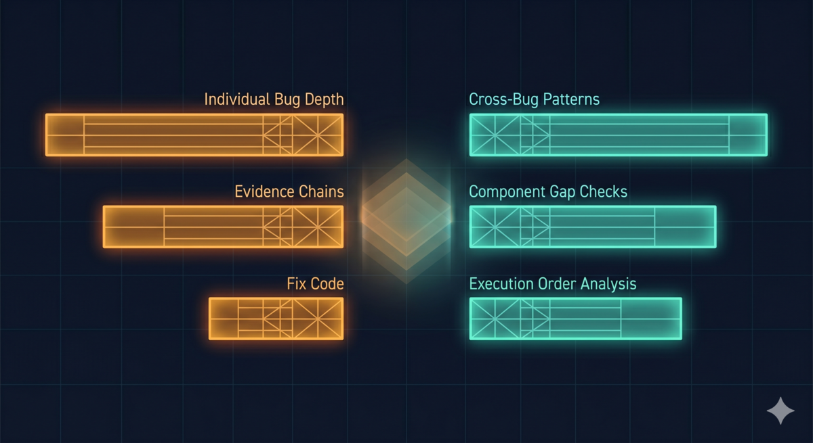

> 系列：破而后立的 TDD 流程迭代（第一篇）

> **TL;DR：** 把 TDD Pipeline 的阶段六（预发布测试）从"步骤驱动"精炼为"原则驱动"，预设目标没达到——精炼版在单个 bug 的追问深度、证据链完整度上都比原版差。但对比两组输出发现了维度差异：精炼版在组件缝隙检查、跨 bug 模式扫描上比原版强。这些差异指向一个判断——阶段六不需要被精炼，而是缺了一个阶段六没有定义的任务，后来被定义为阶段七。

## 背景

我做了一个 skill，叫 TDD Pipeline——从十几个 bug 的痛苦里逼出来的。把开发流程从需求到交付每个环节都定义清楚，每个阶段结束过一轮独立审核。

之前给 TDD skill 加 Why Articulation 时，我做了一组 A/B 实验[2]，发现一个反直觉的结论：给 AI 看正面示例反而降低输出质量。模型会走模仿捷径，而不是独立思考。更好的做法是给原则——告诉它"保护什么、风险在哪、为什么这个方法有效"——让它自己推导怎么做。

这个发现当时只验证了 Pipeline 里的一个环节。但它引出一个更大的问题：如果"给原则不给步骤"在 prompt 层面有效，那在整个规则文件层面呢？

我试了。前五个阶段（需求 → 方案 → 测试方案 → 测试代码 → 业务代码）的精炼成功了——AI 自己推导出了被删掉的步骤。

那第六个呢？

## 结果：没达到预期

同一组诊断任务，对照旧版和精炼版。精炼策略一致——保留原则和反面例子，去掉操作细节。结果，精炼版没有明显提升，某些场景下反而退步了。

精炼版漏掉已知 bug，严重性判断偏了，修复方案有技术错误。旧版在核心任务上全面碾压。

## 但有几个维度不一样

但精炼版在另一个维度上显著领先：组件之间的缝隙检查。

预发布测试不只看单个组件有没有 bug，还要看组件和组件之间有没有对不上的地方——你传给我的数据格式我能不能接住、你崩了我会不会知道、我们的配置是不是同一份。旧版检查了 3 组组件交互，精炼版检查了 6 组——翻了一倍。旧版只看了相邻组件之间的直接调用关系。精炼版多看了间接数据流——组件 A 写数据，组件 B 通过共享存储读数据，双方没有直接调用但有隐式依赖。其中一对隐式数据流暴露了一个真实存在的架构问题。

还有一个差异。同一个 bug，旧版标记为"这个文件有风险"，精炼版标记为"这个模式在项目里多处出现"。旧版看到的是单个 bug，精炼版看到的是 bug 模式。

以及执行顺序分析：同一个检查逻辑的 bug，旧版发现了，说"这个检查太粗暴，把不该清的数据也清了"。精炼版也发现了，但多问了一步：这个粗暴检查提前退出了，后面更精确的检查根本没机会跑——不是精确检查判断失误，是它被跳过了。

## 这些差异指向哪里

旧版擅长的事——单个 bug 深度追问、连续五层追问根因、每个发现配具体修复代码——全是阶段六的核心任务。精炼版在这些任务上退步了。

精炼版表现不同的事——更多组件缝隙检查、跨 bug 的系统性视角、执行顺序分析——全是同一个倾向：从单个 bug 跳出来，看项目整体。

这不是精炼版"做得好"的地方。这是精炼版在做一个阶段六没有定义的事。旧版的注意力全被"追问下一个 bug"占了，没有余力做这件事。精炼版去掉了步骤指引，没有被"下一步"占满——但它不是做得更好了，而是开始做一件不同的事，代价是核心任务退步了。

对比两组维度，一个形状浮现出来：阶段六擅长一个 bug 一个 bug 地追问，但没有人站在上面看整个项目哪里有系统性问题。

## 缺的这一层是什么

这个形状被识别出来之后，才有了阶段七的定义：系统性扫描——检查组件之间的缝隙、分析代码的执行顺序、扫描同一个 bug 模式在项目里是不是多处出现。不是从阶段六精炼出来的，是从精炼版"走偏"的方向里识别出来的。

定义了阶段七之后，问题变成：怎么把它加进来又不损失阶段六的追问精度？

答案不是"精炼阶段六"。精炼版在核心任务上确实更差。答案是：阶段六退回原版，阶段七作为独立阶段加在上面。两层各做各的事——阶段六钻得深，阶段七看得广。

精炼版在预设目标（改进阶段六）上失败了。但失败的形态——差在哪里、不一样在哪里——暴露了一个之前看不到的缺口。

下一篇先看看前五个阶段的精炼实验。对比那次成功，能更清楚地看到阶段六的精炼为什么会失败，以及阶段七是怎么从失败的形状里长出来的。

---

> 系列下一篇：[用方法改进方法](/posts/tdd-pipeline-v07-refinement-experiment/)

---

## 参考

1. 修不完的 bug 与逃不出的循环：AI 辅助根因诊断实战：[ai-bug-root-cause-diagnosis](/posts/ai-bug-root-cause-diagnosis/)
2. 测试全绿，系统不能用：18 个 bug 的六种死法：[six-bug-patterns-and-integration-gaps](/posts/six-bug-patterns-and-integration-gaps/)
